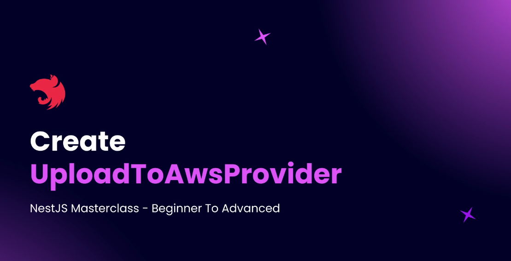

# Step 17 - File Uploads

## Introduction to File Uploads


In this section, you'll learn how to handle file uploads in NestJS. Unlike regular JSON requests, file uploads use the `multipart/form-data` content type. NestJS provides a `FileInterceptor` to help extract files from incoming requests, and a special decorator to access the uploaded file in your controller (similar to how you use `@Body()` for JSON data).


The typical flow is:
- The client sends a POST request with a file using `multipart/form-data`.
- The controller uses the `FileInterceptor` and file decorator to access the uploaded file.
- The file is then uploaded to an Amazon S3 bucket.
- S3 returns a URL for the file, which is often served through Amazon CloudFront (a CDN for faster access).
- Information about the file and its CloudFront URL is saved in your database.

CloudFront helps deliver files quickly to users by caching them in multiple locations around the world, reducing latency and improving user experience.


This section will guide you through each step, from receiving the file in your API to storing and serving it efficiently.

---

## Setup S3 and CloudFront

**Step-by-step:**

1. **Create an S3 Bucket:**
   - Log in to your AWS console and go to the S3 dashboard.
   - Click "Create Bucket", choose a unique name (e.g., `blog-images-nest`), and select your region.
   - Set Object Ownership to "ACLs disabled".
   - Disable "Block all public access" so files can be accessed publicly.
   - Acknowledge the warning and create the bucket.

2. **Set S3 Bucket Policy:**
   - Go to the bucket's "Permissions" tab.
   - Use the Policy Generator to create a policy that allows `s3:GetObject` for everyone (`Principal: *`) on all objects in your bucket (`arn:aws:s3:::your-bucket-name/*`).
   - Paste the generated JSON policy into the Bucket Policy section and save.

3. **Create an IAM User for Uploads:**
   - Go to the IAM dashboard and create a new user (e.g., `nest-blog-images-s3`).
   - Do not enable console access.
   - Attach the following policies:
     - `AmazonS3FullAccess`
     - `IAMUserSSHKeys`
     - `IAMFullAccess`
   - Complete the user creation.

4. **Generate Access Keys:**
   - After creating the user, go to the user details and create a new access key.
   - Choose "Local code" as the use case.
   - Copy the access key and secret; you will use these in your NestJS app to upload files.

5. **Create a CloudFront Distribution:**
   - Go to the CloudFront dashboard and create a new distribution.
   - Set the origin to your S3 bucket.
   - Keep the origin access as public.
   - Use default settings for cache and security.
   - (Optional) Add a custom domain (CNAME) if needed.
   - Create the distribution and copy the distribution domain name for your config.

**Result:**  
You now have an S3 bucket for file storage, an IAM user with upload permissions, and a CloudFront distribution to serve files globally with low latency.

---

## Uploads Module and Configuration

**Steps:**
1. **Install Dependencies:**  
   - Install AWS SDK:  
     ```
     npm install aws-sdk@2.1643.0
     ```
   - Install Multer types for file upload support:  
     ```
     npm install --save-dev @types/multer@1.4.11
     ```

2. **Add Environment Variables:**  
   - In your `.env` file, add:
     ```
     AWS_PUBLIC_BUCKET_NAME=your-bucket-name
     AWS_REGION=your-bucket-region
     AWS_CLOUDFRONT_URL=your-cloudfront-url
     AWS_ACCESS_KEY_ID=your-access-key-id
     AWS_SECRET_ACCESS_KEY=your-secret-access-key
     ```

3. **Update App Config:**  
   - In `src/config/app.config.ts`, add properties for all AWS-related variables, reading from `process.env`.

4. **Configure AWS SDK in main.ts:**  
   - Import `config` from `aws-sdk` and set credentials and region using values from the config service.
   - Example:
     ```typescript
     import { config as awsConfig } from 'aws-sdk';
     // ...get configService from app...
     awsConfig.update({
       credentials: {
         accessKeyId: configService.get(AppConfig.AWS_ACCESS_KEY_ID),
         secretAccessKey: configService.get(AppConfig.AWS_SECRET_ACCESS_KEY),
       },
       region: configService.get(AppConfig.AWS_REGION),
     });
     ```

5. **Generate Uploads Module, Controller, and Service:**  
   - Use NestJS CLI to generate:
     - `uploads` module
     - `uploads` controller
     - `uploads/providers/upload.service.ts` service

**Result:**  
Your NestJS app is now ready to handle file uploads to S3, with all configuration and infrastructure in place.

---

## Create Upload Entity

**Explanation:**  
Create an `Upload` entity to store file information in your database. This entity will include properties such as ID, name, path, type (using an enum), MIME type, size, and timestamps.

**Steps:**
1. **Create Entity File:**  
   - In the `uploads` directory, create `upload.entity.ts`.

2. **Define the Entity:**  
   - Use the `@Entity()` decorator from TypeORM.
   - Add properties:
     - `id`: Primary generated column.
     - `name`: String, varchar(1024), not nullable.
     - `path`: String, varchar(1024), not nullable.
     - `type`: Enum column using `FileTypes` enum, default to `image`, not nullable.
     - `mimeType`: String, varchar(128), not nullable.
     - `size`: Number, not nullable.
     - `createDate`: Use `@CreateDateColumn()`.
     - `updateDate`: Use `@UpdateDateColumn()`.

3. **Create Enum:**  
   - In `uploads/enums/file-types.enum.ts`, define:
     ```typescript
     export enum FileTypes {
       IMAGE = 'image',
       // Add more types as needed
     }
     ```

**Result:**  
Your `Upload` entity is ready to store all relevant file metadata in the database, supporting future extensibility for more file types.

---

## Upload File Service and Controller

**Step-by-step:**

1. **Create the Upload Endpoint in Controller:**
   - Add a `POST /uploads/file` endpoint in your uploads controller.
   - Use the `@UseInterceptors(FileInterceptor('file'))` decorator to extract the file from the request.
   - Use the `@UploadedFile()` decorator to access the uploaded file in the method.
   - Add Swagger decorators (`@ApiHeaders`, `@ApiOperation`) to document required headers and describe the endpoint.

2. **Inject the Uploads Service:**
   - In the controller's constructor, inject the `UploadsService` as a dependency.

3. **Call the Service Method:**
   - In the controller method, call `this.uploadService.uploadFile(file)` and return its result.

4. **Define the Service Method:**
   - In `UploadsService`, create an async `uploadFile(file: Express.Multer.File)` method.
   - Outline the steps:
     - Upload the file to AWS S3.
     - Save file metadata (including the CloudFront URL) to the database.

**Result:**  
Your controller and service are now connected and ready to handle file uploads, extract file data, and prepare for integration with AWS S3 and your database.

---
## Upload To Aws Provider



1. **Generate Provider:**  
   - Use NestJS CLI to create `upload-to-aws.provider.ts` in `uploads/providers`.

2. **Inject Config Service:**  
   - Inject `ConfigService` to access AWS credentials and bucket name.

3. **Create File Upload Method:**  
   - Add a public async `fileUpload(file: Express.Multer.File)` method.
   - Inside this method:
     - Create a new instance of `S3` from the AWS SDK.
     - Use the `upload` method on the S3 instance to upload the file.
     - Pass required properties:
       - `Bucket`: Get from config service.
       - `Body`: Use `file.buffer`.
       - `Key`: Generate a unique file name.
       - `ContentType`: Use `file.mimetype`.

4. **Generate Unique File Name:**  
   - Create a private `generateFileName(file: Express.Multer.File)` method.
   - Steps:
     - Extract the base name (without extension) and remove whitespaces.
     - Get the file extension using Node's `path.extname`.
     - Generate a timestamp and a UUID (using the `uuid` package).
     - Concatenate name, timestamp, UUID, and extension for uniqueness.

5. **Handle Errors:**  
   - Wrap the upload logic in a try-catch block.
   - On error, throw a `RequestTimeoutException`.

6. **Return Uploaded File Key:**  
   - On success, return the uploaded file's key (name).

---
## Complete Uploads Service

1. **Inject Dependencies:**
   - Inject `uploadsRepository` (TypeORM repository for the Upload entity).
   - Inject `UploadToAwsProvider` for S3 uploads.
   - Inject `ConfigService` for accessing CloudFront URL.

2. **Validate Mime Type:**
   - Allow only supported image mime types (`image/gif`, `image/jpeg`, `image/jpg`, `image/png`).
   - Throw a `BadRequestException` if the file's mime type is not supported.

3. **Upload File to S3:**
   - Use `UploadToAwsProvider.fileUpload(file)` to upload the file.
   - Get the unique file name returned from S3.

4. **Prepare File Metadata:**
   - Build an object with:
     - `name`: S3 file name.
     - `path`: CloudFront URL + file name.
     - `type`: Use `FileTypes.IMAGE`.
     - `mimeType`: From the file.
     - `size`: From the file.

5. **Save to Database:**
   - Use `uploadsRepository.create()` to create an entity instance.
   - Use `uploadsRepository.save()` to persist it.

6. **Error Handling:**
   - Wrap logic in a try-catch block.
   - Throw a `ConflictException` if saving fails.

**Result:**  
Your upload service now validates file types, uploads files to S3, generates CloudFront URLs, and saves metadata to the database with proper error handling.

---

## Testing File Uploads