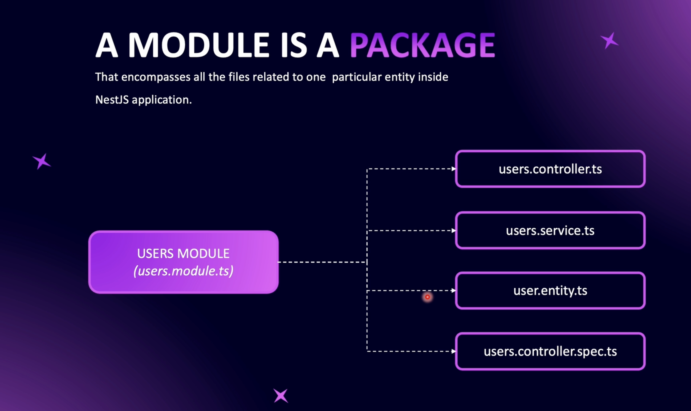
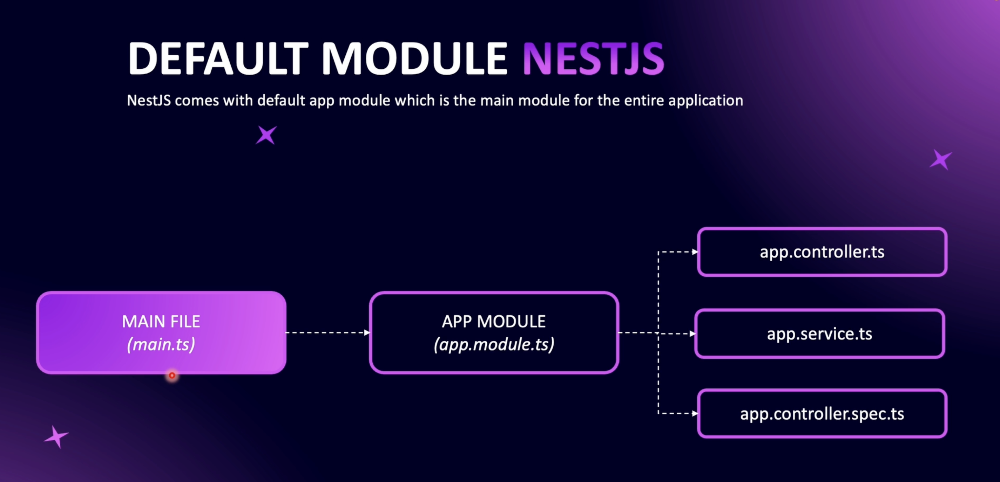
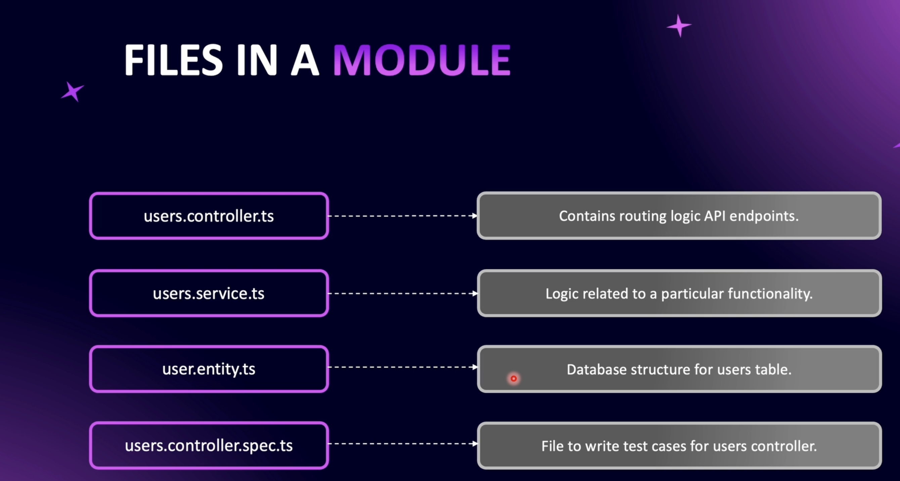
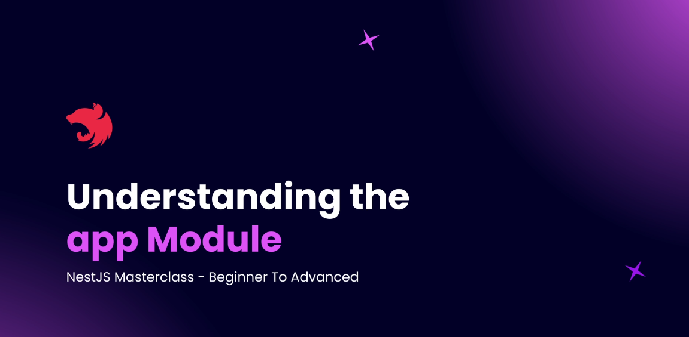
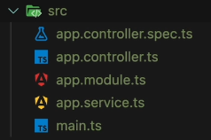

# Step 02 - Understanding Modules

## 1. What are Modules?
<p>
This section outlines the fundamental concepts of using modules in NestJS, focusing on organizing and structuring applications efficiently.
</p>

#### 1. Modules as Packages of Functionality



- In NestJS, **modules** are **_containers for specific functionalities_** within the application.
- When a new functionality is introduced, it should be encapsulated within a dedicated module.
- For instance, in a blog application, a **"Users"** module might handle everything related to user functionality, from routes to data handling.

#### 2. Primary File Structure in a Module

- Each module includes a **_primary file_** which typically follows the naming pattern **_moduleName.module.ts_** (e.g., **_users.module.ts_** for a Users module).
- This primary file acts as the **entry point** for the module, coordinating other essential files within the module.

#### 3. Controller Files

- **Controllers** are essential components in a module and are generally named **_moduleName.controller.ts_** (e.g., **_users.controller.ts_**).
- They manage routing and handle incoming HTTP requests, delegating them to relevant services within the module.
- For example, requests associated with user actions, such as registration or login, would be routed through the **_users.controller.ts_** file.

#### 4. Service Files

- Modules often include **service files** (e.g., **_users.service.ts_**) that house the **business logic** for the module.
- Services provide reusable functions, allowing the controller to execute necessary operations.
- The **_users.service.ts_** file, for instance, might contain methods for user authentication, retrieving user profiles, and other user-related actions.

#### 5. Entity and Test Files

- **Entity files** (e.g., **_users.entity.ts_**) represent database models and are typically found in modules that interact with a database.
- Modules may also contain **spec files** (e.g., **_users.controller.spec.ts_**) for testing the controller and verifying routes and responses.

#### 6. Default App Module

- A default **AppModule** (**_app.module.ts_**) is created with each NestJS installation, serving as the **core module** of the application, linking to other modules.
- The **_main.ts_** file acts as the starting point of a NestJS application. When the application is launched, **_main.ts_** references the **AppModule**, which then connects to all other declared modules.




### Structure of a Basic Module in NestJS

A typical module in NestJS includes the following files:
- **Primary Module File** (e.g., **_users.module.ts_**): Entry point of the module.
- **Controller** (e.g., **_users.controller.ts_**): Manages routes and HTTP requests.
- **Service** (e.g., **_users.service.ts_**): Contains business logic.
- **Entity** (e.g., **_users.entity.ts_**): Represents database models.
- **Spec File** (e.g., **_users.controller.spec.ts_**): For testing the controller.



### Reflection

The modular approach in NestJS promotes a clean structure, making it easier to develop and manage applications by grouping related files into dedicated modules. This structure improves readability and enhances reusability, as each module operates independently while integrating smoothly with others.

---

## 2. How NestJS Bootstraps (main.ts)

In a NestJS application, main.ts is the entry point. The bootstrap function is responsible for setting up the application. By using NestFactory.create(AppModule), it initializes the application with AppModule as the base, ensuring that all routes, dependencies, and configurations are correctly loaded.

```typescript

import { NestFactory } from '@nestjs/core';
import { AppModule } from './app.module';

async function bootstrap() {
  const app = await NestFactory.create(AppModule);
  await app.listen(3000);
}

bootstrap();

```

### Setting the Port with app.listen()

The app.listen() method launches the server and listens on the specified port. By default, this guide uses port 3000, but it can be easily changed to another port, such as 3300.

```typescript
await app.listen(3300);

```

After updating and saving this line, restart the server to apply the new port configuration. Your application will then be accessible at http://localhost:3300.

### Debugging with the app Object

For deeper insights into the application’s structure and configuration, log the app object to the console. This reveals the various components of your NestJS app, aiding in debugging and customization.

```typescript
console.log(app);

```

### Summary

1. NestFactory initializes the application.
2. AppModule organizes the main structure of the application.
3. app.listen(port) starts the server on the specified port.

With these configurations in main.ts, your NestJS application is ready for further development, customization, and expansion!

---

## 3. Understanding the App Module



### 1. Structure of the `src` Directory
The `src` folder typically includes key files like `app.module.ts`, which serves as the root module for the entire application. This file is responsible for importing and organizing other modules, controllers, and services.




### 2. Main.ts - Application Entry Point
The `main.ts` file uses the `bootstrap()` function to initialize and load the application’s main module, `app.module.ts`. This makes it the central point where the application starts running.

### 3. App Module Naming Convention
The `app.module.ts` file contains the word "module" by convention, making it easy for developers to recognize it as a module file. However, it’s not mandatory to name it this way. What makes a file a module is the use of the `@Module()` decorator within it, as shown in the example code below:

```typescript
import { Module } from '@nestjs/common';
import { AppController } from './app.controller';
import { AppService } from './app.service';

@Module({
  imports: [],
  controllers: [AppController],
  providers: [AppService],
})
export class AppModule {}
```


### 4. Importing New Modules
- As you add new modules to your NestJS application, they should be added to the imports array in app.module.ts. This makes them accessible within the application's module tree, centralizing the application configuration.


### 5. Organizing Files within `src`
- In the src folder, files like controllers and services can be stored directly or organized into separate directories. If you decide to reorganize them into folders, ensure that the import paths in main.ts and other files are updated to prevent errors

### 6. Naming Conventions for Controllers and Services
- The filenames for controllers and services don’t need to explicitly contain the words "controller" or "service." Their functionality is determined by the use of @Controller() and @Injectable() decorators rather than by the filename.

### Additional Resources
For further exploration, refer to the NestJS [Resource Repository](), where you can review sample code and learn best practices for NestJS development.

---

- Creating a New Users Module
- What is a REST API
- Setting Up Postman and httpYac
- Creating Controllers
- Working With Routing Decorators
- Params, Query, and Body
- Additional Request Components
- Providers in NestJS
