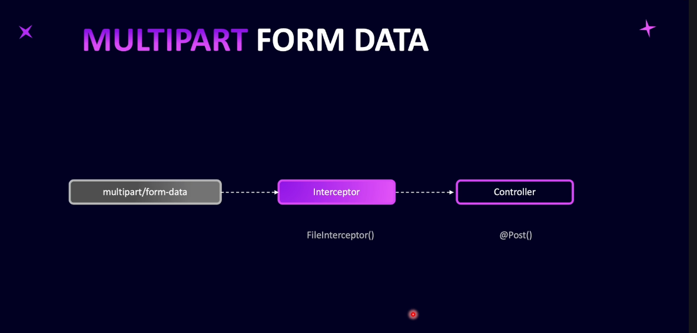
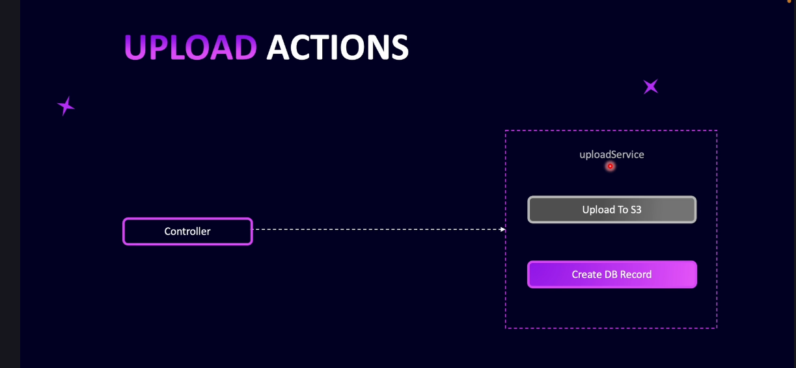
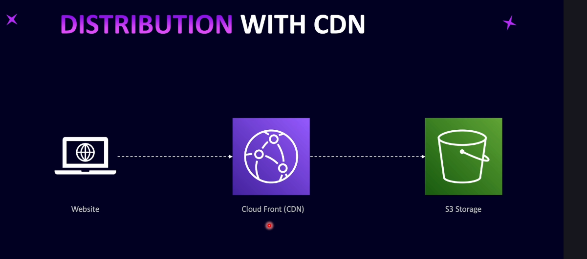

# Step 17 - File Uploads

## Introduction to File Uploads



In this section, you'll learn how to handle file uploads in NestJS. Unlike regular JSON requests, file uploads use the `multipart/form-data` content type. NestJS provides a `FileInterceptor` to help extract files from incoming requests, and a special decorator to access the uploaded file in your controller (similar to how you use `@Body()` for JSON data).



The typical flow is:
- The client sends a POST request with a file using `multipart/form-data`.
- The controller uses the `FileInterceptor` and file decorator to access the uploaded file.
- The file is then uploaded to an Amazon S3 bucket.
- S3 returns a URL for the file, which is often served through Amazon CloudFront (a CDN for faster access).
- Information about the file and its CloudFront URL is saved in your database.

CloudFront helps deliver files quickly to users by caching them in multiple locations around the world, reducing latency and improving user experience.



This section will guide you through each step, from receiving the file in your API to storing and serving it efficiently.

---

## Setup S3 and CloudFront

**Step-by-step:**

1. **Create an S3 Bucket:**
   - Log in to your AWS console and go to the S3 dashboard.
   - Click "Create Bucket", choose a unique name (e.g., `blog-images-nest`), and select your region.
   - Set Object Ownership to "ACLs disabled".
   - Disable "Block all public access" so files can be accessed publicly.
   - Acknowledge the warning and create the bucket.

2. **Set S3 Bucket Policy:**
   - Go to the bucket's "Permissions" tab.
   - Use the Policy Generator to create a policy that allows `s3:GetObject` for everyone (`Principal: *`) on all objects in your bucket (`arn:aws:s3:::your-bucket-name/*`).
   - Paste the generated JSON policy into the Bucket Policy section and save.

3. **Create an IAM User for Uploads:**
   - Go to the IAM dashboard and create a new user (e.g., `nest-blog-images-s3`).
   - Do not enable console access.
   - Attach the following policies:
     - `AmazonS3FullAccess`
     - `IAMUserSSHKeys`
     - `IAMFullAccess`
   - Complete the user creation.

4. **Generate Access Keys:**
   - After creating the user, go to the user details and create a new access key.
   - Choose "Local code" as the use case.
   - Copy the access key and secret; you will use these in your NestJS app to upload files.

5. **Create a CloudFront Distribution:**
   - Go to the CloudFront dashboard and create a new distribution.
   - Set the origin to your S3 bucket.
   - Keep the origin access as public.
   - Use default settings for cache and security.
   - (Optional) Add a custom domain (CNAME) if needed.
   - Create the distribution and copy the distribution domain name for your config.

**Result:**  
You now have an S3 bucket for file storage, an IAM user with upload permissions, and a CloudFront distribution to serve files globally with low latency.

---

## Uploads Module and Configuration

**Steps:**
1. **Install Dependencies:**  
   - Install AWS SDK:  
     ```
     npm install aws-sdk@2.1643.0
     ```
   - Install Multer types for file upload support:  
     ```
     npm install --save-dev @types/multer@1.4.11
     ```

2. **Add Environment Variables:**  
   - In your `.env` file, add:
     ```
     AWS_PUBLIC_BUCKET_NAME=your-bucket-name
     AWS_REGION=your-bucket-region
     AWS_CLOUDFRONT_URL=your-cloudfront-url
     AWS_ACCESS_KEY_ID=your-access-key-id
     AWS_SECRET_ACCESS_KEY=your-secret-access-key
     ```

3. **Update App Config:**  
   - In `src/config/app.config.ts`, add properties for all AWS-related variables, reading from `process.env`.

4. **Configure AWS SDK in main.ts:**  
   - Import `config` from `aws-sdk` and set credentials and region using values from the config service.
   - Example:
     ```typescript
     import { config as awsConfig } from 'aws-sdk';
     // ...get configService from app...
     awsConfig.update({
       credentials: {
         accessKeyId: configService.get(AppConfig.AWS_ACCESS_KEY_ID),
         secretAccessKey: configService.get(AppConfig.AWS_SECRET_ACCESS_KEY),
       },
       region: configService.get(AppConfig.AWS_REGION),
     });
     ```

5. **Generate Uploads Module, Controller, and Service:**  
   - Use NestJS CLI to generate:
     - `uploads` module
     - `uploads` controller
     - `uploads/providers/upload.service.ts` service

**Result:**  
Your NestJS app is now ready to handle file uploads to S3, with all configuration and infrastructure in place.

---

## Create Upload Entity
---
## Upload File Service and Controller
---
## `UploadToAwsProvider`
---
## Complete Uploads Service
---
## Testing File Uploads