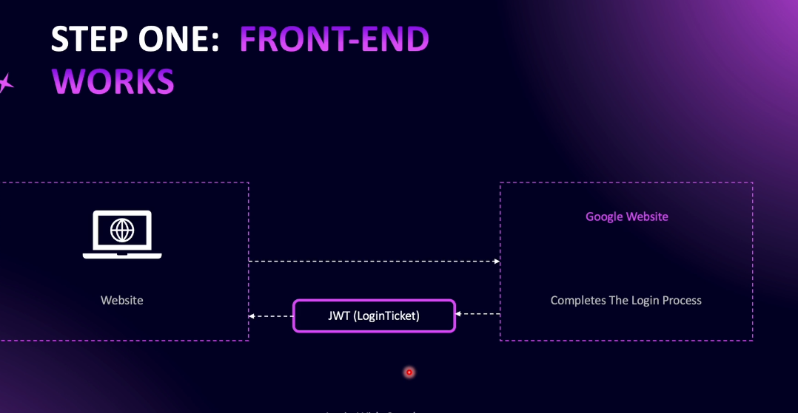
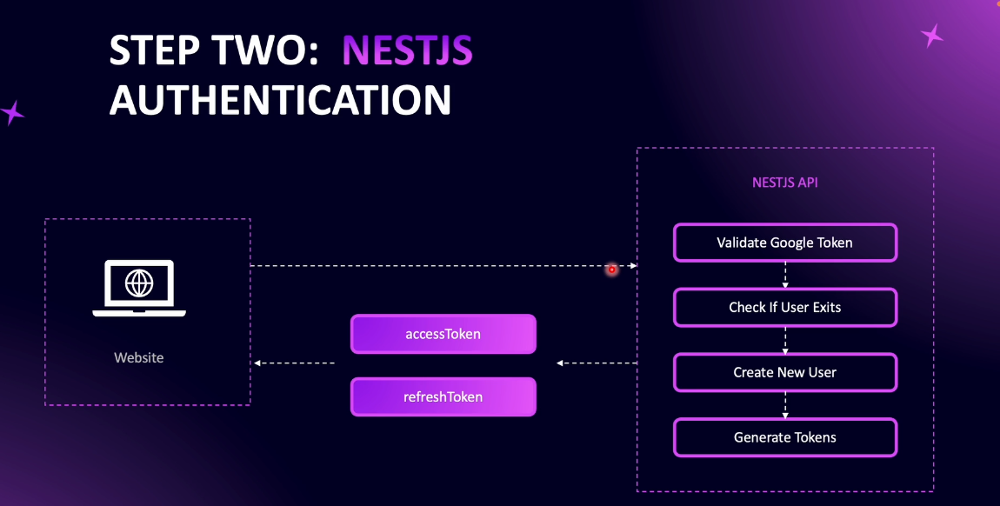

# Step 15 - Google Authentication

## Google Authentication Strategy
**Explanation:**  
Google authentication allows users to sign in to your application using their Google account. The process involves two main steps:


1. **Frontend Initiation:**  
   - The user clicks "Sign in with Google" on your website.
   - The user is redirected to Google's authentication page, logs in, and grants permissions.
   - Google returns a JWT token (login ticket) to your frontend.


2. **Backend Verification:**  
   - The frontend sends the Google JWT token to your NestJS API.
   - The API verifies the token using Google's client ID and secret.
   - If valid, the API checks if the user exists in the database:
     - If not, it creates a new user using the data from the Google token.
     - If yes, it uses the existing user.
   - The API generates and returns access and refresh tokens for the user.

**Benefits:**  
- Users can sign in without creating a new password.
- Secure and familiar authentication flow.
- Integrates seamlessly with your existing token-based authentication.

---

## Create Google Project

**Steps:**
1. Go to [Google Cloud Console](https://console.cloud.google.com) and sign in.
2. Create a new project (e.g., "Nestjs auth").
3. In the sidebar, go to "APIs & Services" > "OAuth consent screen".
   - Select "External" user type.
   - Fill in required fields (app name, support email, developer contact).
   - Add scopes for user info and profile.
   - Add test users (Gmail addresses).
   - Save and continue through the steps.
4. Go to "Credentials" and create new credentials:
   - Choose "OAuth client ID".
   - Select "Web application".
   - Add authorized JavaScript origins (e.g., `http://localhost:3500` and `http://localhost`).
   - Click "Create" to get your client ID and client secret.
5. Save the client ID and secret for use in your application.

**Result:**  
You now have a Google project and OAuth credentials ready for implementing Google authentication in your app.

---

## Setting the Configuration

**Steps:**
1. **Add Environment Variables:**  
   - In your `.env` or environment file, add:
     ```
     GOOGLE_CLIENT_ID=your-google-client-id
     GOOGLE_CLIENT_SECRET=your-google-client-secret
     ```
   - Use the values generated from your Google Cloud project.

2. **Update JWT Config:**  
   - In `src/auth/config/jwt.config.ts`, add:
     ```typescript
     googleClientId: process.env.GOOGLE_CLIENT_ID,
     googleClientSecret: process.env.GOOGLE_CLIENT_SECRET,
     ```

3. **Install Google Auth Library:**  
   - Run:
     ```
     npm install google-auth-library@9.11.0
     ```

4. **Create Controller and Service:**  
   - Use NestJS CLI to generate:
     - `GoogleAuthenticationController` in `auth/social`
     - `GoogleAuthenticationService` in `auth/social/providers`

5. **Create DTO:**  
   - In `auth/social/dtos/google-token.dto.ts`, create:
     ```typescript
     export class GoogleTokenDto {
       @IsNotEmpty()
       token: string;
     }
     ```

6. **Update User Entity:**  
   - Make `password` nullable and optional.
   - Add an optional `googleId` property.

7. **Enable CORS:**  
   - In `main.ts`, call `app.enableCors()` to allow requests from your frontend app.

**Result:**  
Your NestJS app is now configured to support Google authentication and ready for further implementation.

[Code example](https://github.com/NadirBakhsh/nestjs-resources-code/commit/3d93bb7149e2f8f258af322183957bc54731747a)

---

- Initialize Google Auth Client
- Implementation Strategy: Google Authentication
- Implement Authentication with Google Token
- React App in Front-End
- `createGoogleUser` Method
- Complete Google Authentication
- Testing Google Authentication