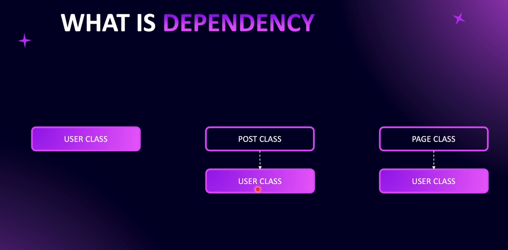
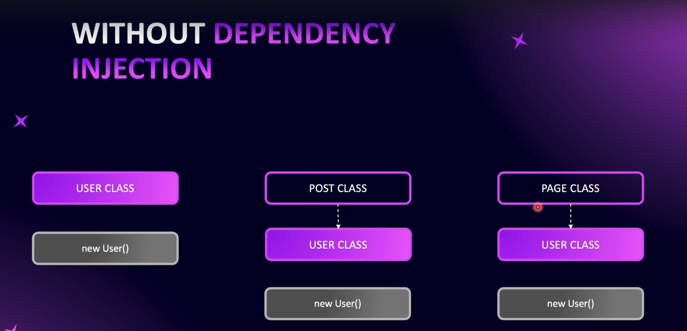
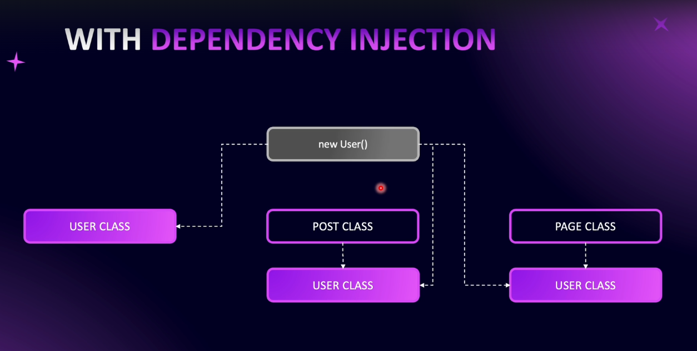
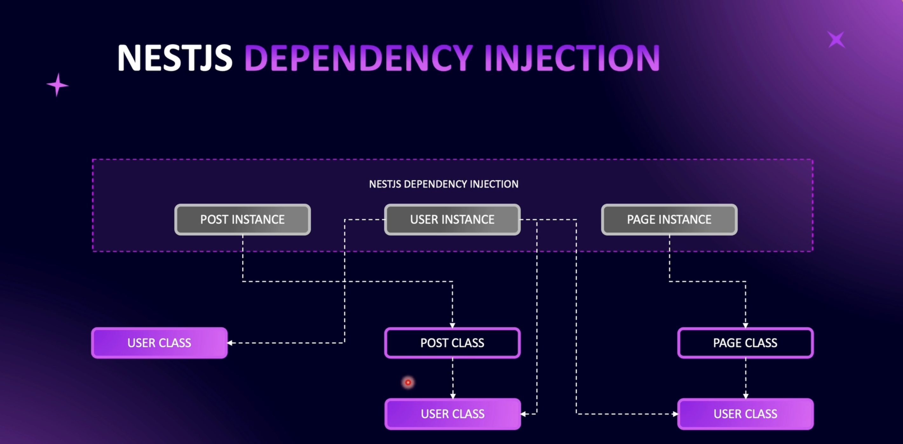
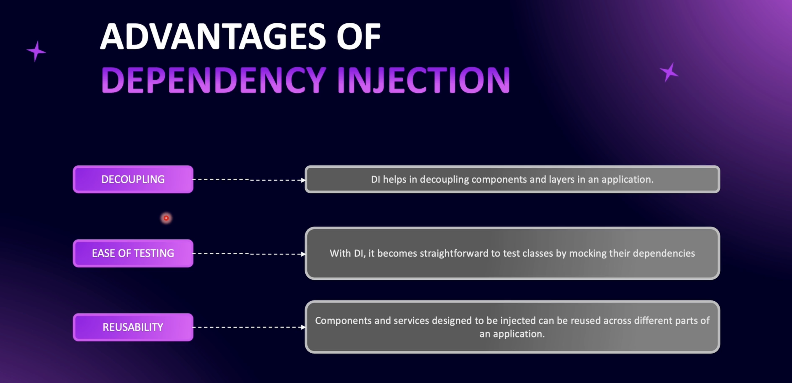
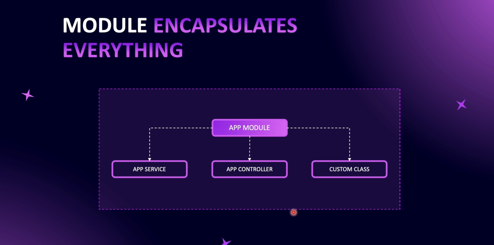
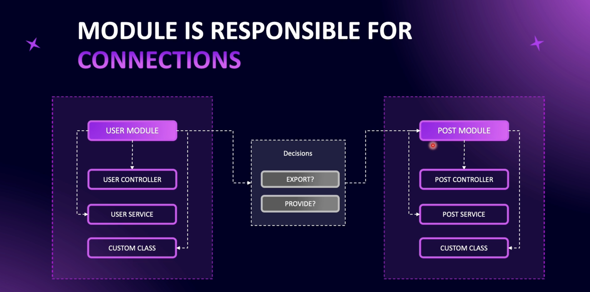
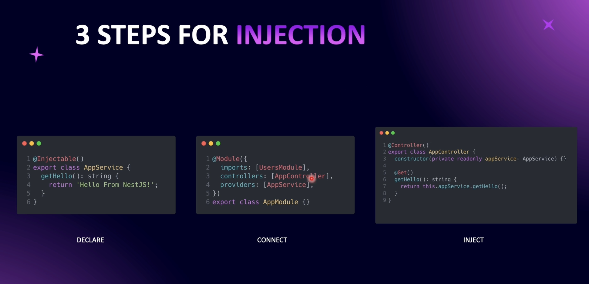

# Step 04 - Dependency Injection

## 1. Introduction to Inversion of Control

Dependency Injection (DI) is one of the most crucial concepts in NestJS, forming the backbone of application architecture. This document explains the basics of DI, how it works in NestJS, and why it is essential for creating scalable and maintainable applications.


- **Dependency Injection:** A design pattern used to manage dependencies by providing them to classes rather than letting the classes instantiate them directly.


- **Inversion of Control (IoC):** Shifts the responsibility of creating and managing dependencies from the class to an external framework or tool (e.g., NestJS).

### What is a Dependency?
**Example:** A User class required by both Post and Page classes to associate posts/pages with a user.
Dependency occurs when one class relies on another class to function.



### Benefits of Dependency Injection

1. **Single Instance:**
   - Dependencies, such as a User instance, are created once and reused across different parts of the application. This promotes efficient memory usage and ensures consistency.

2. **Loose Coupling:**
   - Classes depend on abstractions (interfaces) rather than concrete implementations. This makes it easier to change the implementation of a dependency without affecting the classes that use it.

3. **Simplified Testing:**
   - Dependencies can be replaced with mock objects during testing. This allows for isolated tests and ensures that the behavior of a class can be tested without involving external dependencies.

4. **Efficient Resource Usage:**
   - By reusing existing instances of dependencies, the application conserves resources and reduces overhead associated with creating new objects.

### Code Example



without DI
```typescript
class User {
  constructor() {
      console.log("User was instantiated");
  }
}

class Post {
    private user = new User(); // Creates a new instance
  constructor() {
      console.log("Post class was instantiated");
  }
}

class Page {
    private user = new User(); // Creates another new instance
  constructor() {
      console.log("Page class was instantiated");
  }
}

const post = new Post();
const page = new Page();
```




with DI
```typescript
class User {
    constructor() {
        console.log("User was instantiated");
  }
}

class Post {
    constructor(private user: User) {
        console.log("Post class was instantiated");
  }
}

class Page {
  constructor(private user: User) {
    console.log("Page class was instantiated");
  }
}

const user = new User(); // Single instance created
const post = new Post(user); // Dependency injected
const page = new Page(user); // Dependency injected
```

Dependency injection in NestJS not only simplifies dependency management but also ensures better maintainability, testability, and scalability of applications.

---


## 2. Dependency Injection in NestJS

# Dependency Injection in NestJS


### Understanding Dependency Injection (DI)
Dependency Injection (DI) is the backbone of a NestJS application, making it modular and scalable. It follows the principle of **Inversion of Control (IoC)**, allowing NestJS to manage dependencies and their lifecycle.




### How NestJS Handles Dependency Injection
- NestJS creates a **dependency graph**, determining the order of instantiation.
- Dependencies are instantiated only once (Singleton pattern) and injected where required.
- NestJS ensures that dependent classes (e.g., `Post` and `Page`) do not create multiple instances of `User`, optimizing memory usage.



### Advantages of Dependency Injection
1. **Decoupling of Components**  
   - Dependencies are injected rather than instantiated inside the class.
   - Promotes modularity and flexibility in the application.

2. **Easier Testing**  
   - Allows mocking dependencies for unit tests.
   - Enables testing individual modules without requiring real dependencies.

3. **Reusability**  
   - A single instance of a dependency is shared across multiple modules.
   - Reduces redundant instantiations and improves performance.



### How Modules Manage Dependency Injection
- **Modules encapsulate services and providers**
- **Providers** can be **provided** within the module for internal use.
- **Exports** allow sharing providers with other modules.



### Example: User Module & Post Module
```typescript
@Module({
  providers: [UserService],
  exports: [UserService], // Allows PostModule to use UserService
})
export class UserModule {}

@Module({
  imports: [UserModule],
  providers: [PostService],
})
export class PostModule {}
```



### Steps to Implement Dependency Injection
1. **Declare an Injectable Provider**
   ```typescript
   @Injectable()
   export class AppService {
     getHello(): string {
       return 'Hello World!';
     }
   }
   ```

2. **Register Provider in a Module**
   ```typescript
   @Module({
     providers: [AppService],
   })
   export class AppModule {}
   ```

3. **Inject Provider into a Controller**
   ```typescript
   @Controller()
   export class AppController {
     constructor(private readonly appService: AppService) {}
     
     @Get()
     getHello(): string {
       return this.appService.getHello();
     }
   }
   ```

### Conclusion
- DI in NestJS simplifies module dependencies and improves code maintainability.
- Understanding **Providers, Modules, and Injection** is key to mastering DI.
- As you practice, the concepts will become second nature.

---

## 3. Create a Users Service

### Overview
This guide covers the implementation of Dependency Injection within a module in NestJS. We create a `UsersService` provider and integrate it into the `UsersModule`, making it available for use in the `UsersController`.

### Steps to Implement Dependency Injection

### 1. Create the `UsersService`
- Navigate to the `users` directory.
- Create a new directory named `providers`.
- Inside `providers`, create a file called `users.service.ts`.
- Add the `@Injectable()` decorator to make it a provider.

#### `users.service.ts`
```typescript
import { Injectable } from '@nestjs/common';

@Injectable()
export class UsersService {
  constructor() {}
  
  // Define business logic methods here
}
```

### 2. Connect `UsersService` to `UsersModule`
- Import `UsersService` into `users.module.ts`.
- Add `UsersService` to the `providers` array.

#### `users.module.ts`
```typescript
import { Module } from '@nestjs/common';
import { UsersService } from './providers/users.service';
import { UsersController } from './users.controller';

@Module({
  providers: [UsersService],
  controllers: [UsersController],
})
export class UsersModule {}
```

### 3. Inject `UsersService` into `UsersController`
- Import `UsersService` into `users.controller.ts`.
- Inject it using the constructor.

#### `users.controller.ts`
```typescript
import { Controller } from '@nestjs/common';
import { UsersService } from './providers/users.service';

@Controller('users')
export class UsersController {
  constructor(private readonly usersService: UsersService) {}
  
  // Define routes that utilize usersService methods here
}
```

### Summary
- **Step 1**: Created `UsersService` with `@Injectable()`.
- **Step 2**: Registered `UsersService` in `UsersModule`.
- **Step 3**: Injected `UsersService` into `UsersController`.
- Now, `UsersService` is available in `UsersController` for handling business logic while keeping the controller focused on routing.

---


## 4. findAll Users Method
## 5. findOneById Users Method
## 6. Practice: Create a Posts Module
## 7. Solution: Create a Posts Module
## 8. Types of Dependencies
## 9. Create a GET Posts Route with DTO
## 10. Return Posts From Posts Service
## 11. Use Users Service Inside Posts Service
## 12. Practice: Create an Auth Module
## 13. Solution: Create an Auth Module
## 14. Circular Dependency