# Step 07 - Database Relations


## Relationships in SQL Database


# Relational Database Relationships Overview with TypeORM & NestJS

### 📘 Introduction
In this section, we explore the **types of relationships in relational databases**, and how to define them using **TypeORM** in a **NestJS** application.

### 🔍 Why Use Relational Databases?
Relational databases such as **PostgreSQL** and **MySQL** are powerful systems that manage data through relationships between tables.


### ✅ Key Advantages:
1. **Avoid Data Duplication**  
   - Reduce redundancy by separating data into multiple related tables.
   - Example: Separate tables for `Users`, `Posts`, `Profiles`, etc.

2. **Ensure Data Accuracy**  
   - Enforce column constraints (e.g., data types, required fields).
   - Example: A `timestamp` column will always contain a valid timestamp due to validation rules.

3. **Flexibility & Scalability**  
   - Start with small schemas and grow your database as your application scales.
   - Easy to add more tables and relationships later.


### 🔗 Types of Relationships in Relational Databases
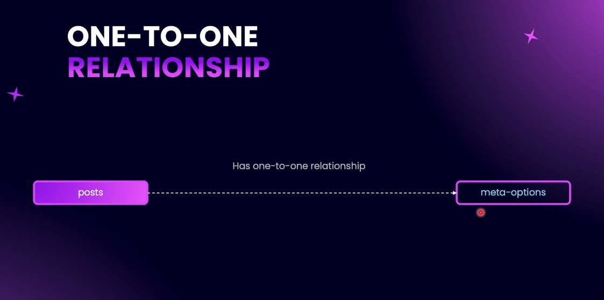

### 1️⃣ One-to-One (1:1)
- Each row in Table A has **only one** related row in Table B and vice versa.
- **Example:** `Post` ⇨ `MetaOptions`
  - Each post has **one meta option** (e.g., JSON settings).
  - Stored in a separate `MetaOptions` table.

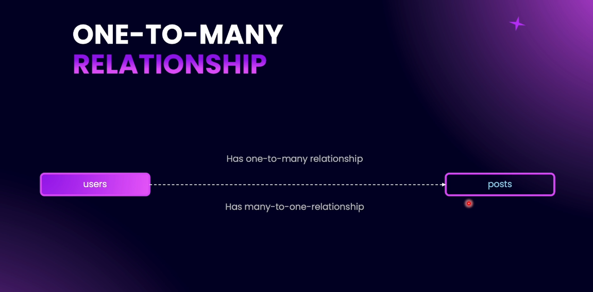
### 2️⃣ One-to-Many (1:N) / Many-to-One (N:1)
- **One-to-Many**: One row in Table A relates to **multiple** rows in Table B.
- **Many-to-One**: Multiple rows in Table B relate back to **one** row in Table A.
- **Example:** `Author` ⇨ `Posts`
  - One author can write multiple posts (1:N).
  - Each post has one author (N:1).

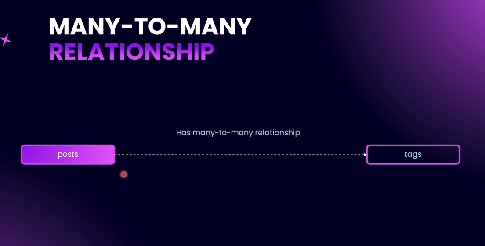
### 3️⃣ Many-to-Many (M:N)
- Multiple rows in Table A relate to multiple rows in Table B.
- **Example:** `Posts` ⇄ `Tags`
  - One post can have many tags (e.g., JavaScript, TypeScript).
  - One tag can be assigned to many posts.

---

### 🛠️ Summary
| Relationship Type | Description                              | Example                    |
|------------------|------------------------------------------|----------------------------|
| One-to-One       | One record in A relates to one in B      | Post ⇨ MetaOptions         |
| One-to-Many      | One record in A relates to many in B     | Author ⇨ Posts             |
| Many-to-One      | Many records in B relate to one in A     | Posts ⇨ Author             |
| Many-to-Many     | Many records in A relate to many in B    | Posts ⇄ Tags               |

---
## 📌 What’s Next
In the upcoming sections, we’ll learn **how to implement each relationship type** using **TypeORM decorators** inside a **NestJS** project.
Stay tuned!

---

## Creating the Tags Entity


#### Files Added/Modified:

1. `src/app.module.ts`
- Registered `TagsModule by file path is not` into the main application module.

2. `src/tags/tag.entity.ts`
- Created `Tag` entity with the following fields:
  - `id`: Primary key
  - `name`: Unique, non-null, max length 256
  - `slug`: Unique, non-null, max length 256
  - `description`: Optional text
  - `schema`: Optional text
  - `featuredImageUrl`: Optional varchar(1024)
  - `createDate`, `updateDate`, `deletedDate`: Timestamps

3. `src/tags/tags.controller.ts`
- Empty controller scaffold for future Tag routes.

4. `src/tags/tags.module.ts`
- Tag feature module created, controller registered.

#### Notes:
- Modular architecture pattern followed.
- Entity includes soft delete support via `DeleteDateColumn`.
- No service or repository layer created yet; controller is also empty.
- Future enhancements expected: CRUD endpoints, DTOs, validation, services.

#### Recommendations:
- Implement `TagsService` for business logic.
- Add input validation via DTOs.
- Add unit tests for the entity schema.

 Code: [View full commit](https://r.1lm.io/p/https://github.com/NadirBakhsh/nestjs-resources-code/commit/eb604d2b49a19fe3b56de4699fc899fc40a0650d)

---
## Creating the Meta Options Entity


## MetaOptions Module

### Description
This module introduces a new `MetaOption` entity designed to store dynamic JSON meta values in the database.

### Entity Structure
| Property     | Type   | Description                     |
|--------------|--------|---------------------------------|
| id           | number | Primary Key                     |
| metaValue    | json   | JSON structured metadata field  |
| createDate   | Date   | Auto timestamp on create        |
| updateDate   | Date   | Auto timestamp on update        |

### Module Structure
- `meta-option.entity.ts`: Entity definition
- `meta-options.controller.ts`: REST Controller (base path: `/meta-options`)
- `meta-options.module.ts`: Module declaration

### Files Added/Updated
- `src/app.module.ts` – Imported `MetaOptionsModule`
- `src/meta-options/meta-option.entity.ts` – Entity class `MetaOption`
- `src/meta-options/meta-options.controller.ts` – Controller definition
- `src/meta-options/meta-options.module.ts` – Module declaration

### Entity Code
```ts
// src/meta-options/meta-option.entity.ts

import {
  Column,
  CreateDateColumn,
  Entity,
  PrimaryGeneratedColumn,
  UpdateDateColumn,
} from 'typeorm';

@Entity()
export class MetaOption {
  @PrimaryGeneratedColumn()
  id: number;

  @Column({
    type: 'json',
    nullable: false,
  })
  metaValue: string;

  @CreateDateColumn()
  createDate: Date;

  @UpdateDateColumn()
  updateDate: Date;
}
```

### Integration
Ensure `MetaOptionsModule` is imported into `AppModule`:

```ts
import { MetaOptionsModule } from './meta-options/meta-options.module';

@Module({
  imports: [MetaOptionsModule, ...]
})
```

---
## Updating DTO Files


### Description
This commit introduces updates and refactors to Data Transfer Object (DTO) structures across multiple modules.

### Files Added/Updated
- `src/meta-options/dtos/createPostMetaOptions.dto.ts` – ➕ New DTO for `metaValue` field validation.
- `src/posts/dtos/createPost.dto.ts` – 🔁 Updated import path for `CreatePostMetaOptionsDto`.
- `src/posts/dtos/createPostMetaOptions.dto.ts` – ❌ Removed duplicate DTO file.
- `src/posts/post.entity.ts` – 🔁 Adjusted import path of DTO.
- `src/tags/dtos/create-tag.dto.ts` – ➕ New tag creation DTO with detailed validations.

### DTO: `CreatePostMetaOptionsDto`
```ts
import { IsJSON, IsNotEmpty } from 'class-validator';

export class CreatePostMetaOptionsDto {
  @IsNotEmpty()
  @IsJSON()
  metaValue: string;
}
```

### DTO: `CreateTagDto`
```ts
import { ApiProperty, ApiPropertyOptional } from '@nestjs/swagger';
import {
  IsJSON,
  IsNotEmpty,
  IsOptional,
  IsString,
  IsUrl,
  Matches,
  MaxLength,
  MinLength
} from 'class-validator';

export class CreateTagDto {
  @ApiProperty()
  @IsString()
  @IsNotEmpty()
  @MinLength(3)
  @MaxLength(256)
  name: string;

  @ApiProperty({
    description: 'Here it is the slug for the blog post',
    example: 'post-url-slug',
  })
  @IsString()
  @IsNotEmpty()
  @MaxLength(256)
  @Matches(/^[A-Za-z0-9]+(?:-[A-Za-z0-9]+)*$/, {
    message: 'Slug must be a valid slug',
  })
  slug: string;

  @ApiPropertyOptional()
  @IsOptional()
  @IsString()
  description?: string;

  @ApiPropertyOptional()
  @IsOptional()
  @IsJSON()
  schema?: string;

  @ApiPropertyOptional()
  @IsOptional()
  @IsUrl()
  @MaxLength(1024)
  featuredImageUrl?: string;
}
```
## DTO Updates Commit Summary

### Commit Ref: [Updating DTO Files](https://github.com/NadirBakhsh/nestjs-resources-code/commit/906a80e5645041d829e534cb7b9d4729952afabf)

---
## Autoloading Entities

### Description
Initial implementation of the MetaOptions module including entity, controller, and module integration.

### Files Added/Updated
- `src/app.module.ts` – Imported `MetaOptionsModule` into AppModule.
- `src/meta-options/meta-option.entity.ts` – New `MetaOption` entity class created.
- `src/meta-options/meta-options.controller.ts` – Basic REST controller with base route `/meta-options`.
- `src/meta-options/meta-options.module.ts` – Declared `MetaOptionsModule` and linked controller.

### Entity Code: `MetaOption`
```ts
import {
  Column,
  CreateDateColumn,
  Entity,
  PrimaryGeneratedColumn,
  UpdateDateColumn,
} from 'typeorm';

@Entity()
export class MetaOption {
  @PrimaryGeneratedColumn()
  id: number;

  @Column({
    type: 'json',
    nullable: false,
  })
  metaValue: string;

  @CreateDateColumn()
  createDate: Date;

  @UpdateDateColumn()
  updateDate: Date;
}
```

### Controller Code: `MetaOptionsController`
```ts
import { Controller } from '@nestjs/common';

@Controller('meta-options')
export class MetaOptionsController {}
```

### Module Code: `MetaOptionsModule`
```ts
import { Module } from '@nestjs/common';
import { MetaOptionsController } from './meta-options.controller';

@Module({
  controllers: [MetaOptionsController],
})
export class MetaOptionsModule {}
```

### Integration Snippet in AppModule
```ts
import { MetaOptionsModule } from './meta-options/meta-options.module';

@Module({
  imports: [MetaOptionsModule, ...],
})
export class AppModule {}
```

### Commit Ref: [Autoloading Entities](https://github.com/NadirBakhsh/nestjs-resources-code/commit/7d0dbfdb4d3dd94893ea0b3fba371fec9209f240)

---

## One to One Relationships

A **1-to-1 (one-to-one)** relationship occurs when **one record in a table is linked to only one record in another table** — and vice versa.

> **Example**: One `Post` has one `MetaOption`, and one `MetaOption` is linked to one `Post`.

### 🔗 How is this Relationship Implemented?
- In a 1-to-1 relationship, **one table’s primary key is used as a foreign key in another table**.
- This foreign key acts as the **link between the two tables**.

#### 📊 Example Schema:

#### `Post` Table
| post_id (PK) | title         | meta_option_id (FK) |
|--------------|---------------|---------------------|
| 1            | Hello World   | 1001                |

#### `MetaOption` Table
| meta_option_id (PK) | seo_title        | canonical_url         |
|---------------------|------------------|------------------------|
| 1001                | Welcome Post     | /welcome-post          |

- `meta_option_id` in `Post` is a **foreign key**, referencing the `meta_option_id` **primary key** in `MetaOption`.


### 📌 Why Use 1-to-1 Relationship?
- When you want to **separate additional information** about an entity (like post metadata) but **keep it tied closely** to the original entity.
- Helps in **data normalization**, improving data organization and clarity.

### 🔄 Direction of Relationships

#### ▶️ Unidirectional:
- Only one side knows about the relationship.
- **Post → MetaOption** (Post knows its MetaOption, but MetaOption doesn’t directly reference Post).

#### 🔁 Bidirectional:
- Both tables reference each other.
- **Post ↔ MetaOption** (Each knows the other — e.g., MetaOption may include a `post_id` back-reference).


### 📌 Summary
| Concept                     | Description                                      |
|----------------------------|--------------------------------------------------|
| Relationship Type          | One-to-One                                       |
| Foreign Key Location       | `meta_option_id` in `Post` references `MetaOption` |
| Cardinality                | One Post → One MetaOption                        |
| Directionality             | Can be Unidirectional or Bidirectional           |

---
## Uni-Directional One to One Relationship

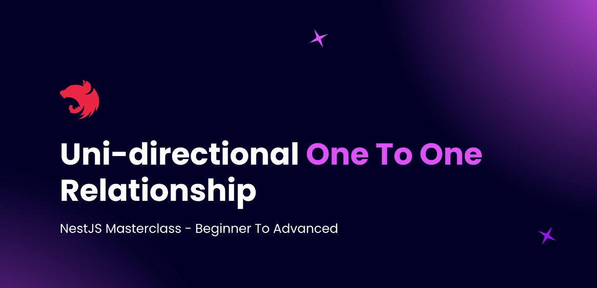


A **Unidirectional One-to-One relationship** in TypeORM is when only one of the entities is aware of the relationship. This means the relationship is defined only in one entity class, and the other entity does not have any reference back to the first entity.


In a **Unidirectional One-to-One**, we use two decorators:
- `@OneToOne(() => TargetEntity)`
- `@JoinColumn()`

`@JoinColumn()` specifies which side owns the relationship and adds the foreign key column in that table.


### GitHub Code Example

#### `post.entity.ts`
```ts
import {
  Column,
  Entity,
  JoinColumn,
  OneToOne,
  PrimaryGeneratedColumn,
} from 'typeorm';
import { postType } from './enums/postType.enum';
import { postStatus } from './enums/postStatus.enum';
import { MetaOption } from 'src/meta-options/meta-option.entity';

@Entity()
export class Post {
  @PrimaryGeneratedColumn()
  id: number;

  @Column()
  title: string;

  @Column()
  content: string;

  @OneToOne(() => MetaOption)
  @JoinColumn() // foreign key created in Post table
  metaOptions?: MetaOption;

  // additional fields
  @Column({ nullable: true })
  publishOn?: Date;

  @Column('simple-array')
  tags: string[];
}
```

#### `meta-option.entity.ts`
```ts
import { Entity, Column, PrimaryGeneratedColumn } from 'typeorm';

@Entity()
export class MetaOption {
  @PrimaryGeneratedColumn()
  id: number;

  @Column()
  seoTitle: string;

  @Column()
  seoDescription: string;
}
```


#### Schema Overview
```
Post Table:
- id (PK)
- title
- content
- metaOptionsId (FK -> MetaOption.id)
- publishOn
- tags

MetaOption Table:
- id (PK)
- seoTitle
- seoDescription
```


## Key Takeaways
- `@JoinColumn()` used only on one side (Post).
- Foreign Key column created in Post table.
- MetaOption entity has no reference to Post (Unidirectional).


## Code Reference:
GitHub Commit Example: [nestjs-resources-code@6ebe58f](https://github.com/NadirBakhsh/nestjs-resources-code/commit/6ebe58feef72d3d9cea52509d91f6e6458045b41)

---

## Creating MetaOptions Service
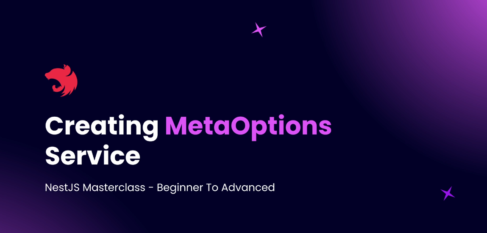

1. meta-options.post.endpoints.http
- 📌 Adds a sample HTTP request for testing the POST /meta-options endpoint.

```http
POST http://localhost:3000/meta-options
Content-Type: application/json

{
  "metaValue": "{\"sidebarEnabled\": true, \"footerActive\": true}"
}
```

2. meta-options.controller.ts

- Imports Body, Post, and DTO.
- Injects MetaOptionsService.
- Defines @Post() endpoint.

```ts
@Post()
public create(@Body() createPostMetaOptionsDto: CreatePostMetaOptionsDto) {
  return this.metaOptionsService.create(createPostMetaOptionsDto);
}
```

3. meta-options.module.ts

- Adds MetaOptionsService as a provider.
- Ensures TypeOrmModule is configured for the MetaOption entity.

```ts
@Module({
  controllers: [MetaOptionsController],
  imports: [TypeOrmModule.forFeature([MetaOption])],
  providers: [MetaOptionsService],
})
export class MetaOptionsModule {}
```

4. providers/meta-options.service.ts

- Implements MetaOptionsService with a create() method.
- Uses TypeORM Repository to persist MetaOption entities.

```ts
@Injectable()
export class MetaOptionsService {
  constructor(
    @InjectRepository(MetaOption)
    private readonly metaOptionRepository: Repository<MetaOption>,
  ) {}

  public async create(createPostMetaOptionsDto: CreatePostMetaOptionsDto) {
    const metaOption = this.metaOptionRepository.create(createPostMetaOptionsDto);
    return await this.metaOptionRepository.save(metaOption);
  }
}
```

code reference: [GitHub Commit Example](https://github.com/NadirBakhsh/nestjs-resources-code/commit/2c095a4f1e736d80b2b769ab3244c68c580aae8c)

---
## Creating Post with Relationships

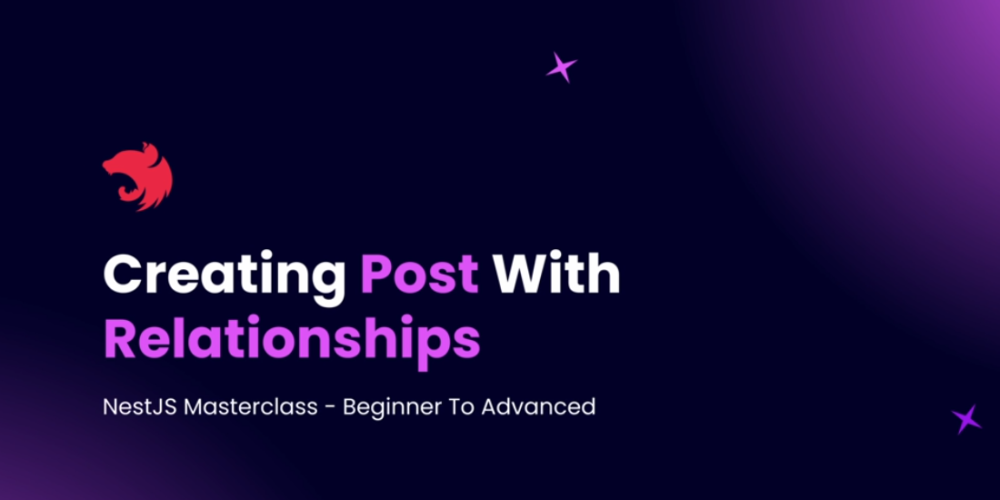

### 📦 Changes Overview

#### 1. **DTO Modification**
- Updated `CreatePostDto`:
  - Replaced `metaOptions` array of objects with a single `metavalue` JSON object.
  - Type changed to `object`, documented as a JSON string.
  - Simplified the schema example.

#### 2. **Controller Update**
- `PostsController.createPost()`:
  - Removed debug `console.log`.
  - Delegates logic to `PostsService.create()`.

#### 3. **Service Logic Enhancement**
- `PostsService.create()`:
  - Handles both `Post` and `MetaOption` creation.
  - Saves meta options (if provided), then attaches them to the new post.
  - Returns the saved post with relationships.

#### 4. **Entity Injection**
- Injected `MetaOption` repository using `@InjectRepository`.
- Updated `PostsModule` to include `MetaOption` in `TypeOrmModule.forFeature`.

---

### ⚙️ Technical Benefits

- Enables relational data handling (`Post` + `MetaOption`) in a single API call.
- Clean and modular NestJS service structure.
- Prepares DTO for flexible `metaOptions` usage via JSON.

---

### 📎 Related Files Modified

- `createPost.dto.ts`
- `posts.controller.ts`
- `posts.service.ts`
- `posts.module.ts`
- Sample payload updated in comments

### 🔗 [View Commit on GitHub](https://github.com/NadirBakhsh/nestjs-resources-code/commit/ac9260f8f674fd2141182a30e23f1b5828d8cbf3)


---
## Cascade Creation with Relationships

### What is Cascade in TypeORM?

**Cascade** is a feature in TypeORM (and relational databases) that allows related entities to be automatically persisted, updated, or removed when you perform these actions on the parent entity. This is especially useful for relationships like One-to-One or One-to-Many, where you want to create or update related records in a single operation.

### Why Use Cascade?

- **Simplifies code:** You don't need to manually save related entities before saving the parent.
- **Reduces dependencies:** No need to inject or use multiple repositories for related entities.
- **Keeps logic clean:** All related data is handled together, making your service methods shorter and easier to test.

### How to Enable Cascade

To enable cascade, add the `cascade` option to your relationship decorator (e.g., `@OneToOne`, `@OneToMany`).  
You can set `cascade: true` for all operations, or specify an array of actions (`['insert', 'update', 'remove', 'soft-remove', 'recover']`).

**Example:**

```ts
@OneToOne(() => MetaOption, { cascade: true })
@JoinColumn()
metaOptions?: MetaOption;
```

Or for specific actions:

```ts
@OneToOne(() => MetaOption, { cascade: ['insert', 'remove'] })
@JoinColumn()
metaOptions?: MetaOption;
```

### How It Works

With cascade enabled, you can include the related entity directly in your DTO or object graph when saving:

```ts
// In your service:
const post = this.postRepository.create({
  title: 'My Post',
  content: '...',
  metaOptions: {
    metaValue: '{"sidebarEnabled": true, "footerActive": true}',
  },
});
await this.postRepository.save(post);
// Both Post and MetaOption are created in one operation!
```

### Benefits

- **Single save operation**: Both the main entity and its related entities are created/updated together.
- **No manual repository calls**: No need to separately create and link related entities.
- **Cleaner tests and code**: Fewer dependencies and less boilerplate.

### Key Points

- Cascade can be enabled for all or specific actions.
- Use cascade to simplify creation, update, and deletion of related entities.
- Especially useful for tightly-coupled relationships (e.g., Post and MetaOption).

Code reference: [GitHub Commit Example](https://github.com/NadirBakhsh/nestjs-resources-code/commit/ee3bbbf84b024b5481e9b3633eae6f316095f696))

---

## Querying with Eager Loading

When working with related entities in TypeORM, you often want to fetch not just the main entity (e.g., `Post`), but also its related data (e.g., `MetaOption`). There are two main ways to achieve this:

### 1. Using the `relations` Option in Repository Methods

You can specify which relationships to load by passing a `relations` object to methods like `find` or `findOne`. For example:

```ts
// In your PostsService
async findAll() {
  return this.postRepository.find({
    relations: {
      metaOptions: true, // loads the related MetaOption for each Post
    },
  });
}
```

This will return all posts, each with its associated `metaOptions` property populated (or `null` if not present).

### 2. Using Eager Loading in the Entity

You can set a relationship to be loaded automatically every time the entity is fetched by adding `eager: true` to the relationship decorator in your entity:

```ts
@OneToOne(() => MetaOption, { cascade: true, eager: true })
@JoinColumn()
metaOptions?: MetaOption;
```

With `eager: true`, you don't need to specify `relations` in your queries—TypeORM will always include the related entity.

### When to Use Each Approach

- Use the `relations` option when you want to control relationship loading per-query.
- Use `eager: true` when you always want the relationship loaded with the entity.

**Note:** If you set `eager: true`, you cannot override this behavior per-query.

### Example

- Fetching all posts with their meta options using the `relations` option:

  ```ts
  const posts = await this.postRepository.find({ relations: { metaOptions: true } });
  ```

- Or, if `eager: true` is set in the entity, simply:

  ```ts
  const posts = await this.postRepository.find();
  ```

In both cases, the returned posts will include their related meta options.

code reference: [GitHub Commit Example](https://github.com/NadirBakhsh/nestjs-resources-code/commit/495b11fc0142f6cc597154e60a7013e5696fb12b)

---
## Deleting Related Entities

When working with a **unidirectional one-to-one relationship** (e.g., `Post` → `MetaOption`), you cannot use cascade delete out-of-the-box. Instead, you must perform a **sequential deletion**:

### Steps for Sequential Deletion

1. **Find the Post**  
   Retrieve the post by its ID to ensure it exists and to get the related `metaOptions` ID.

2. **Delete the Post First**  
   Delete the post entry. This is necessary because the post table holds the foreign key to `metaOptions`. Deleting the meta option first would violate the foreign key constraint.

3. **Delete the Related MetaOption**  
   After the post is deleted, delete the associated meta option using its ID.

4. **Return Confirmation**  
   Respond with a confirmation message (e.g., `{ deleted: true, id }`).

### Example Service Method

```ts
// In your PostsService
public async delete(id: number) {
  // Step 1: Find the post (and get metaOptions id)
  const post = await this.postRepository.findOneBy({ id });
  // Step 2: Delete the post
  await this.postRepository.delete(id);
  // Step 3: Delete the related meta option
  await this.metaOptionsRepository.delete(post.metaOptions.id);
  // Step 4: Return confirmation
  return { deleted: true, id };
}
```

### Example Controller Endpoint

```ts
// In your PostsController
@Delete()
public deletePost(
  @Query('id', ParseIntPipe) id: number,
) {
  return this.postsService.delete(id);
}
```

- The `@Query('id', ParseIntPipe)` ensures the `id` is received as a number from the query string.

### Why This Order?

- **Foreign key constraint:** The post table references the meta option. You must delete the post first to avoid constraint errors.

### Note

- This approach is needed only for unidirectional relationships without cascade delete.
- Exception handling (e.g., if the post does not exist) should be added for production code.

code reference: [GitHub Commit Example](https://github.com/NadirBakhsh/nestjs-resources-code/commit/de732373a98220f8aabddb8df5b723e8f43ba887)
---

## Bi-Directional One to One Relationship

In TypeORM, you can define both **unidirectional** and **bidirectional** relationships.  
A **unidirectional** relationship is when only one entity (e.g., `Post`) knows about the other (`MetaOption`).  
A **bidirectional** relationship is when both entities reference each other.

### How Bidirectional One-to-One Works

- The foreign key still resides in the table where you use the `@JoinColumn()` decorator.
- You can choose which entity holds the foreign key by placing `@JoinColumn()` on that side.
- In a bidirectional relationship, both entities have a property referencing the other, and both use relationship decorators.

### Example

Suppose you want `Post` and `MetaOption` to reference each other:

```ts
// post.entity.ts
@OneToOne(() => MetaOption, metaOption => metaOption.post, { cascade: true })
@JoinColumn()
metaOptions: MetaOption;

// meta-option.entity.ts
@OneToOne(() => Post, post => post.metaOptions)
post: Post;
```

- Here, `Post` holds the foreign key (because of `@JoinColumn()`).
- You can now fetch a post and get its meta options, or fetch a meta option and get its post.

### Why Use Bidirectional Relationships?

- Enables navigation from both sides:  
  - Fetch a post and its meta options.
  - Fetch a meta option and its post.
- Allows for cascade operations (like cascade delete) from either side.
- Useful when you need to query or operate from both entities.

### Foreign Key Placement

- The foreign key is always in the entity where `@JoinColumn()` is used.
- If you want the foreign key in `MetaOption`, use `@JoinColumn()` in `MetaOption` instead.

### Summary

- Bidirectional relationships provide more flexibility for querying and cascading.
- Both entities reference each other, but the foreign key is only in one table.
- Enables features like cascade delete and easier navigation in both directions.

[GitHub Commit Example](https://github.com/NadirBakhsh/nestjs-resources-code/commit/69ecd0643833e5e0428e39947eda4e7a9d01951f)

---
## Cascade Delete With Bi-Directional Relationship

With a **bi-directional one-to-one relationship** in TypeORM, you can enable true cascade delete—so that deleting a parent entity (like `Post`) will automatically delete its related entity (like `MetaOption`) in a single operation.

### How Does It Work?

- **Foreign Key Placement:**  
  For cascade delete to work from `Post` to `MetaOption`, the foreign key must be in the `MetaOption` table. This is achieved by placing the `@JoinColumn()` decorator on the `MetaOption` entity's relationship property.

- **Entity Setup Example:**

  ```ts
  // post.entity.ts
  @OneToOne(() => MetaOption, metaOption => metaOption.post)
  metaOptions: MetaOption;

  // meta-option.entity.ts
  @OneToOne(() => Post, post => post.metaOptions, { onDelete: 'CASCADE' })
  @JoinColumn()
  post: Post;
  ```

  - Here, `MetaOption` holds the foreign key to `Post` and specifies `onDelete: 'CASCADE'`.

### What Changes in Practice?

- **No More Manual Deletion:**  
  You no longer need to manually delete the related `MetaOption` after deleting a `Post`. TypeORM and the database will handle it for you.

- **Simplified Service Code:**  
  Your delete method in the service can simply delete the post by ID:

  ```ts
  // In your PostsService
  async delete(id: number) {
    await this.postRepository.delete(id);
    return { deleted: true, id };
  }
  ```

- **Automatic Cleanup:**  
  When you delete a post, the related meta option is automatically deleted due to the cascade rule.

### Why Is the Foreign Key Placement Important?

- If the foreign key is in the `Post` table, you cannot delete the post first (because of the foreign key constraint).
- By moving the foreign key to the `MetaOption` table, you can safely delete the post, and the database will automatically delete the related meta option.

### Summary

- **Cascade delete** in a one-to-one relationship is possible when the foreign key is on the dependent entity (here, `MetaOption`).
- Use `@JoinColumn()` and `onDelete: 'CASCADE'` on the dependent entity's relationship property.
- This setup allows you to delete a post and have its meta option automatically deleted, reducing code and preventing orphaned records.

[GitHub Commit Example](https://github.com/NadirBakhsh/nestjs-resources-code/commit/69ecd0643833e5e0428e39947eda4e7a9d01951f)

---
## One to Many Relationships

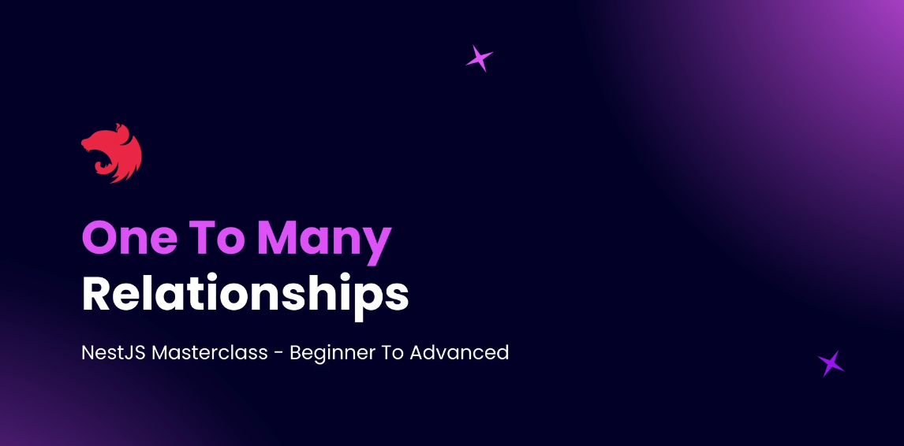

---

## Theoretical Overview: One-to-Many & Many-to-One Relationships

When modeling relational data, **One-to-Many** and **Many-to-One** relationships are among the most common patterns.

### Example Entities

- **User** (author)
- **Post**

#### Relationship Explanation

- **User → Post (One-to-Many):**  
  A single user can author multiple posts.
- **Post → User (Many-to-One):**  
  Each post is authored by exactly one user.

#### Bidirectional Nature

- In practice, One-to-Many and Many-to-One are typically modeled as a **bidirectional relationship**:
  - The "many" side (e.g., `Post`) references the "one" side (e.g., `User`) with a foreign key.
  - The "one" side (e.g., `User`) can have a collection of the "many" side (e.g., an array of `Post`).

#### Foreign Key Placement

- The **foreign key always resides on the "many" side** (here, the `Post` entity).
- This means the `Post` table will have a `userId` (or similar) column referencing the `User` table.

#### Decorators in TypeORM

- **Many-to-One:**  
  Defined on the "many" side (e.g., `Post`), and this is where the foreign key is created.
- **One-to-Many:**  
  Defined on the "one" side (e.g., `User`), referencing the collection of the "many" side.
- **@JoinColumn:**  
  Not required for Many-to-One/One-to-Many; TypeORM automatically manages the foreign key on the "many" side.

#### Unidirectional vs. Bidirectional

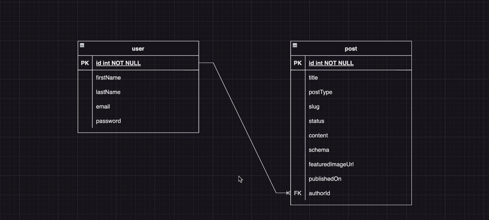

- You can define only a Many-to-One relationship (unidirectional), but in most cases, both sides are defined for easier navigation and querying (bidirectional).

---

## Creating One to Many Relationship


### Creating One to Many Relationship

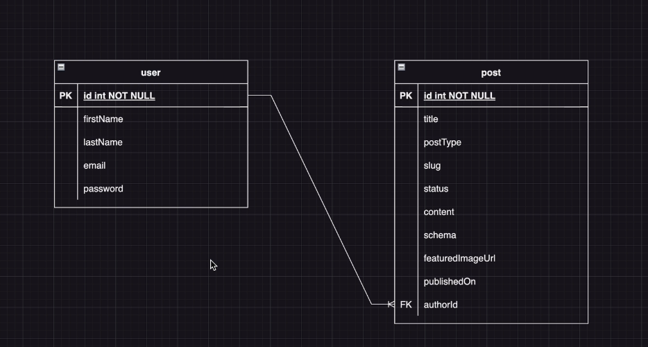

In this section, we're going to create a one to many relationship between the user and the post entity.  A user can have multiple posts, and each post is associated with a user.  So let's start by opening the user entity first.  And over here I'm going to add a new property.  Let's call this property as posts because one user can have multiple posts.  And in this case the type of this property is going to be an array of posts.  So we import this post entity and we say that posts is an array of posts.

@OneToMany(() => Post, post => post.author)
posts: Post[];

code example: [Creating One To Many Relationship](https://github.com/NadirBakhsh/nestjs-resources-code/commit/ae4d811231327d9accc0344762beeeed19921f15)

---

## Create Post with Author


To implement the process of creating a new post and assigning an author using a one-to-many relationship, follow these steps:

### Step 1: Update the CreatePost DTO

In your `CreatePostDto`, add an `authorId` property to accept the ID of the author:

```typescript
import { IsInt, IsNotEmpty, ApiProperty } from 'class-validator';

export class CreatePostDto {
  @IsNotEmpty()
  @IsInt()
  @ApiProperty({
    type: 'integer',
    required: true,
    example: 1,
  })
  authorId: number;

  // other properties...
}
```

### Step 2: Update the UserService

Use `UserService` to find the author by ID:

```typescript
// user.service.ts
import { Injectable } from '@nestjs/common';
import { InjectRepository } from '@nestjs/typeorm';
import { Repository } from 'typeorm';
import { User } from './user.entity';

@Injectable()
export class UserService {
  constructor(
    @InjectRepository(User)
    private usersRepository: Repository<User>,
  ) {}

  async findOneById(id: number): Promise<User> {
    return await this.usersRepository.findOneBy({ id });
  }
}
```

### Step 3: Inject UserService in PostService

Inject `UserService` in `PostService` to use it for assigning the author:

```typescript
// post.service.ts
import { Injectable } from '@nestjs/common';
import { InjectRepository } from '@nestjs/typeorm';
import { Repository } from 'typeorm';
import { Post } from './post.entity';
import { CreatePostDto } from './dtos/create-post.dto';
import { UserService } from '../users/user.service';

@Injectable()
export class PostService {
  constructor(
    @InjectRepository(Post)
    private postsRepository: Repository<Post>,
    private userService: UserService,
  ) {}

  async create(createPostDto: CreatePostDto): Promise<Post> {
    const author = await this.userService.findOneById(createPostDto.authorId);
    const post = this.postsRepository.create({
      ...createPostDto,
      author,
    });

    return await this.postsRepository.save(post);
  }
}
```

### Step 4: Verify the Relationship

Ensure that the user exists in the database (e.g., John Doe with `ID=1`) and test creating a post with this user as the author.

### Example Usage

To create a new post with `authorId`:

```json
{
  "title": "My New Post",
  "content": "This is the content of the post.",
  "authorId": 1
}
```

This setup will create a post with the specified author, utilizing the one-to-many and many-to-one relationship between the `Post` and `User` entities in the database.


[GitHub Commit Example](https://github.com/NadirBakhsh/nestjs-resources-code/commit/a6eba4a9a2d480c7ef4af61a01a9929aa576947f)

---
## Eager Loading Author
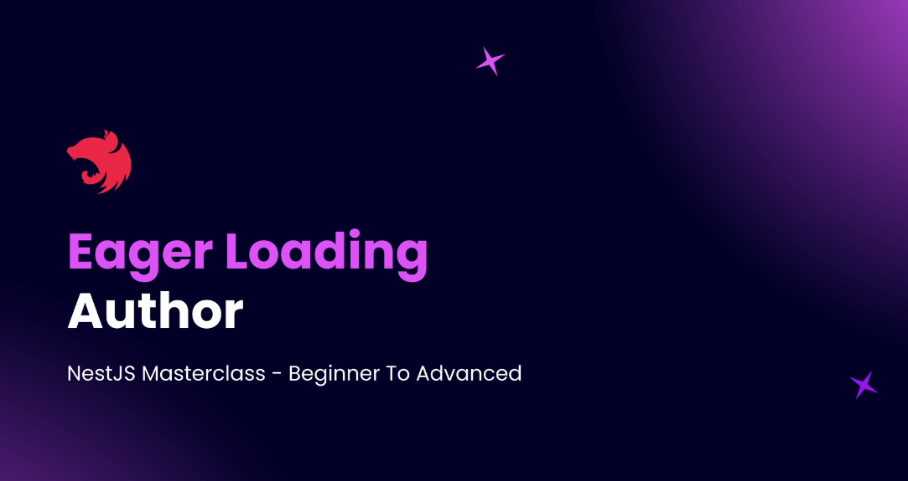

---

## Querying Data with One-to-One and One-to-Many Relationships

When querying data with related entities (such as `Post` with its `author` or `metaOptions`), you have two main options in TypeORM:

### 1. Using the `relations` Option in Repository Methods

You can specify which relationships to load by passing a `relations` object to methods like `find` or `findOne`.  
For example, to fetch posts with both `metaOptions` and `author`:

```typescript
// In your PostsService
async findAll() {
  return this.postRepository.find({
    relations: {
      metaOptions: true,
      author: true, // key must match the property name in your entity
    },
  });
}
```

This will return all posts, each with its associated `metaOptions` and `author` properties populated.

### 2. Using Eager Loading in the Entity

You can set a relationship to be loaded automatically every time the entity is fetched by adding `eager: true` to the relationship decorator in your entity:

```typescript
@OneToOne(() => MetaOption, { eager: true })
@JoinColumn()
metaOptions: MetaOption;

@ManyToOne(() => User, user => user.posts, { eager: true })
author: User;
```

With `eager: true`, you don't need to specify `relations` in your queries—TypeORM will always include the related entity.

### When to Use Each Approach

- Use the `relations` option for **per-query flexibility** (choose which relationships to load).
- Use `eager: true` for **automatic loading** (always fetch the related entity).

**Note:** The property name in the `relations` object must match the property defined in your entity.

[Eager Loading Author code example](https://github.com/NadirBakhsh/nestjs-resources-code/commit/8311db44fe5db188e5677be43819f4ecd9009b18)

---

## Many to Many Relationships

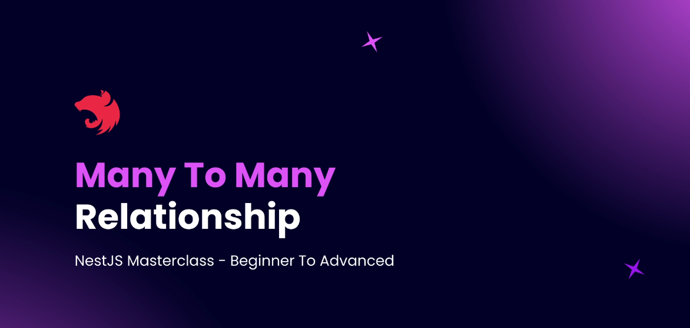

---

## Theoretical Overview: Many-to-Many Relationships

A **many-to-many relationship** occurs when multiple records in one table are associated with multiple records in another table.

### Example Scenario

- **Post** entity
- **Tag** entity

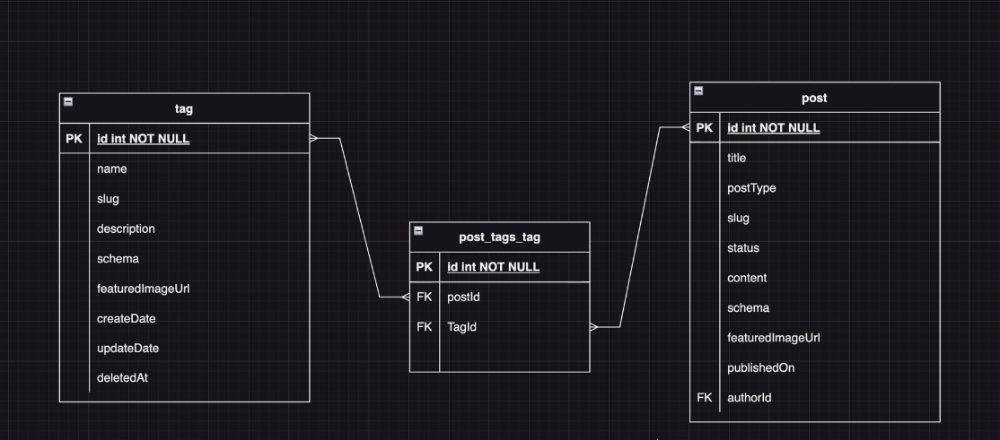

Each **Post** can have multiple **Tags** (e.g., JavaScript, TypeScript), and each **Tag** can be assigned to multiple **Posts**.

### How is it Implemented in SQL?

- You cannot store all foreign keys directly in either table.
- Instead, a **junction table** (also called a join table or pivot table) is created.
- The junction table contains two columns:
  - One referencing the primary key of the **Post**
  - One referencing the primary key of the **Tag**
- Each row in the junction table represents a relationship between a post and a tag.

### How is it Modeled in TypeORM?

- Use the `@ManyToMany` decorator in your entity classes.
- TypeORM will automatically create the junction table for you.
- You can define the relationship as **unidirectional** (only one entity knows about the relationship) or **bidirectional** (both entities reference each other).

### Summary

- Many-to-many relationships require a separate junction table to store associations.
- Both entities can have collections referencing each other.
- TypeORM provides decorators to easily define and manage these relationships.

From the next sections, you'll see practical implementations of both unidirectional and bidirectional many-to-many relationships between `Post` and `Tag`.

---

## Practice: Service to Create Tags


We already have a tags module and we have created the tag entity as well as a tag DTO.

So if you look inside this particular tags directory we have a create tag DTO in place.

And we also have this tag entity.

Now what I want you to do is based on this tag entity as well as the tag DTO.

I want you to go ahead and create a new tag service.

There has to be a method inside this tag service, which is a create method that lets you create new

tags and insert them into the database.

Also, update your controller over here to add a post method for the tag.

So we need to have a post endpoint where we can use that particular endpoint in order to create tags

inside our application.


---
## Solution: TagsService
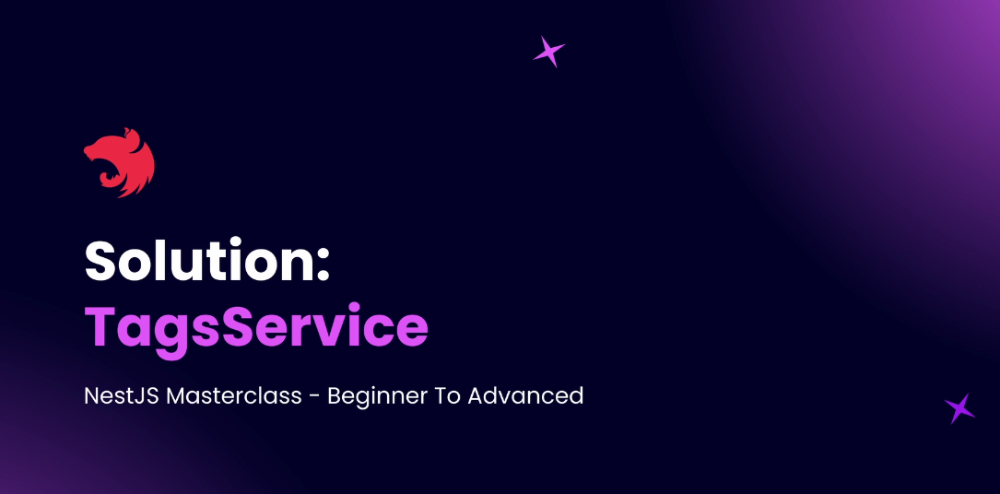

please check out the github code example
[ GitHub code example ](https://github.com/NadirBakhsh/nestjs-resources-code/commit/8311db44fe5db188e5677be43819f4ecd9009b18)

---
## Testing Tags Service


Testing: http://localhost:3000/tags

[code example](https://github.com/NadirBakhsh/nestjs-resources-code/commit/b4994a11e2d4ce16416ef53caeaf253e03517fe6)

---

## Unidirectional Many-to-Many Relationship


### Overview

This document explains how to establish a **unidirectional many-to-many relationship** between a `Post` entity and a `Tag` entity using **TypeORM** with **NestJS**.

We assume `Tag` is already defined as a separate entity with its own module, service, and controller, and one or more tags already exist in the database.

---

### Step-by-Step Implementation

#### 1. **Update Post Entity**

**File: `post.entity.ts`**

```ts
import { Entity, PrimaryGeneratedColumn, Column, ManyToMany, JoinTable } from 'typeorm';
import { Tag } from '../../tags/entities/tag.entity';

@Entity('posts')
export class Post {
  @PrimaryGeneratedColumn()
  id: number;

  // ... other columns

  @ManyToMany(() => Tag)
  @JoinTable()
  tags: Tag[];
}
```

#### 2. **Update DTO: `CreatePostDto`**

**File: `create-post.dto.ts`**

```ts
import { IsArray, IsInt, IsOptional } from 'class-validator';
import { ApiProperty } from '@nestjs/swagger';

export class CreatePostDto {
  // ... other properties

  @IsOptional()
  @IsArray()
  @IsInt({ each: true })
  @ApiProperty({ example: [1, 2], description: 'Array of IDs of tags' })
  tags?: number[];
}
```

#### 3. **Implement TagService Method**

**File: `tag.service.ts`**

```ts
import { In } from 'typeorm';

async findMultipleTags(tagIds: number[]): Promise<Tag[]> {
  return await this.tagsRepository.find({
    where: { id: In(tagIds) },
  });
}
```

#### 4. **Inject TagService into PostService**

#### Update `post.module.ts`

```ts
@Module({
  imports: [TypeOrmModule.forFeature([Post]), TagModule],
  providers: [PostService],
  controllers: [PostController],
})
export class PostModule {}
```

#### Update `post.service.ts`

```ts
@Injectable()
export class PostService {
  constructor(
    @InjectRepository(Post)
    private readonly postRepository: Repository<Post>,
    private readonly tagService: TagService,
  ) {}

  async create(createPostDto: CreatePostDto): Promise<Post> {
    const tags = await this.tagService.findMultipleTags(createPostDto.tags || []);

    const post = this.postRepository.create({
      ...createPostDto,
      tags,
    });

    return await this.postRepository.save(post);
  }
}
```

#### 5. **Export TagService from TagModule**

**File: `tag.module.ts`**

```ts
@Module({
  imports: [TypeOrmModule.forFeature([Tag])],
  providers: [TagService],
  controllers: [TagController],
  exports: [TagService],
})
export class TagModule {}
```

#### 6. **Example Request**

Send a POST request to `/posts` endpoint:

```json
{
  "title": "NestJS with Tags",
  "slug": "nestjs-tags",
  "tags": [1, 2]
}
```

#### 7. **Database Changes**

* A join table `post_tags_tag` is automatically created by TypeORM.
* This join table holds the relationship between `postId` and `tagId`.

#### 8. **Verify with PGAdmin or Query**

```sql
SELECT * FROM post_tags_tag;
```

This will show rows like:

```
postId | tagId
----------------
7      | 1
```

---

### Summary

* Unidirectional many-to-many relation is defined **only** on the `Post` entity.
* `@ManyToMany(() => Tag)` with `@JoinTable()` on `Post` side.
* DTO changed to accept tag IDs.
* Helper method in TagService to find tags by ID.
* Dependency injected via TagModule export.
* A join table auto-created by TypeORM to store relations.

---

### Next Steps

* Implement bidirectional relation (if tag needs to access posts).
* Add unit tests for `create` logic.
* Add validation for tag existence or duplicate prevention.

[Code example Github](https://github.com/NadirBakhsh/nestjs-resources-code/commit/27de40005e5e5c2e60fe0f56a35a2d9ab87fbe6f)

---
## Querying Many to Many Relationship

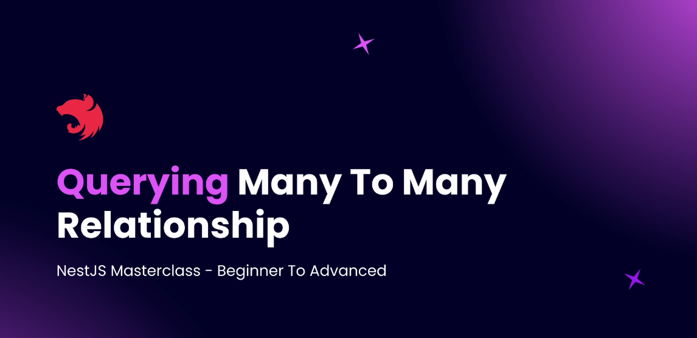

## 📌 Fetching Many-to-Many `Tags` in Posts (TypeORM)

In this application, `Post` and `Tag` entities have a **many-to-many** relationship. However, by default, when fetching posts from the database, related `tags` are **not included**.

---

### 🔍 Problem

When querying posts (e.g., via `posts.get.ts`), only `meta` and `author` fields are returned — the `tags` are missing from the result.

---

### ✅ Solution: Two Ways to Include `Tags`

We can fetch the associated `tags` using **either** of the following methods:

---

### 1. 🔗 Define `relations` in the Service Method

In `post.service.ts`, update the `findAll()` method:

```ts
this.postRepository.find({
  relations: {
    author: true,
    meta: true,
    tags: true // ✅ Include tags here
  }
});
```

- The key tags must match the property name in the Post entity.
- Use this when you want more explicit control over which relations to fetch.

2. 🚀 Use Eager Loading in the Entity
In post.entity.ts, update the relation definition to always load tags:

```ts
@ManyToMany(() => Tag, (tag) => tag.posts, { eager: true })
@JoinTable()
tags: Tag[];
```

- This makes TypeORM always include tags when querying posts.
- Recommended if tags are frequently required with posts.

### Which One Should You Use?
Use eager loading for fields that are almost always needed.
Use explicit relations for better control and optimized queries when tags are not always necessary.

[Code example Github](https://github.com/NadirBakhsh/nestjs-resources-code/commit/2461cbbddbd86f7a6bbebc97180e9523793e9843)

---
## Updating Post with New Tags

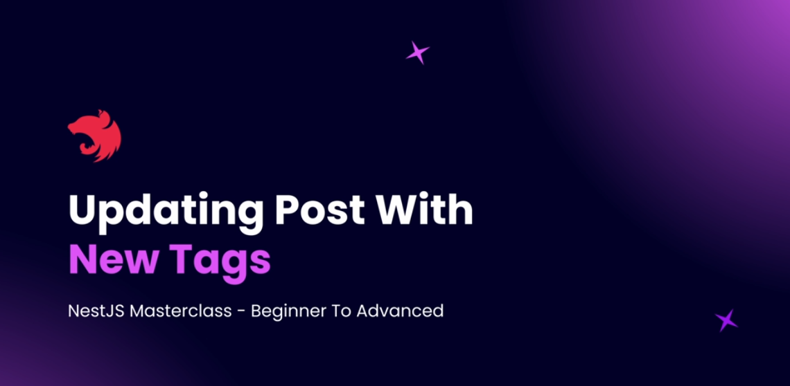


### Updating a Unidirectional Many-to-Many Relationship in NestJS (TypeORM)

This section demonstrates how to update a Post entity along with its associated Tags using a unidirectional many-to-many relationship with TypeORM in a NestJS application.

🔄 Update Flow
1. Receive PatchPostDto
PatchPostDto extends CreatePostDto partially with an added id field. It allows updating scalar properties and tag relationships.

2. Fetch Tags from DB

```ts
const tags = await this.tagService.findMultipleTags(patchPostDto.tags);
```

3. Find the Existing Post

```ts
const post = await this.postRepository.findOneBy({ id: patchPostDto.id });
```

4. Update Scalar Properties

```ts
post.title = patchPostDto.title ?? post.title;
post.content = patchPostDto.content ?? post.content;
post.status = patchPostDto.status ?? post.status;
post.slug = patchPostDto.slug ?? post.slug;
post.postType = patchPostDto.postType ?? post.postType;
post.featuredImageUrl = patchPostDto.featuredImageUrl ?? post.featuredImageUrl;
post.publishedOn = patchPostDto.publishedOn ?? post.publishedOn;
```

5. Update Tags

```ts
post.tags = tags;
```

6. Save the Updated Post

```ts
await this.postRepository.save(post);
```

#### ✅ Best Practices
 - Use ?? (nullish coalescing) to retain existing values when properties are not sent.
 - Avoid using object spread ({ ...post, ...patchPostDto }) with TypeORM entities.
 - Implement proper exception handling for missing or invalid IDs.


[ Code example Github](https://github.com/NadirBakhsh/nestjs-resources-code/commit/295dca480b659d11dbb1748573e4ef22989a91d1)


---
## Deleting Post and Relationship


---
## Bi-Directional Many to Many Relationship

We are creating a bidirectional relationship between Post and Tag entities.

#### ✅ Step 1: Setup in Post Entity

We already have one side set up in the Post entity:

```ts
// post.entity.ts

@ManyToMany(() => Tag, (tag) => tag.posts)
@JoinTable()
tags: Tag[];

```

- @ManyToMany is used to define the relation.
- (tag) => tag.posts tells TypeORM how to find the inverse side on the Tag entity.
- @JoinTable() is used only on one side, the owning side, here in the Post entity.

#### Step 2: Add the Inverse Side in Tag Entity
Now go to Tag entity and define the inverse relationship:
```ts
// tag.entity.ts

@ManyToMany(() => Post, (post) => post.tags)
posts: Post[];

```

- We define a property posts of type Post[].
- The first argument is a function returning the related entity.
- The second argument tells TypeORM where on Post it can find the related Tag[].

#### Summary

- This setup creates a bidirectional many-to-many relationship.
- Post is the owning side (has @JoinTable()).
- Tag is the inverse side (has reference back via post.tags).
- TypeORM now knows how to navigate in both directions:

-  - post.tags to access related tags.
-  - tag.posts to access related posts.


[Code example Github](https://github.com/NadirBakhsh/nestjs-resources-code/commit/cad2a338b428c6ece72f65392bdc3250b7627e8b)


---
## Cascade Delete with Many to Many
---
## Soft Delete Tags
---