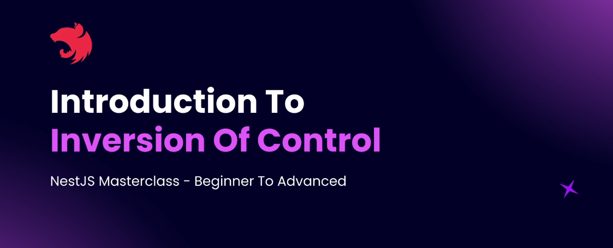

# Step 04 - Dependency Injection

## 1. Introduction to Inversion of Control

Dependency Injection (DI) is one of the most crucial concepts in NestJS, forming the backbone of application architecture. This document explains the basics of DI, how it works in NestJS, and why it is essential for creating scalable and maintainable applications.



- **Dependency Injection:** A design pattern used to manage dependencies by providing them to classes rather than letting the classes instantiate them directly.

- **Inversion of Control (IoC):** Shifts the responsibility of creating and managing dependencies from the class to an external framework or tool (e.g., NestJS).

### What is a Dependency?
**Example:** A User class required by both Post and Page classes to associate posts/pages with a user.
Dependency occurs when one class relies on another class to function.

### Benefits of Dependency Injection

1. **Single Instance:**
   - Dependencies, such as a User instance, are created once and reused across different parts of the application. This promotes efficient memory usage and ensures consistency.

2. **Loose Coupling:**
   - Classes depend on abstractions (interfaces) rather than concrete implementations. This makes it easier to change the implementation of a dependency without affecting the classes that use it.

3. **Simplified Testing:**
   - Dependencies can be replaced with mock objects during testing. This allows for isolated tests and ensures that the behavior of a class can be tested without involving external dependencies.

4. **Efficient Resource Usage:**
   - By reusing existing instances of dependencies, the application conserves resources and reduces overhead associated with creating new objects.

### Code Example

```without DI
class User {
  constructor() {
    console.log("User was instantiated");
  }
}

class Post {
  private user = new User(); // Creates a new instance
  constructor() {
    console.log("Post class was instantiated");
  }
}

class Page {
  private user = new User(); // Creates another new instance
  constructor() {
    console.log("Page class was instantiated");
  }
}

const post = new Post();
const page = new Page();
```

```with DI
class User {
  constructor() {
    console.log("User was instantiated");
  }
}

class Post {
  constructor(private user: User) {
    console.log("Post class was instantiated");
  }
}

class Page {
  constructor(private user: User) {
    console.log("Page class was instantiated");
  }
}

const user = new User(); // Single instance created
const post = new Post(user); // Dependency injected
const page = new Page(user); // Dependency injected
```

Dependency injection in NestJS not only simplifies dependency management but also ensures better maintainability, testability, and scalability of applications.

---


## 2. Dependency Injection in NestJS
## 3. Create a Users Service
## 4. findAll Users Method
## 5. findOneById Users Method
## 6. Practice: Create a Posts Module
## 7. Solution: Create a Posts Module
## 8. Types of Dependencies
## 9. Create a GET Posts Route with DTO
## 10. Return Posts From Posts Service
## 11. Use Users Service Inside Posts Service
## 12. Practice: Create an Auth Module
## 13. Solution: Create an Auth Module
## 14. Circular Dependency