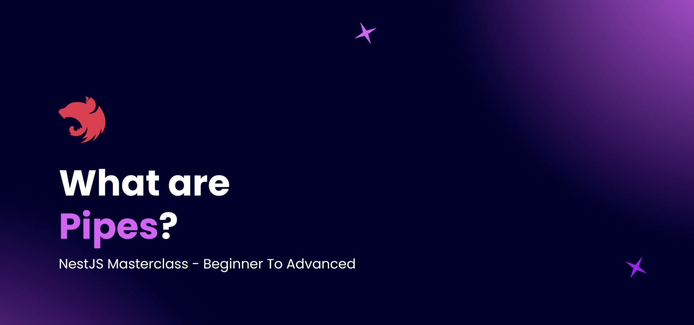
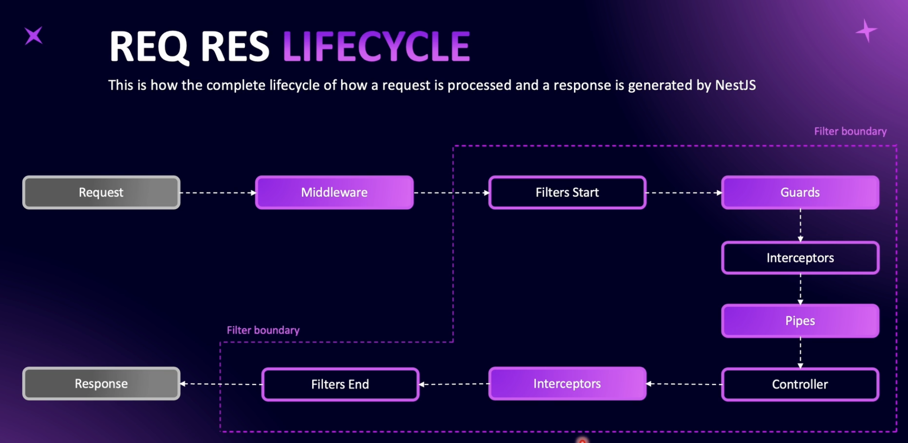
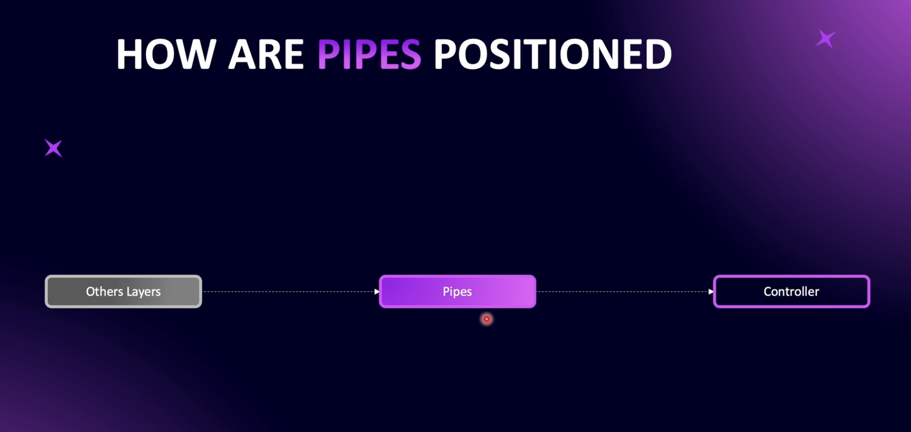
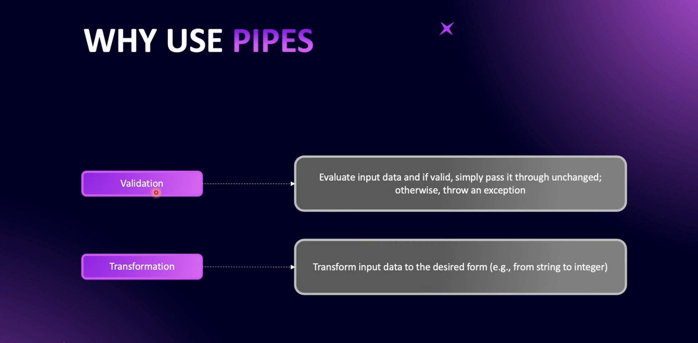
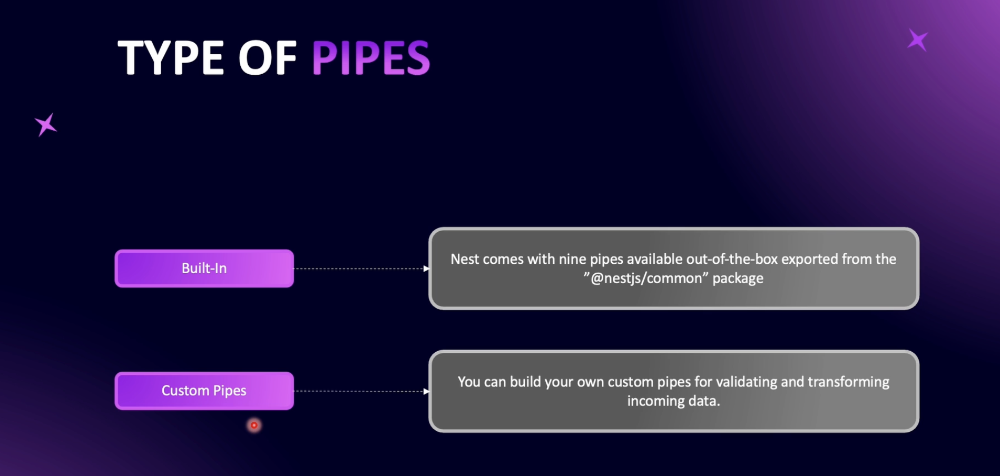
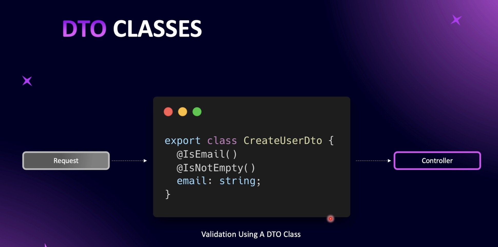

# Step 03 - Validation and Pipes

## 1. What are Pipes?


Pipes are a powerful feature in NestJS used to transform and validate incoming request data before it reaches the controller. They act as a layer in the request-response lifecycle to ensure that data sent to your application is in the correct format and adheres to your expected validation

 **Overview**


NestJS is a progressive Node.js framework for building efficient, reliable, and scalable server-side applications. This project explores the various components involved in the request-response lifecycle:

- Middleware
- Filters
- Guards
- Interceptors
- Pipes
- Controllers
- Providers/Services


### **Pipes**
- **Purpose**: Validate and transform incoming request data.
- **Usage**: 
  - **Validation**: Ensure data matches schema.
  - **Transformation**: Convert data to the required format.



### **Reasons to Use Pipes**

**Centralized Validation Logic**
Pipes allow you to consolidate your validation logic in a reusable way, rather than repeating it in multiple places.
By leveraging tools like class-validator with ValidationPipe, you can declaratively define validation rules in Data Transfer Objects (DTOs).

 
### **Built-in Pipes:**

NestJS provides several built-in pipes for common validation and transformation needs.

Examples:
- ValidationPipe – Validates data using class-validator decorators.
- ParseIntPipe – Transforms a string into an integer.
- ParseBoolPipe – Transforms a string into a boolean ("true" to true).
- ParseArrayPipe – Ensures incoming data is an array.
- ParseUUIDPipe – Validates and parses UUID strings.

### **Custom Pipes:**
- Developers can create custom pipes for specific use cases.
- Useful for advanced validation logic or transformations tailored to the application's requirements.

---

## 2. Validation and Transformation Needs

Final Endpoint - /users/id?limit=10&page=1

Param id - optional, convert to integer, cannot have a default value  
Query limit - integer, default 10  
Query page - integer, default value 1  

==> USE CASES  
/users/ -> return all users with default pagination  
/users/1223 -> returns one user whose id is 1223  
/users?limit=10&page=2 -> return page 2 with limit of pagination 10

code: example where we need to validate and transform the incoming request data
[GitHub Repository](https://github.com/NadirBakhsh/nestjs-resources-code/commit/6b04e6c3d7582c89e95078356877405e0c9efb40#diff-f50bd3ad4287f192c56e363ab00244f9f773705f9e41b8214b1a22804e40659cR28)

---

## 3. Validating Params with Built-in Pipes

### *ParseIntPipe*

```typescript
import { Controller, Get, Param, Query, ParseIntPipe } from '@nestjs/common';

export class UsersController {
  @Get('/:userId?')
  public getUser(
    @Param('userId', ParseIntPipe) userId: number | undefined, 
    @Query() query: any
    ) {
    if (userId) {
      console.log('type of id', userId);
      console.log('userId', userId);
      console.log('limit', typeof query?.limit);
      console.log('offset', typeof query?.offset);
      return `Get user with ID ${userId}`;
    }
    return `Get all users`;
  }
}
```

code example: [Validating Params with Built-in Pipes](https://github.com/NadirBakhsh/nestjs-resources-code/commit/b1a4c8b32b796a74ef866552a26dff97e35949ff)

---

## 4. Validating Query Params

### Validating and Transforming Query Parameters in NestJS

**Overview**

- Use NestJS's query decorators to grab parameters from incoming requests.
- Apply transformation and validation pipes to query parameters.
- Assign default values to parameters when they are not provided by the client.

Start by grabbing `limit` and `page` from the query string using the `@Query()` decorator.

```typescript
@Query('limit', ParseIntPipe) limit: number,
@Query('page', ParseIntPipe) page: number,

```

**Applying Validation**
Use ParseIntPipe to ensure that both limit and page are converted into integers. If a non-convertible value is provided, NestJS will throw a validation error.

 **Setting Default Values**
To make the parameters optional and assign default values:

Import DefaultValuePipe from NestJS.
Assign default values using the new DefaultValuePipe(value) syntax.

```typescript
@Query('limit', new DefaultValuePipe(10), ParseIntPipe) limit: number,
@Query('page', new DefaultValuePipe(1), ParseIntPipe) page: number,

```

**Handling Requests**

Test the endpoint by:
Sending requests with valid limit and page parameters.
Omitting limit and page to observe default values being assigned.
Sending invalid data to see validation errors in action.

 **Additional Pipes**
NestJS offers various other pipes for transformation and validation:

ParseFloatPipe - Validates and converts floating-point numbers.
ParseBoolPipe - Converts true/false or 1/0 into boolean values.
Custom pipes can also be created for specific use cases.
Example Endpoint

```typescript
@Get('users')
findAll(
  @Query('limit', new DefaultValuePipe(10), ParseIntPipe) limit: number,
  @Query('page', new DefaultValuePipe(1), ParseIntPipe) page: number
) {
  console.log({ limit, page });
  return { limit, page };
}
```

github code: [Validating Query Params](https://github.com/NadirBakhsh/nestjs-resources-code/commit/3e263d6a0494484e73707fe306d1a8fd88192a21)

---

## 5. Introduction to DTO

A data transfer object, commonly called a DTO, is an object used to validate data and define data structure sent into your Nest applications. DTOs are similar to interfaces, but differ from interfaces in the following ways:



- Interfaces are used for type-checking and structure definition.
- A DTO is used for type-checking, structure definition, and data validation.
- Interfaces disappear during compilation, as it’s native to TypeScript and doesn't exist in JavaScript.
- DTOs are defined using classes that are supported in native JavaScript. Hence, it remains after compilation.

---

## 6. Creating Our First DTO
## 7. Connecting DTO to Route Method
## 8. Global Pipes and Avoiding Malicious Requests
## 9. Converting to an Instance of DTO
## 10. Using DTOs with Params
## 11. Using Mapped Types to Avoid Code Duplication