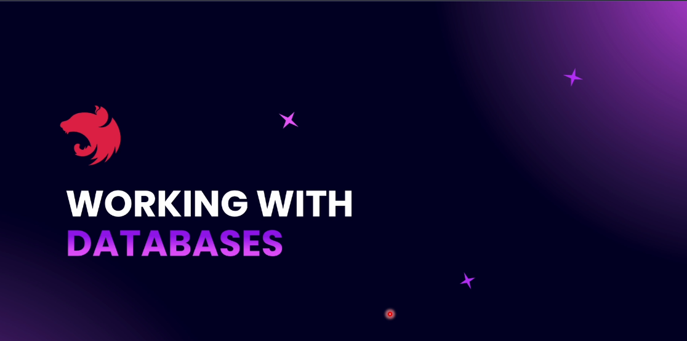
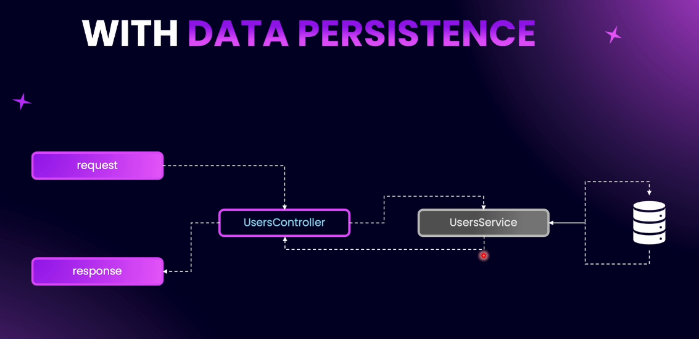
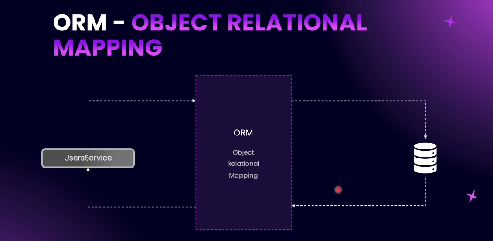
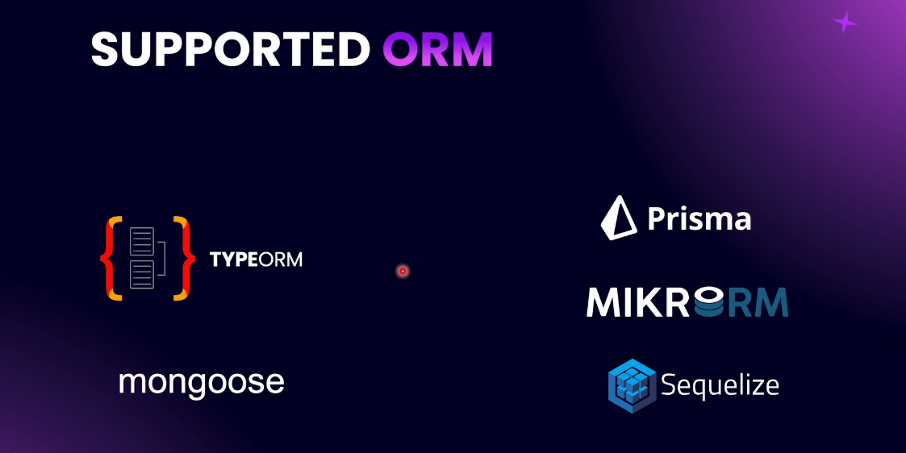
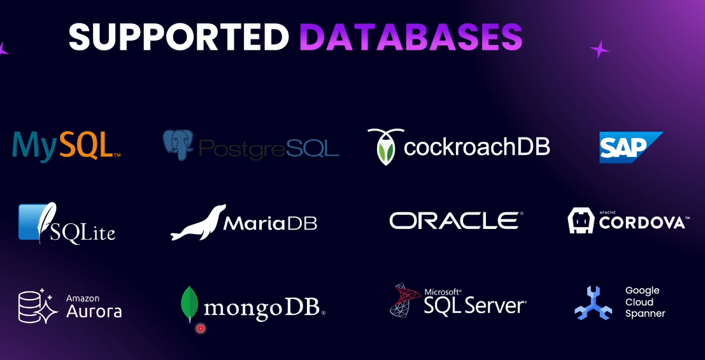
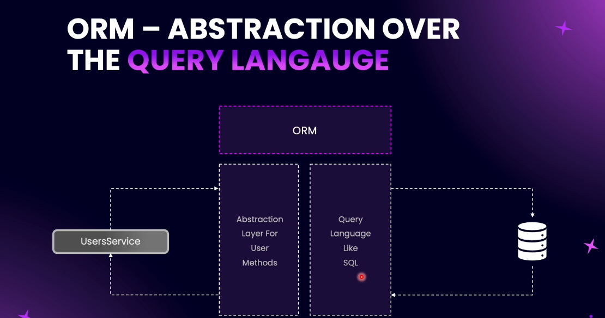
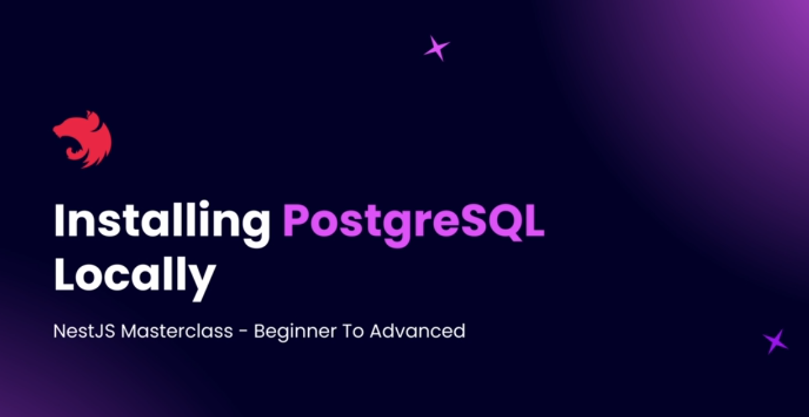

# Step 06 - Working with SQL Databases

## 1. Working with Databases in NestJS



A basic architectural pattern where data is processed without being persisted to any storage system.


### Architecture Flow

- Request: A client sends a request to the system.

- UsersController: Acts as the entry point to handle the request and route it appropriately.

- UsersService: Processes the business logic but does not persist any data.

- Response: A response is sent back to the client based on the in-memory processing.



### Architecture Flow

🔸 No Data Persistence

- Request → UsersController → UsersService (in-memory) → UsersController → Response

- No interaction with any storage or database.

🔸 With Data Persistence

- Request → UsersController → UsersService → Database

- Service reads/writes data to a persistent database, then sends it back via controller.

ORM Integration Flow: Service → ORM Layer → Database


ORM (Object Relational Mapping) - a design layer that bridges the object-oriented application code with relational databases.

🔸 ORM (Object Relational Mapping)

- UsersService → ORM Layer → Database
- ORM handles object-to-table mapping, abstracts SQL queries, and provides CRUD operations through object-oriented code.

### Use Cases

- Rapid application development
- Clean abstraction of database logic
- Seamless integration with object-oriented languages

### Supported ORM in NestJS

NestJS supports integration with multiple Object-Relational Mapping (ORM) tools to facilitate database interaction in a structured and scalable way. Currently supported ORMs:



- **TypeORM**: A powerful and flexible ORM for SQL-based databases such as PostgreSQL, MySQL, SQLite, etc. TypeORM is deeply integrated with NestJS and follows the Data Mapper pattern with support for advanced features like migrations, relations, and query builders.
  🔗 [TypeORM Documentation](https://typeorm.io/)

- **Mongoose**: A popular ODM (Object Data Modeling) library for MongoDB, offering a straightforward schema-based solution to model application data.

🔗 [Mongoose Documentation](https://mongoosejs.com/)

### Commonly Used Databases in NestJS

NestJS offers flexible database integration using ORMs like TypeORM and Mongoose, enabling support for a wide variety of databases.



✅ Popular Supported Databases:

- MySQL / MariaDB – Widely used relational database for web applications.
- PostgreSQL – Advanced relational DB with powerful features and ACID compliance.
- SQLite – Lightweight, file-based database, ideal for small projects or local development.
- Microsoft SQL Server – Enterprise-grade RDBMS used in corporate applications.
- MongoDB – Leading NoSQL document database, great with Mongoose ODM.
- Oracle – Enterprise-level relational DB for complex systems.

---

- What is an ORM?

# Overview: Understanding ORM & TypeORM in SaaS Applications

## 🔍 What is an ORM?

ORM (Object-Relational Mapping) acts as an abstraction layer between your application and the database, allowing developers to interact with databases using programming language constructs rather than SQL.



### 1. **Abstraction Layer**

- ORM provides methods to perform DB operations (e.g., `.create()`, `.find()`), eliminating the need to manually write SQL queries.

### 2. **TypeORM in Action**

- We use **TypeORM** in a SaaS application.
- Enables writing queries and managing DB schema using **TypeScript**.

### 3. **Simplified Data Access**

- Traditional SQL: `SELECT * FROM users WHERE id = 132;`
- TypeORM: `userRepository.findOne({ where: { id: 132 } })`

### 4. **Complex Queries Simplified**

- TypeORM allows writing advanced conditions in TypeScript, not SQL.
- Example: Filtering users with rating > 4, last active in 7 days, amount spent > 1200 — all handled via object-based query.

### 5. **Relationships & Decorators**

- Define relationships (e.g., OneToOne, ManyToOne) via decorators in TypeScript.
- Example:
  ```ts
  @OneToOne(() => Profile)
  profile: Profile;
  ```

### 6. **Schema Management in Code**

- Table structure, indexes, and constraints are defined in code.
- No separate SQL schema files required.
- Example:
  ```ts
  @Index(['firstName', 'lastName'])
  ```

### 7. **Migrations and Syncing**

- ORM syncs your application model to the database schema automatically.
- Ensures consistency between app code and DB structure.

### 8. **Database Portability**

- Easily switch between DBs (MySQL, PostgreSQL, SQL Server).
- Abstracted layer simplifies migration to other DB systems.

### 9. **Fallback to Raw SQL**

- For performance-critical or complex queries, raw SQL can still be executed.

## ✅ Advantages

- No SQL knowledge required.
- Improved developer productivity.
- Code-first schema definition.
- Easy DB migrations.
- Seamless DB switching.

## ⚠️ Disadvantages

- Less control over low-level query optimization.
- Performance issues on complex queries.
- Debugging ORM-generated SQL can be tricky.

---

### Installing PostgreSQL Locally



1. **Download** the installation package from the official website: https://www.postgresql.org/download/
2. **Install** PostgreSQL on your local machine, following the instructions for your operating system.
3. **Create a new user account** for PostgreSQL, e.g., `postgres` with password `secret`.
4. **Create a new database** for your NestJS application, e.g., `myapp` owned by the `postgres` user.

- Adding `psql` to PATH
- Connecting NestJS to PostgreSQL
- Using Async Configuration
- Theoretical Understanding of the Repository Pattern
- Creating Our First Entity - `user.entity`
- Expanding Entity Definition
- Creating First Repository
- Practice: Creating Post Entity
- Solution: Creating Post Entity
