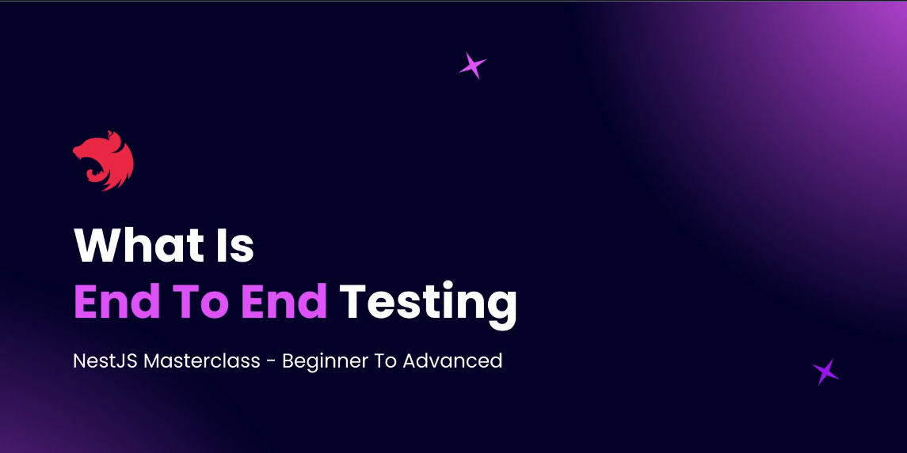
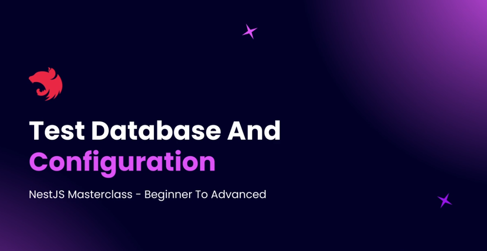

# Step 20 - End to End Testing

## What is End-to-End Testing



End-to-End (E2E) testing represents a more holistic approach to testing compared to unit testing. While unit tests focus on testing individual methods in isolation, E2E tests validate complete user workflows and API endpoints from start to finish.

**Understanding E2E vs Unit Testing**
- **Unit Tests**: Test individual methods and functions in isolation with mocked dependencies
- **E2E Tests**: Test complete API endpoints with real database interactions and full application stack

**What E2E Testing Covers**
E2E tests validate:
- **API Endpoints**: Verify that endpoints return correct data and status codes
- **Request/Response Flow**: Test the complete HTTP request-response cycle
- **Validation Logic**: Ensure input validation works correctly
- **Database Integration**: Test actual database operations (create, read, update, delete)
- **Authentication & Authorization**: Verify security measures work end-to-end
- **Business Logic**: Test complete user workflows and business processes

**File Naming Convention**
E2E test files follow a specific naming pattern:
```
users.post.e2e-spec.ts    // Tests POST endpoints for users
users.get.e2e-spec.ts     // Tests GET endpoints for users  
users.patch.e2e-spec.ts   // Tests PATCH endpoints for users
```

**Key Differences from Unit Tests:**
- Unit tests use `.spec.ts` extension
- E2E tests use `.e2e-spec.ts` extension
- This helps Jest identify and categorize different types of tests

**Directory Structure**
E2E tests are organized in the `test/` directory:
```
project-root/
├── src/                     # Application source code
├── test/                    # E2E tests directory
│   ├── users/              # Module-specific tests
│   │   ├── users.post.e2e-spec.ts
│   │   ├── users.get.e2e-spec.ts
│   │   └── users.patch.e2e-spec.ts
│   └── jest-e2e.json      # E2E Jest configuration
```

**Database Considerations**
For E2E testing, you need a test database:
- **Recommended**: Use the same database type as production (PostgreSQL in our case)
- **Why Not SQLite**: Production-specific features (PostgreSQL functions, data types) won't be available
- **Best Practice**: Create a separate test database to avoid affecting development data

**Required Libraries**
E2E testing uses a combination of tools:
- **Jest**: Test runner and assertion library
- **Supertest**: HTTP request library for testing API endpoints
- **Faker.js**: Generates realistic fake data for testing

**How Supertest Works**
```typescript
import * as request from 'supertest';

// Example E2E test
it('should create a new user', () => {
  return request(app.getHttpServer())
    .post('/users')
    .send({
      firstName: 'John',
      lastName: 'Doe',
      email: 'john@example.com'
    })
    .expect(201)
    .expect((res) => {
      expect(res.body.email).toBe('john@example.com');
    });
});
```

**Test Data Generation with Faker**
```typescript
import { faker } from '@faker-js/faker';

const testUser = {
  firstName: faker.person.firstName(),
  lastName: faker.person.lastName(),
  email: faker.internet.email(),
  password: faker.internet.password()
};
```

**Benefits of E2E Testing**
- **Real-World Validation**: Tests how users actually interact with your API
- **Integration Verification**: Ensures all components work together correctly
- **Confidence**: Provides high confidence that features work end-to-end
- **Regression Prevention**: Catches issues that unit tests might miss
- **Documentation**: Serves as living documentation of API behavior

**When to Use E2E Tests**
- Testing critical user workflows
- Validating API contracts
- Ensuring database operations work correctly
- Testing authentication flows
- Verifying complex business logic that spans multiple layers

**E2E Test Strategy**
- Focus on happy path scenarios and critical edge cases
- Test one endpoint thoroughly rather than many endpoints superficially
- Use realistic test data that represents actual usage patterns
- Clean up test data after each test to ensure isolation

This section will guide you through setting up and writing comprehensive E2E tests that validate your NestJS application's behavior from the user's perspective, ensuring your APIs work correctly in real-world scenarios.
---

## Test Database and Configuration



Before writing any end-to-end tests, you need to set up a dedicated test database and environment configuration. This ensures your tests run in isolation and do not affect your development data.

### 1. Create a Test Database

1. **Open pgAdmin** and navigate to the **Databases** section.
2. **Right-click** on `Databases` and select **Create > Database...**
3. **Enter a name** for your test database, e.g., `nestjs_blog_test`.
4. **Set the owner** (e.g., `postgres`).
5. **Click Save** to create the database.

Your test database is now ready for use.

### 2. Duplicate Environment Configuration

1. In your project, **locate** the `.env.development` file.
2. **Duplicate** this file and rename the copy to `.env.test`.
3. **Edit** the `DATABASE_NAME` (or equivalent variable) in `.env.test` to match your new test database name (e.g., `nestjs_blog_test`).

Example:
```env
# .env.test
DATABASE_HOST=localhost
DATABASE_PORT=5432
DATABASE_USER=postgres
DATABASE_PASSWORD=yourpassword
DATABASE_NAME=nestjs_blog_test
```

### 3. How It Works

- When running tests, set `NODE_ENV=test`. Your application will automatically load `.env.test`.
- All test operations will use the test database, keeping your development data safe.

You are now ready to configure and run end-to-end tests using this isolated environment.

---


## Encapsulate App Creation Logic

To avoid code duplication between production and testing environments, we need to extract the application configuration logic into a reusable function. This ensures both production and test applications use identical middleware configurations.

**The Problem**
In your `main.ts` file, you likely have middleware configuration like this:

```typescript
// main.ts - Before refactoring
async function bootstrap() {
  const app = await NestFactory.create(AppModule);
  
  // Multiple middleware configurations
  app.useGlobalPipes(new ValidationPipe());
  
  // Swagger configuration
  const config = new DocumentBuilder()
    .setTitle('NestJS Blog API')
    .setDescription('Use the base API URL as http://localhost:3000')
    .setTermsOfService('http://localhost:3000/terms-of-service')
    .setLicense('MIT License', 'https://github.com/git/git-scm.com/blob/main/MIT-LICENSE.txt')
    .addServer('http://localhost:3000')
    .setVersion('1.0')
    .build();
  
  const document = SwaggerModule.createDocument(app, config);
  SwaggerModule.setup('api', app, document);
  
  // AWS SDK Configuration
  AWS.config.update({
    credentials: {
      accessKeyId: configService.get('appConfig.awsAccessKeyId'),
      secretAccessKey: configService.get('appConfig.awsSecretAccessKey'),
    },
    region: configService.get('appConfig.awsRegion'),
  });
  
  // Enable CORS
  app.enableCors();
  
  await app.listen(3000);
}
```

**The Solution: Create a Reusable Function**

1. **Create `src/app.create.ts`**:

```typescript
import { INestApplication, ValidationPipe } from '@nestjs/common';
import { ConfigService } from '@nestjs/config';
import { DocumentBuilder, SwaggerModule } from '@nestjs/swagger';
import * as AWS from 'aws-sdk';
import { DataResponseInterceptor } from './common/interceptors/data-response/data-response.interceptor';

export function appCreate(app: INestApplication): void {
  const configService = app.get(ConfigService);

  // Global Validation Pipe
  app.useGlobalPipes(
    new ValidationPipe({
      whitelist: true,
      forbidNonWhitelisted: true,
      transform: true,
      transformOptions: {
        enableImplicitConversion: true,
      },
    }),
  );

  // Global Data Response Interceptor
  app.useGlobalInterceptors(new DataResponseInterceptor());

  // Swagger Configuration
  const config = new DocumentBuilder()
    .setTitle('NestJS Blog API')
    .setDescription('Use the base API URL as http://localhost:3000')
    .setTermsOfService('http://localhost:3000/terms-of-service')
    .setLicense(
      'MIT License',
      'https://github.com/git/git-scm.com/blob/main/MIT-LICENSE.txt',
    )
    .addServer('http://localhost:3000')
    .setVersion('1.0')
    .build();

  const document = SwaggerModule.createDocument(app, config);
  SwaggerModule.setup('api', app, document);

  // AWS SDK Configuration
  AWS.config.update({
    credentials: {
      accessKeyId: configService.get('appConfig.awsAccessKeyId'),
      secretAccessKey: configService.get('appConfig.awsSecretAccessKey'),
    },
    region: configService.get('appConfig.awsRegion'),
  });

  // Enable CORS
  app.enableCors();
}
```

2. **Refactor `main.ts`**:

```typescript
import { NestFactory } from '@nestjs/core';
import { AppModule } from './app.module';
import { appCreate } from './app.create';

async function bootstrap() {
  const app = await NestFactory.create(AppModule);
  
  // Add all middleware using the reusable function
  appCreate(app);
  
  await app.listen(3000);
}
bootstrap();
```

**Benefits of This Approach**

**Code Reusability**: 
- Same configuration logic used in both production and testing
- Eliminates duplicate middleware setup code

**Consistency**:
- Ensures test environment mirrors production exactly
- Reduces configuration drift between environments

**Maintainability**:
- Single place to update middleware configuration
- Easier to add new middleware across all environments

**Reduced Errors**:
- Less chance of forgetting middleware in test setup
- Consistent behavior across environments

**How to Use in Tests**
In your E2E tests, you can now use the same function:

```typescript
// In your E2E test setup
import { Test } from '@nestjs/testing';
import { AppModule } from '../src/app.module';
import { appCreate } from '../src/app.create';

let app: INestApplication;

beforeAll(async () => {
  const moduleFixture = await Test.createTestingModule({
    imports: [AppModule],
  }).compile();

  app = moduleFixture.createNestApplication();
  
  // Apply the same middleware as production
  appCreate(app);
  
  await app.init();
});
```

**Key Points**
- **Function Type**: `appCreate(app: INestApplication): void`
- **Parameter**: Receives the NestJS application instance
- **Purpose**: Configures all middleware consistently
- **Return**: Void - modifies the app instance in place

**What Gets Configured**
- Global validation pipes with transformation options
- Global response interceptors
- Swagger documentation setup
- AWS SDK configuration
- CORS enabling
- Any other global middleware

This pattern ensures your E2E tests run against an application configured identically to production, providing confidence that your tests reflect real-world behavior.

---

## Creating First E2E Test


Now that we have our configuration in place, let's create our first end-to-end test file. We'll start by creating a test for the Users POST endpoint to understand the E2E testing structure.

**1. Create Test Directory Structure**
Navigate to the `test/` directory and create a module-specific directory:

```
test/
├── users/                          # Users module tests
│   └── users.post.e2e-spec.ts     # POST endpoint tests
└── jest-e2e.json                  # E2E Jest config
```

**2. Create the Test File**
Create `test/users/users.post.e2e-spec.ts`:

```typescript
import { Test, TestingModule } from '@nestjs/testing';
import { INestApplication } from '@nestjs/common';
import * as request from 'supertest';
import { AppModule } from '../../src/app.module';
import { appCreate } from '../../src/app.create';

describe('UsersController [POST] endpoints', () => {
  let app: INestApplication;

  beforeEach(async () => {
    const moduleFixture: TestingModule = await Test.createTestingModule({
      imports: [AppModule],
    }).compile();

    app = moduleFixture.createNestApplication();
    
    // Apply the same middleware as production
    appCreate(app);
    
    await app.init();
  });

  afterEach(async () => {
    // Important: Close the app after each test
    await app.close();
  });

  // Test cases using it.todo for planning
  it.todo('should be a public endpoint');
  it.todo('should validate that firstName is mandatory');
  it.todo('should validate that email is mandatory');  
  it.todo('should validate that password is mandatory');
  it.todo('should create a new user when valid data is provided');
  it.todo('should not return password in the response');
  it.todo('should not return googleId in the response');
});
```

**3. Key Differences from Unit Tests**

**Module Setup**:
- **Full Application**: Creates the complete NestJS application
- **Real Dependencies**: Uses actual database connections and services
- **Complete Module**: Imports the entire `AppModule`

**Application Lifecycle**:
- **`beforeEach`**: Creates and initializes the full application
- **`afterEach`**: Closes the application to prevent memory leaks
- **`app.init()`**: Initializes the application (different from `app.listen()`)

**Test Structure**:
```typescript
describe('Component [HTTP_METHOD] endpoints', () => {
  // Setup and teardown
  // Test cases
});
```

**4. Using `it.todo()` for Test Planning**
`it.todo()` is a powerful Jest feature for planning tests:

```typescript
it.todo('should validate that firstName is mandatory');
```

**Benefits**:
- **Planning**: Outline all tests you need to write
- **Reminders**: Jest shows pending todos in test results
- **Documentation**: Serves as specification for endpoint behavior
- **Progress Tracking**: Easy to see which tests are completed

**5. Test Categories for POST Endpoints**

**Public Access Testing**:
- Verify endpoint doesn't require authentication
- Test that requests succeed without tokens

**Validation Testing**:
- Required fields validation (firstName, email, password)
- Field format validation (email format, password strength)
- Request body structure validation

**Success Scenarios**:
- Valid user creation
- Correct response structure
- Proper status codes (201 Created)

**Security Testing**:
- Sensitive data not returned (passwords, internal IDs)
- Response data sanitization

**6. Running E2E Tests**
Execute your E2E tests with:

```bash
# Run all E2E tests
npm run test:e2e

# Run specific test file
npm run test:e2e -- --testNamePattern="users.post"

# Run with verbose output
npm run test:e2e -- --verbose
```

**7. Expected Output**
When you run the test, Jest will show:

```bash
 RUNS  test/users/users.post.e2e-spec.ts
  UsersController [POST] endpoints
    ✓ should be a public endpoint (todo)
    ✓ should validate that firstName is mandatory (todo)
    ✓ should validate that email is mandatory (todo)
    ✓ should validate that password is mandatory (todo)
    ✓ should create a new user when valid data is provided (todo)
    ✓ should not return password in the response (todo)
    ✓ should not return googleId in the response (todo)

Test Suites: 1 passed, 1 total
Tests:       0 passed, 7 todo, 7 total
```

**8. Next Steps**
With this foundation in place, you can:
- Complete the application loading lifecycle
- Implement actual test assertions
- Add request/response validation
- Test different scenarios and edge cases

**Important Notes**:
- **App Initialization**: Always call `app.init()` for E2E tests, not `app.listen()`
- **Cleanup**: Always close the app in `afterEach` to prevent resource leaks
- **Import Paths**: Adjust import paths based on your file location
- **Middleware**: Use the `appCreate()` function to ensure consistent configuration

This structure provides a solid foundation for comprehensive E2E testing of your NestJS endpoints.

---

## Completing App Loading Lifecycle


To properly execute our E2E tests, we need to complete the application loading lifecycle. This involves three essential steps: injecting ConfigService, adding middleware, and implementing database cleanup between tests.

**The Three Required Steps:**

1. **Inject ConfigService**: Make configuration available to the test application
2. **Add Middleware**: Apply the same middleware as production using `appCreate()`  
3. **Database Cleanup**: Clear database after each test to prevent conflicts

**1. Inject ConfigService into Test Module**

Update your test file to include ConfigService:

```typescript
import { Test, TestingModule } from '@nestjs/testing';
import { INestApplication } from '@nestjs/common';
import { ConfigService } from '@nestjs/config';
import { ConfigModule } from '@nestjs/config';
import * as request from 'supertest';
import { AppModule } from '../../src/app.module';
import { appCreate } from '../../src/app.create';

describe('UsersController [POST] endpoints', () => {
  let app: INestApplication;
  let config: ConfigService;

  beforeEach(async () => {
    const moduleFixture: TestingModule = await Test.createTestingModule({
      imports: [
        AppModule,
        ConfigModule, // Import ConfigModule
      ],
      providers: [
        ConfigService, // Provide ConfigService
      ],
    }).compile();

    app = moduleFixture.createNestApplication();
    
    // Extract ConfigService from the app
    config = app.get<ConfigService>(ConfigService);
    
    // Apply the same middleware as production
    appCreate(app);
    
    await app.init();
  });

  // ...rest of test code
});
```

**2. Create Database Drop Helper**

Create `test/helpers/drop-database.helper.ts`:

```typescript
import { ConfigService } from '@nestjs/config';
import { DataSource } from 'typeorm';

export async function dropDatabase(config: ConfigService): Promise<void> {
  // Step 1: Create connection with the data source
  const appDataSource = await new DataSource({
    type: 'postgres',
    host: config.get('database.host'),
    port: +config.get('database.port'),
    username: config.get('database.user'),
    password: config.get('database.password'),
    database: config.get('database.name'),
    synchronize: config.get('database.synchronize'),
    // Note: autoLoadEntities is removed as it's not needed for DataSource
  });

  // Step 2: Drop all tables
  await appDataSource.dropDatabase();

  // Step 3: Close the connection
  await appDataSource.destroy();
}
```

**3. Implement Database Cleanup in Tests**

Update your test file to include database cleanup:

```typescript
import { dropDatabase } from '../helpers/drop-database.helper';

describe('UsersController [POST] endpoints', () => {
  let app: INestApplication;
  let config: ConfigService;

  beforeEach(async () => {
    // ...existing setup code
  });

  afterEach(async () => {
    // Drop database before closing the app
    await dropDatabase(config);
    
    // Close the app after each test
    await app.close();
  });

  // ...test cases
});
```

**Why Each Step is Critical:**

**ConfigService Injection:**
- **Environment Access**: Provides test environment configuration
- **Database Connection**: Required for connecting to test database
- **Service Dependencies**: Many services depend on configuration values

**Middleware Addition:**
- **Production Parity**: Tests run with same setup as production
- **Validation Active**: Global validation pipes process requests
- **Interceptors Applied**: Response formatting and other interceptors work

**Database Cleanup:**
- **Test Isolation**: Each test starts with clean database state
- **No Side Effects**: Prevents data from one test affecting another
- **Consistent Results**: Eliminates conflicts between test runs

**Verification: Testing Environment Loading**

To verify your test loads the correct environment:

1. **Modify `.env.test`**: Temporarily change a variable name
2. **Run Test**: Should fail with "missing environment variable" error
3. **Revert Change**: Fix variable name and test should pass

This proves your test is loading from `.env.test` when `NODE_ENV=test`.

**Full Application vs Module Loading**

**Why Load Entire Application:**
- **Complete Dependencies**: All modules and services available
- **No Dependency Injection Issues**: Don't need to manually wire dependencies
- **Real Behavior**: Tests reflect actual application behavior
- **Easier Testing**: Less complexity in test setup

**Trade-offs:**
- **Performance**: Loading entire application takes more time
- **Large Applications**: Consider loading specific modules for very large apps
- **Test Speed vs Confidence**: Slower tests but higher confidence in results

**Complete Test File Structure:**
```typescript
import { Test, TestingModule } from '@nestjs/testing';
import { INestApplication } from '@nestjs/common';
import { ConfigService } from '@nestjs/config';
import { ConfigModule } from '@nestjs/config';
import * as request from 'supertest';
import { AppModule } from '../../src/app.module';
import { appCreate } from '../../src/app.create';
import { dropDatabase } from '../helpers/drop-database.helper';

describe('UsersController [POST] endpoints', () => {
  let app: INestApplication;
  let config: ConfigService;

  beforeEach(async () => {
    const moduleFixture: TestingModule = await Test.createTestingModule({
      imports: [AppModule, ConfigModule],
      providers: [ConfigService],
    }).compile();

    app = moduleFixture.createNestApplication();
    config = app.get<ConfigService>(ConfigService);
    
    appCreate(app);
    
    await app.init();
  });

  afterEach(async () => {
    await dropDatabase(config);
    await app.close();
  });

  // Test cases here...
});
```

**Best Practices:**
- Always extract ConfigService after creating the app
- Use `appCreate()` to ensure consistent middleware setup
- Clean database after each test, not before
- Import correct ConfigService from `@nestjs/config`, not AWS SDK
- Test environment loading by temporarily breaking config

This setup ensures your E2E tests run against a fully configured application that mirrors production, providing maximum confidence in test results while maintaining isolation between tests.

---

## Encapsulate Application Bootstrap

### Encapsulating Application Bootstrap Logic

As your test suite grows, you'll notice that the code for bootstrapping the NestJS application is repeated in every E2E test file. To avoid duplication and ensure consistency, it's best to encapsulate this logic in a reusable helper function.

#### Creating the Bootstrap Helper

Inside your `test/helpers` directory, create a new file named:

```
bootstrap-nest-application.helper.ts
```

Add the following code to encapsulate the application bootstrap logic:

```typescript
import { Test, TestingModule } from '@nestjs/testing';
import { INestApplication } from '@nestjs/common';
import { ConfigService } from '@nestjs/config';
import { AppModule } from '../../src/app.module';
import { appCreate } from '../../src/app.create';

export async function bootstrapNestApplication(): Promise<INestApplication> {
  const moduleFixture: TestingModule = await Test.createTestingModule({
    imports: [AppModule],
    providers: [ConfigService],
  }).compile();

  const app = moduleFixture.createNestApplication();
  appCreate(app);
  await app.init();
  return app;
}
```

- **Purpose:** This function creates and initializes a fully configured NestJS application instance, ready for E2E testing.
- **Return Type:** `Promise<INestApplication>` — the initialized application.

#### Using the Helper in Your Tests

Now, in your E2E test files, you can replace the repetitive setup code with a simple call to your new helper:

```typescript
import { bootstrapNestApplication } from '../helpers/bootstrap-nest-application.helper';
import { ConfigService } from '@nestjs/config';

let app: INestApplication;
let config: ConfigService;

beforeEach(async () => {
  app = await bootstrapNestApplication();
  config = app.get<ConfigService>(ConfigService);
});
```

- **Benefits:**
  - **DRY Principle:** Eliminates repeated setup code across test files.
  - **Consistency:** Ensures all tests use the exact same application configuration.
  - **Maintainability:** Any changes to the bootstrap process need to be made in only one place.

With this approach, your test files become much cleaner and easier to maintain, focusing only on the test logic rather than setup boilerplate.

---

## Introduction To SuperTest

### What is SuperTest?

[SuperTest](https://github.com/ladjs/supertest) is a powerful HTTP assertion library for Node.js, designed to test API endpoints by sending HTTP requests directly to your running server instance. It integrates seamlessly with Jest and other test runners, allowing you to write expressive, end-to-end tests for your REST APIs.

### How SuperTest Works

SuperTest allows you to:
- Spin up your NestJS app in memory (no need to listen on a real port)
- Send HTTP requests (GET, POST, PUT, DELETE, etc.) to your endpoints
- Assert on the response status, headers, and body

### Example: Sending a Request with SuperTest

Here's how you can use SuperTest in your E2E test:

```typescript
import * as request from 'supertest';

describe('UsersController [POST] endpoints', () => {
  let app: INestApplication;
  let httpServer: any;

  beforeEach(async () => {
    app = await bootstrapNestApplication();
    httpServer = app.getHttpServer();
  });

  afterEach(async () => {
    await app.close();
  });

  it('should be a public endpoint', () => {
    return request(httpServer)
      .post('/users')
      .send({})
      .expect(400) // Expecting Bad Request due to missing required fields
      .then(({ body }) => {
        console.log(body); // Inspect the response body
      });
  });
});
```

**Key Points:**
- `app.getHttpServer()` extracts the underlying HTTP server instance for SuperTest.
- `request(httpServer)` creates a SuperTest client targeting your app.
- `.post('/users')` sends a POST request to the `/users` endpoint.
- `.send({})` sends an empty request body.
- `.expect(400)` asserts that the response status code is 400 (Bad Request).
- `.then(({ body }) => { ... })` allows you to inspect or further assert on the response body.

### Common SuperTest Patterns

- Chain `.expect()` for status codes or response properties.
- Use `.send()` to provide request bodies for POST/PUT requests.
- Use `.then()` or `await` to handle asynchronous assertions.

### Important: TypeORM Initialization

If you use a custom database drop helper, ensure you call `.initialize()` on your `DataSource` before dropping the database:

```typescript
const appDataSource = new DataSource({ /* ... */ });
await appDataSource.initialize();
await appDataSource.dropDatabase();
await appDataSource.destroy();
```

Failing to initialize the connection will result in errors during test runs.

---

With SuperTest, you can now send real HTTP requests to your NestJS app and assert on the results, enabling robust end-to-end testing of your API endpoints.

## Introduction to Faker


## Using SuperTest for Assertions

Now that you have SuperTest set up, let's see how to use it for making requests and writing assertions in your E2E tests.

### Example: Testing the Users POST Endpoint

Here's how you can write your first real test using SuperTest:

```typescript
import * as request from 'supertest';
import { bootstrapNestApplication } from '../helpers/bootstrap-nest-application.helper';
import { INestApplication } from '@nestjs/common';
import { ConfigService } from '@nestjs/config';
import { dropDatabase } from '../helpers/drop-database.helper';

describe('UsersController [POST] endpoints', () => {
  let app: INestApplication;
  let config: ConfigService;
  let httpServer: any;

  beforeEach(async () => {
    app = await bootstrapNestApplication();
    config = app.get<ConfigService>(ConfigService);
    httpServer = app.getHttpServer();
  });

  afterEach(async () => {
    await dropDatabase(config);
    await app.close();
  });

  it('should be a public endpoint', () => {
    return request(httpServer)
      .post('/users')
      .send({})
      .expect(400) // Expecting Bad Request due to missing required fields
      .then(({ body }) => {
        console.log(body); // Inspect the response body
      });
  });
});
```

**Key Points:**

- `httpServer = app.getHttpServer();` extracts the HTTP server for SuperTest.
- `request(httpServer).post('/users')` sends a POST request to the `/users` endpoint.
- `.send({})` sends an empty request body.
- `.expect(400)` asserts that the response status code is 400 (Bad Request).
- `.then(({ body }) => { ... })` allows you to inspect the response body.

### Initializing TypeORM DataSource

If you use a custom database drop helper, ensure you call `.initialize()` on your `DataSource` before dropping the database:

```typescript
const appDataSource = new DataSource({ /* ... */ });
await appDataSource.initialize();
await appDataSource.dropDatabase();
await appDataSource.destroy();
```

This ensures the database connection is properly established before cleanup.

### Writing Assertions

You can chain multiple `.expect()` calls to check status codes, response bodies, and headers. For example:

```typescript
return request(httpServer)
  .post('/users')
  .send({})
  .expect(400)
  .expect((res) => {
    expect(res.body.statusCode).toBe(400);
    expect(res.body.message).toContain('firstName should not be empty');
  });
```

This pattern lets you verify both the HTTP status and the actual error message returned by your API.

---

With SuperTest, you can now send HTTP requests to your endpoints and write assertions to validate your API's behavior in real-world scenarios.


## Testing Validations


With SuperTest, you can send HTTP requests to your API endpoints and perform assertions on the responses, making it ideal for testing validation logic in your E2E tests.

**How to Use SuperTest for Validation Testing**

1. **Extract the HTTP Server**
   - After bootstrapping your NestJS app, use `app.getHttpServer()` to get the HTTP server instance for SuperTest.

   ```typescript
   let httpServer: any;
   beforeEach(async () => {
     app = await bootstrapNestApplication();
     httpServer = app.getHttpServer();
   });
   ```

2. **Send Requests and Inspect Responses**
   - Use SuperTest's `request()` function, passing the HTTP server.
   - Chain `.post('/users')` to target the endpoint.
   - Use `.send({})` to provide the request body.
   - Chain `.expect(400)` to assert the response status code.
   - Use `.then(({ body }) => { ... })` to inspect the response body.

   ```typescript
   it('should validate required fields', () => {
     return request(httpServer)
       .post('/users')
       .send({})
       .expect(400)
       .then(({ body }) => {
         console.log(body); // Inspect the validation error response
       });
   });
   ```

3. **Focus on the Response Body**
   - The `body` property contains the actual validation errors returned by your API.
   - You can destructure the response to get just the body and log or assert on it.

   ```typescript
   .then(({ body }) => {
     expect(body.statusCode).toBe(400);
     expect(body.message).toContain('firstName should not be empty');
   });
   ```

4. **TypeORM DataSource Initialization**
   - If you use a custom database drop helper, always call `.initialize()` on your `DataSource` before dropping the database.
   - Without initialization, TypeORM will throw connection errors.

   ```typescript
   const appDataSource = new DataSource({ /* ... */ });
   await appDataSource.initialize();
   await appDataSource.dropDatabase();
   await appDataSource.destroy();
   ```

**Best Practices**
- Use `.expect()` for status code assertions.
- Use `.then()` or async/await to inspect and assert on the response body.
- Log the response body during development to understand validation error formats.
- Always initialize your TypeORM DataSource before performing database operations in tests.

**Summary**
SuperTest makes it easy to test validation logic by sending requests and asserting on the exact error messages and status codes returned by your API. This approach ensures your endpoints enforce required fields and return meaningful validation errors.

---

## Completing All Test Cases


Now that you have a solid understanding of how to set up and write E2E tests, it's time to complete all the test cases for the Users POST endpoint. This section will guide you through writing comprehensive tests that cover all aspects of your endpoint's behavior.

### 1. Test File Structure

Ensure your test file is structured as follows:

```typescript
import { Test, TestingModule } from '@nestjs/testing';
import { INestApplication } from '@nestjs/common';
import { ConfigService } from '@nestjs/config';
import { ConfigModule } from '@nestjs/config';
import * as request from 'supertest';
import { AppModule } from '../../src/app.module';
import { appCreate } from '../../src/app.create';
import { dropDatabase } from '../helpers/drop-database.helper';

describe('UsersController [POST] endpoints', () => {
  let app: INestApplication;
  let config: ConfigService;
  let httpServer: any;

  beforeEach(async () => {
    app = await bootstrapNestApplication();
    config = app.get<ConfigService>(ConfigService);
    httpServer = app.getHttpServer();
  });

  afterEach(async () => {
    await dropDatabase(config);
    await app.close();
  });

  // Test cases
});
```

### 2. Test Cases Overview

For the Users POST endpoint, you should cover the following test cases:

1. **Public Access**: Ensure the endpoint is publicly accessible.
2. **Validation**: Test all validation rules for required fields and formats.
3. **Success**: Validate successful user creation with correct data.
4. **Security**: Ensure sensitive data is not exposed in the response.

### 3. Writing the Test Cases

Here's how you can implement each test case:

```typescript
describe('UsersController [POST] endpoints', () => {
  // ...setup code

  it('should be a public endpoint', () => {
    return request(httpServer)
      .post('/users')
      .send({})
      .expect(400); // Expecting Bad Request due to missing required fields
  });

  it('should validate that firstName is mandatory', () => {
    return request(httpServer)
      .post('/users')
      .send({
        lastName: 'Doe',
        email: 'john@example.com',
        password: 'Password123',
      })
      .expect(400)
      .expect((res) => {
        expect(res.body.message).toContain('firstName should not be empty');
      });
  });

  it('should validate that email is mandatory', () => {
    return request(httpServer)
      .post('/users')
      .send({
        firstName: 'John',
        lastName: 'Doe',
        password: 'Password123',
      })
      .expect(400)
      .expect((res) => {
        expect(res.body.message).toContain('email should not be empty');
      });
  });

  it('should validate that password is mandatory', () => {
    return request(httpServer)
      .post('/users')
      .send({
        firstName: 'John',
        lastName: 'Doe',
        email: 'john@example.com',
      })
      .expect(400)
      .expect((res) => {
        expect(res.body.message).toContain('password should not be empty');
      });
  });

  it('should create a new user when valid data is provided', () => {
    return request(httpServer)
      .post('/users')
      .send({
        firstName: 'John',
        lastName: 'Doe',
        email: 'john@example.com',
        password: 'Password123',
      })
      .expect(201)
      .expect((res) => {
        expect(res.body.email).toBe('john@example.com');
        expect(res.body).not.toHaveProperty('password');
        expect(res.body).not.toHaveProperty('googleId');
      });
  });
});
```

### 4. Running All Tests

To run all your E2E tests, use the following command:

```bash
npm run test:e2e
```

### 5. Expected Test Results

When you run the tests, you should see output indicating all tests have passed:

```bash
 RUNS  test/users/users.post.e2e-spec.ts
  UsersController [POST] endpoints
    ✓ should be a public endpoint (todo)
    ✓ should validate that firstName is mandatory (todo)
    ✓ should validate that email is mandatory (todo)
    ✓ should validate that password is mandatory (todo)
    ✓ should create a new user when valid data is provided (todo)
    ✓ should not return password in the response (todo)
    ✓ should not return googleId in the response (todo)

Test Suites: 1 passed, 1 total
Tests:       0 passed, 7 todo, 7 total
```

### 6. Next Steps

With all test cases implemented, you can now:
- Run your tests to ensure everything works as expected.
- Debug any failing tests by inspecting the logs and response bodies.
- Refactor your code with confidence, knowing that your tests will catch any regressions.

---

By following this guide, you have successfully set up and executed end-to-end tests for your NestJS application, ensuring your API endpoints function correctly and reliably.