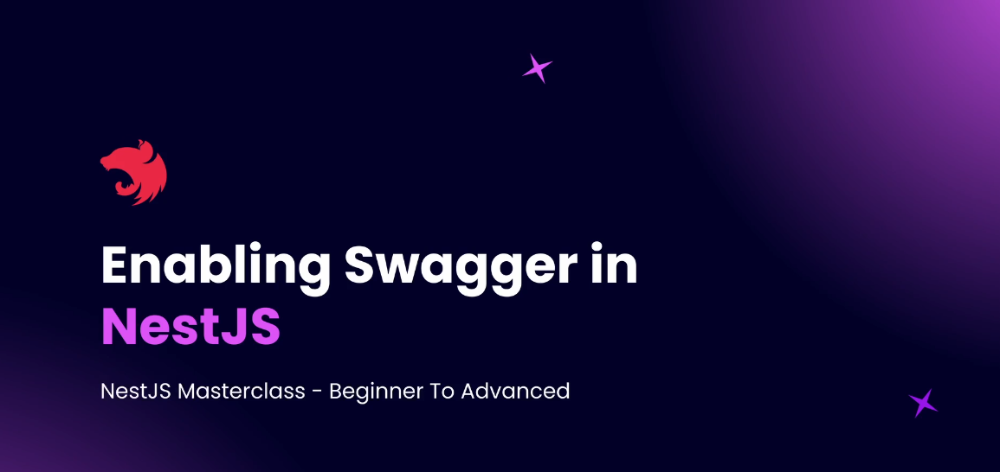
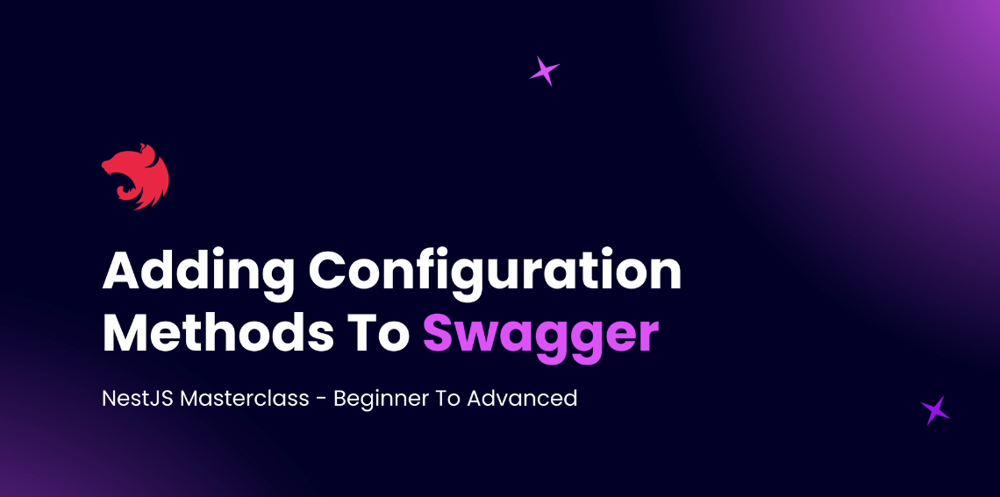
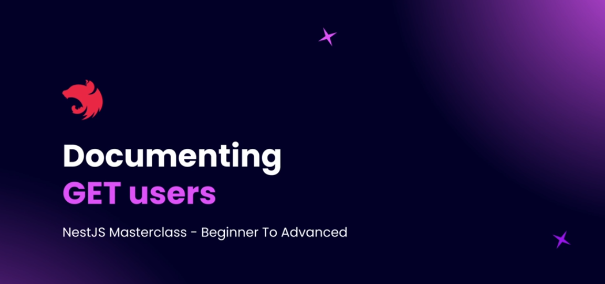

# Step 05 - Documenting Code

## 1. Documentation with NestJS


### Introduction

NestJS provides built-in tools for documenting both code and API endpoints. This documentation helps both developers and clients interact with the system efficiently.

### Types of Documentation

NestJS supports two primary types of documentation:

1. **API Documentation** (for developers and clients)
2. **Code Documentation** (for developers)


### 1. API Documentation with OpenAPI (Swagger)

NestJS leverages **OpenAPI (Swagger)** to document APIs. This allows developers and clients to explore API endpoints, understand request/response structures, and even test APIs interactively.

#### Features:

- Automatically generated documentation based on decorators.
- Hosted at `localhost:3000/api` (by default).
- Documents modules, controllers, routes, query parameters, and request/response bodies.
- Interactive **Try Out** feature to test API requests.

#### Example:

```typescript
import { DocumentBuilder, SwaggerModule } from "@nestjs/swagger"

const config = new DocumentBuilder()
  .setTitle("API Documentation")
  .setDescription("API description")
  .setVersion("1.0")
  .build()
const document = SwaggerModule.createDocument(app, config)
SwaggerModule.setup("api", app, document)
```

### 2. Code Documentation with Compodoc

**Compodoc** generates documentation for the internal structure of a NestJS application, providing an overview of modules, services, controllers, and dependencies.

#### Features:

- Provides a detailed map of modules and their dependencies.
- Displays methods, properties, and class structures.
- Helps track code coverage for documentation completeness.

#### Example Usage:

```bash
npm install -g @compodoc/compodoc
compodoc -p tsconfig.json -s
```

### Key Differences

| Feature  | API Documentation (Swagger) | Code Documentation (Compodoc)    |
| -------- | --------------------------- | -------------------------------- |
| Audience | Developers & Clients        | Developers Only                  |
| Purpose  | Describe API Endpoints      | Describe Internal Code Structure |
| Hosting  | Hosted with API             | Generated locally                |
| Format   | OpenAPI Specification       | HTML-based Documentation         |

### Conclusion

NestJS simplifies both API and code documentation:

- **Swagger** helps document and test APIs interactively.
- **Compodoc** provides an internal view of the codebase for developers.
  By leveraging these tools, developers can maintain well-structured, self-explanatory applications.

---

## 2. Open API Specification


### What is OpenAPI Specification?

OpenAPI Specification (OAS) is a standardized format for describing REST APIs. It defines how an API should be documented, ensuring consistency across different platforms and tools.

### What is Swagger?

Swagger UI: A user-friendly interface for exploring and testing APIs.

---

## 3. Enabling Swagger in NestJS



### 1. Install Swagger

Run the following command to install a specific version of `@nestjs/swagger`:

```sh
npm install @nestjs/swagger@<version>
```

### 2. Import Required Modules

Open `main.ts` and import the required modules:

```ts
import { DocumentBuilder, SwaggerModule } from "@nestjs/swagger"
```

### 3. Configure Swagger

#### Create a Swagger config using `DocumentBuilder`:

```ts
const config = new DocumentBuilder()
  .setTitle("API Documentation")
  .setDescription("NestJS Swagger API documentation")
  .setVersion("1.0")
  .build()
```

#### Generate a Swagger document using `SwaggerModule.createDocument`:

```ts
const document = SwaggerModule.createDocument(app, config)
```

#### Setup Swagger in the app using `SwaggerModule.setup`:

```ts
SwaggerModule.setup("api", app, document)
```

This will expose the Swagger UI at **`http://localhost:3000/api`**.

### 4. Run the App & Access Swagger

- Start your NestJS app:
  ```sh
  npm run start
  ```
- Open **`http://localhost:3000/api`** in your browser to view the API documentation.

code example [Enabling-Swagger](https://github.com/NadirBakhsh/nestjs-resources-code/commit/1ed8ae48b12074490b135827a5d2e77eecba5ab7)

---

## 4. Adding Configuration Methods to Swagger



### Adding Basic Information

#### Set Title

```ts
const config = new DocumentBuilder()
  .setTitle("NestJS Master Class Blog App API")
  .build()
```

#### Set Description

```ts
.setDescription('Use API URL as http://localhost:3000')
```

#### Set Terms of Service

```ts
.setTermsOfService('https://example.com/terms')
```

#### Set License

```ts
.setLicense('MIT', 'https://opensource.org/licenses/MIT')
```

#### Adding Server Configuration

```ts
.addServer('http://localhost:3000')
```

#### Organizing API Endpoints with Tags

By default, all endpoints are under a general collapsible. To organize them into meaningful groups, we use @ApiTags.

```ts
@ApiTags("users")
@Controller("users")
export class UsersController {}
```

```ts
@ApiTags("posts")
@Controller("posts")
export class PostsController {}
```

code example [Adding-Configuration-Methods-to-Swagger](https://github.com/NadirBakhsh/nestjs-resources-code/commit/0c7ae75b0253d4effd4723c4f7ef273cb62e143d)

---

## 5. Documenting GET Users



### Steps to Document API with Swagger

#### 1. Adding Swagger Decorators

Swagger decorators can be used within **DTOs** and **controllers** to define API documentation.

#### 1.1 Documenting Parameters in DTOs

To document an `ID` parameter:

```typescript
import { ApiPropertyOptional } from "@nestjs/swagger"

export class GetUsersParamDTO {
  @ApiPropertyOptional({
    description: "Get user with a specific ID",
    example: 1234
  })
  id: number
}
```

- `ApiPropertyOptional` marks the property as optional.
- `description` provides details about the parameter.
- `example` gives an example value.

#### 1.2 Documenting Query Parameters in Controllers

Query parameters are documented using `@ApiQuery`.

```typescript
import { ApiQuery } from '@nestjs/swagger';

@ApiQuery({
  name: 'limit',
  type: Number,
  required: false,
  description: 'Number of entries returned per query',
  example: 10,
})
@ApiQuery({
  name: 'page',
  type: Number,
  required: false,
  description: 'Page number to return',
  example: 1,
})
```

- `name` specifies the query parameter.
- `type` defines its data type.
- `required: false` makes it optional.
- `description` and `example` provide additional details.

#### 2. Adding API Endpoint Descriptions

Use `@ApiOperation` to provide a summary of the API.

```typescript
import { ApiOperation } from '@nestjs/swagger';

@ApiOperation({ summary: 'Fetches a list of registered users.' })
```

#### 3. Documenting API Responses

Use `@ApiResponse` to specify the possible API responses.

```typescript
import { ApiResponse } from '@nestjs/swagger';

@ApiResponse({
  status: 200,
  description: 'Users fetched successfully based on the query.',
})
```

- You can add multiple `@ApiResponse` decorators for different response statuses.

### Testing in Swagger UI

Once decorated, Swagger UI will automatically generate interactive documentation where developers can test the API using predefined example values.

### Conclusion

By using Swagger decorators in DTOs and controllers, we can create well-structured, interactive API documentation, making it easier for developers to understand and use our APIs effectively.

Code example [Documenting-GET-Users](https://github.com/NadirBakhsh/nestjs-resources-code/commit/ea19f3ffbaa852c545eaaf1032952e7ccd4e8dda)

---

## 6. Practice: POST Endpoint and DTO for Posts Controller

---

## 7. Solution: POST Endpoint and DTO for Posts Controller

---

## 8. Adding Validations to CreatePostDto

---

## 9. Working with Nested DTOs

---

## 10. Testing Validation

---

## 11. Using Swagger for Documenting CreatePostDto

---

## 12. Mapped Types Using Swagger

---

## 13. Getting Started with Compodoc

---

## 14. Compodoc Coverage and JSDocs
