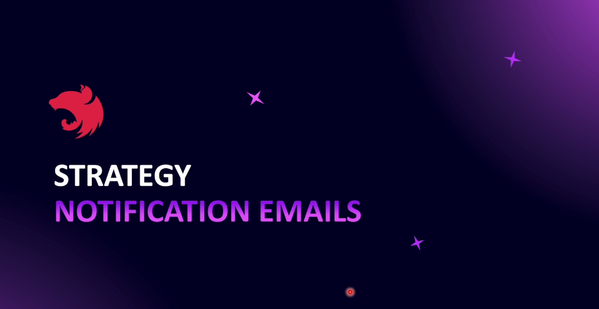
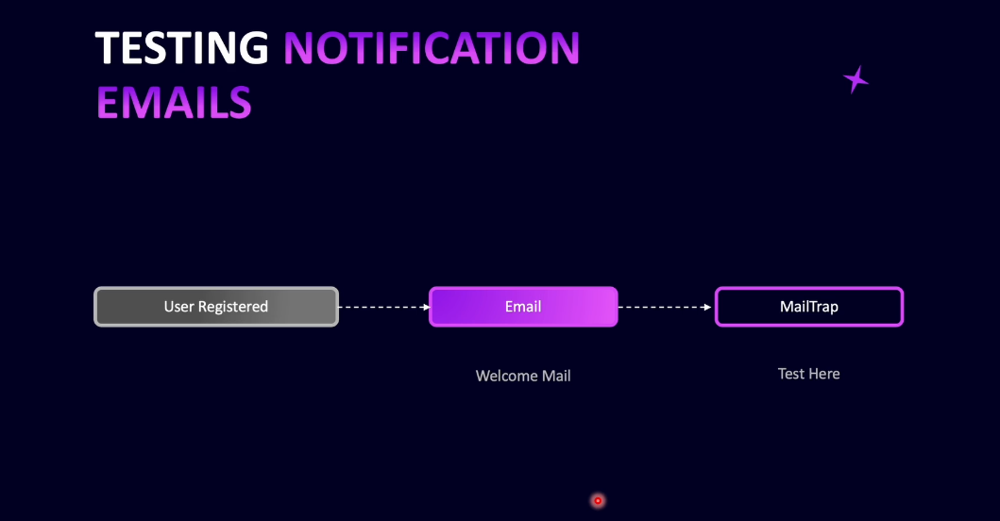

# Step 18 - Notification Emails

## Introduction to Notification Emails

Notification emails are essential for keeping users informed about important events in your application, such as account creation, password resets, or updates. Until now, our application hasn't sent any notification emails—for example, new users haven't received a welcome email upon registration.

To develop and test notification emails safely, we'll use Mailtrap, an email testing service. Mailtrap provides its own SMTP credentials, which you can configure in your application. When a notification email (like a welcome email) is triggered, it is sent to Mailtrap instead of real users. You can then log in to Mailtrap's portal to view and test these emails. Mailtrap also offers tools to inspect and debug your emails.

Once you're ready for production, you can replace Mailtrap's SMTP details with a live email service such as Amazon SES, SendGrid, or Sendinblue.

For templating email content, we'll use EJS (Embedded JavaScript Templates), which works well with NodeMailer—the underlying library used by NestJS's mailer module. This allows us to create dynamic and styled email templates. If you prefer, you can use other templating engines like Handlebars or Pug, but this course will focus on EJS.

In this section, we'll set up a welcome email that is sent to new users upon registration, configure Mailtrap, and integrate everything with NestJS's mailer module.

---

## Setup a Mailtrap Account

## Configuration for Notification Emails

## Configure NestJS Mailer

## Creating `MailService`

## Testing Email Service

## Enabling Inline CSS