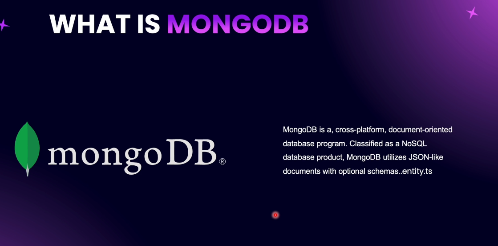
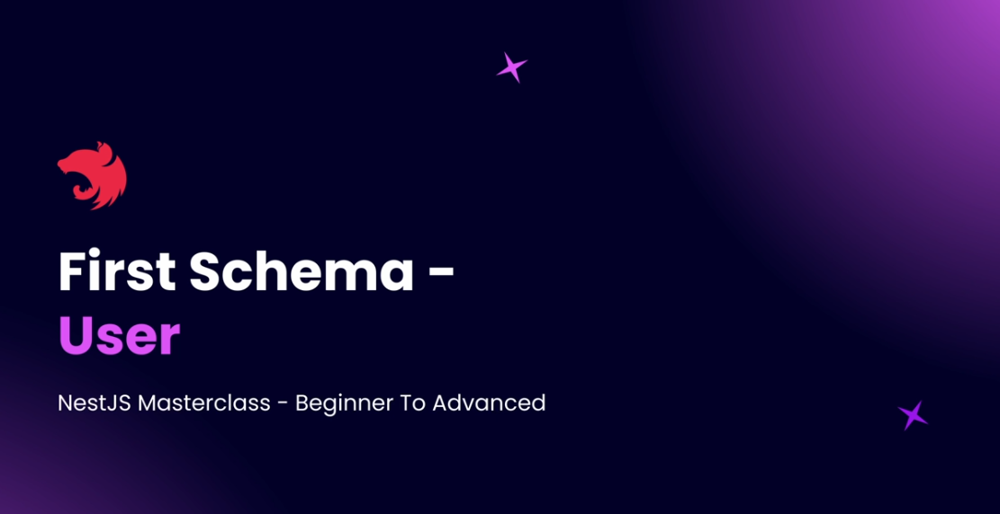
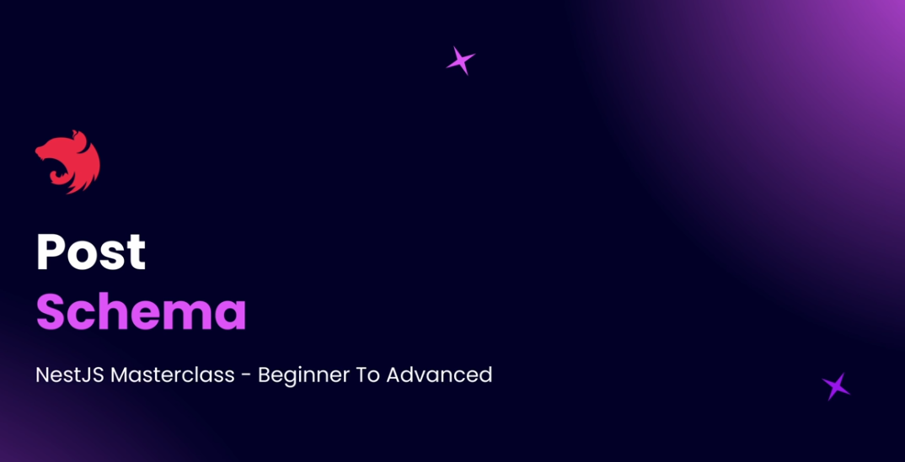

# Step 21 - MongoDB and Mongoose

## Introduction to MongoDB with Mongoose


MongoDB is a NoSQL database that stores data as JSON-like documents, making it ideal for handling unstructured data. In NestJS, Mongoose is used as an abstraction layer to interact with MongoDB, similar to how TypeORM works with SQL databases. Instead of entities, you define schemas to describe the structure of collections. Models are injected into services to perform CRUD operations. This approach allows you to work with MongoDB efficiently within your NestJS applications.





### **SQL vs NoSQL refers to two broad categories of database systems:**

SQL (Structured Query Language) Databases
Type: Relational databases (e.g., MySQL, PostgreSQL, SQL Server)
Data Structure: Tables with rows and columns; each row is a record, each column is a field.
Schema: Fixed and predefined; you must define the structure before inserting data.
Relationships: Supports JOINs to relate data across tables.
Transactions: Strong ACID compliance (Atomicity, Consistency, Isolation, Durability).
Use Case: Ideal for structured data and complex queries (e.g., banking, inventory).
NoSQL (Not Only SQL) Databases
Type: Non-relational databases (e.g., MongoDB, Cassandra, Redis)
Data Structure: Flexible; can be document-based, key-value, graph, or column-family.
Schema: Dynamic; you can store different structures in the same collection.
Relationships: Limited JOIN support; often handled at the application level.
Transactions: May offer eventual consistency; ACID support varies.
Use Case: Great for unstructured or semi-structured data, scalability, and rapid development (e.g., social media, IoT).


## Creating MongoDB Account

To start working with MongoDB, create a free account at mongodb.com and set up a cloud cluster using the M0 free tier. This approach avoids local installation and provides access to features available only in clusters. After registration, whitelist your IP address for access, create a database user, and copy your connection string. You can use MongoDB Compass (GUI tool) to connect and browse your cluster, similar to how PgAdmin works for PostgreSQL. Create your database and collections (e.g., users) in Compass for development.

## MongoDB Configuration


### Setting Up MongoDB with NestJS

To integrate MongoDB with your NestJS application, you need to install the required dependencies and configure the connection. This section assumes you already have a MongoDB Atlas account and cluster set up.

### Required Dependencies

Install two essential packages:

```bash
npm install @nestjs/mongoose@10.0.6 mongoose@8.4.4
```

- **@nestjs/mongoose**: Official NestJS adapter for Mongoose
- **mongoose**: MongoDB object modeling library for Node.js

### Application Configuration

In your `app.module.ts`, import and configure the MongooseModule:

```typescript
import { MongooseModule } from '@nestjs/mongoose';

@Module({
  imports: [
    MongooseModule.forRoot('your-mongodb-connection-string', {
      dbName: 'nestjs-blog'
    }),
    // ... other modules
  ],
})
export class AppModule {}
```

### Configuration Options

**Connection String**: Use the connection string from MongoDB Atlas dashboard
**Database Name**: Specify `dbName` to target a specific database instead of the default 'test' database
**Async Configuration**: For production, use `forRootAsync()` with ConfigService for environment variables

### Key Points

- The connection string connects to your MongoDB cluster
- `dbName` parameter ensures collections are created in the specified database
- Without `dbName`, MongoDB creates a default 'test' database
- Use MongoDB Compass to verify your database connection and view collections
- The configuration is similar to TypeORM but simpler with fewer required parameters


## First Schema - User



### Creating Your First Schema

A schema in Mongoose is equivalent to an entity in TypeORM - it defines the structure of your MongoDB collection. Let's create a User schema to understand the process.

### Schema File Structure

Create `user.schema.ts` in your users module:

```typescript
import { Prop, Schema, SchemaFactory } from '@nestjs/mongoose';
import { Document } from 'mongoose';

@Schema()
export class User extends Document {
  @Prop({ type: String, required: true })
  firstName: string;

  @Prop({ type: String, required: false })
  lastName?: string;

  @Prop({ type: String, required: true })
  email: string;

  @Prop({ type: String, required: true })
  password: string;
}

export const UserSchema = SchemaFactory.createForClass(User);
```

### Key Components Explained

**@Schema() Decorator**: Marks the class as a Mongoose schema
**Document Extension**: All schemas must extend Mongoose's Document class
**@Prop() Decorator**: Defines schema properties with constraints (similar to @Column in TypeORM)
**SchemaFactory**: Creates the actual schema object needed for module registration

### Schema Property Configuration

The `@Prop()` decorator accepts various options:
- **type**: Defines the data type (String, Number, Date, Array, etc.)
- **required**: Makes the field mandatory
- **unique**: Ensures field uniqueness
- **default**: Sets default values

### Module Registration

Register the schema in your module's imports:

```typescript
import { MongooseModule } from '@nestjs/mongoose';
import { User, UserSchema } from './user.schema';

@Module({
  imports: [
    MongooseModule.forFeature([
      { name: User.name, schema: UserSchema }
    ])
  ],
})
export class UsersModule {}
```

### Important Notes

- **Collection Naming**: MongoDB automatically pluralizes schema names (User → users collection)
- **Automatic Creation**: Collections are created automatically when the schema is registered
- **Schema Export**: Always export both the class and the schema constant
- **Boilerplate Pattern**: The SchemaFactory.createForClass() pattern is required for every schema

### Verification

Use MongoDB Compass to verify that your users collection has been created successfully in your database.

## Post Schema



### Creating a More Complex Schema

The Post schema demonstrates advanced Mongoose features including enums, optional properties, and different data types. This provides a comprehensive example of schema creation.

### Post Schema Structure

Create `post.schema.ts` in your posts module:

```typescript
import { Prop, Schema, SchemaFactory } from '@nestjs/mongoose';
import { Document } from 'mongoose';
import { PostType } from '../enums/post-type.enum';
import { PostStatus } from '../enums/post-status.enum';

@Schema()
export class Post extends Document {
  @Prop({ type: String, required: true })
  title: string;

  @Prop({ 
    type: String, 
    required: true, 
    enum: PostType, 
    default: PostType.POST 
  })
  postType: PostType;

  @Prop({ type: String, required: true })
  slug: string;

  @Prop({ 
    type: String, 
    required: true, 
    enum: PostStatus, 
    default: PostStatus.DRAFT 
  })
  status: PostStatus;

  @Prop({ type: String, required: false })
  content?: string;

  @Prop({ type: String, required: false })
  featuredImageUrl?: string;

  @Prop({ type: Date, required: false })
  publishedOn?: Date;
}

export const PostSchema = SchemaFactory.createForClass(Post);
```

### Advanced Schema Features

**Enum Properties**: Use `enum` option to restrict values to predefined constants
**Default Values**: Set `default` to provide fallback values when properties are not specified
**Optional Properties**: Mark with `required: false` and TypeScript optional operator `?`
**Date Types**: Use `Date` type for timestamp fields
**Mixed Types**: Support for various data types (String, Number, Date, Boolean, Array, etc.)

### Key Differences from TypeORM

**No ID Property**: MongoDB automatically creates `_id` field - don't define it manually
**Automatic Pluralization**: Post schema creates "posts" collection
**Enum Handling**: Enums are stored as strings with validation constraints
**Type Flexibility**: More flexible typing system compared to SQL databases

### Module Registration

Register the Post schema in your posts module:

```typescript
import { MongooseModule } from '@nestjs/mongoose';
import { Post, PostSchema } from './post.schema';

@Module({
  imports: [
    MongooseModule.forFeature([
      { name: Post.name, schema: PostSchema }
    ])
  ],
})
export class PostsModule {}
```

### Schema Property Options

Common `@Prop()` decorator options:
- **type**: Data type (String, Number, Date, Boolean, Array, etc.)
- **required**: Field validation (true/false)
- **enum**: Restricts values to enum constants
- **default**: Default value when not provided
- **unique**: Ensures field uniqueness across collection
- **index**: Creates database index for faster queries

### Verification

Check MongoDB Compass to confirm your posts collection has been created automatically when the schema is registered.

- Create Using Model
- Mongoose Sub Documents
- Single Sub Document
- Practice: Tags Module
- Solution: Tags Module
- Practice: Tags Service + Controller
- Solution: Tags Service + Controller
- Array of Sub Documents
- Querying Sub Documents