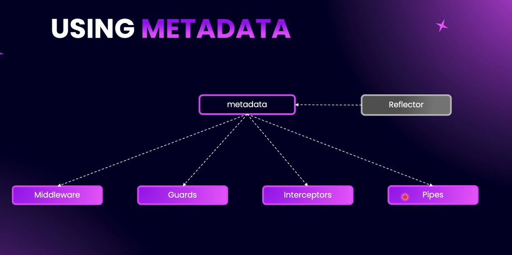
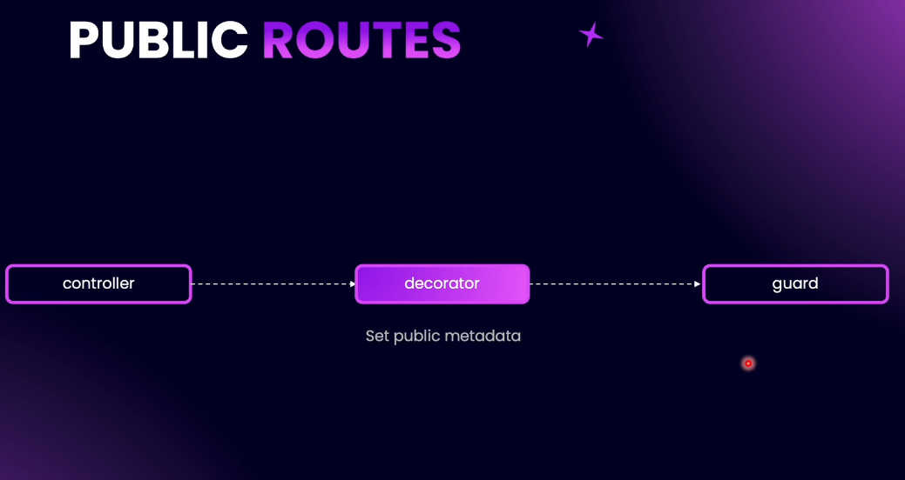

# Step 13 - Guards and Decorators

## Introducing Guards

Guards in NestJS are used to approve or disapprove incoming requests. Their main purpose is to determine whether a request should be processed based on certain conditions, such as the presence and validity of an access token.


**Explanation:**  
A guard acts as a gatekeeper for your routes, controllers, or even the entire application. If a request does not meet the guard's criteria (for example, lacking a valid JWT access token), the guard will deny the request and throw an unauthorized exception.


**Note:**  
- Guards can be applied at the controller class level, method level, or globally.


- Use the `@UseGuards()` decorator to apply guards.


- Guards are commonly used for authentication and authorization, such as validating JWT tokens in 
request headers.

- If the token is missing or invalid, the guard will reject the request.


---

## Creating AccessTokenGuard

**Explanation:**  
The AccessTokenGuard is a special guard in NestJS that checks if a request has a valid access token (usually a JWT) in its headers. Its main job is to extract the token from the request, validate it, and decide if the request should be allowed or denied.

**How it works:**  
1. **Extract the Request:**  
   The guard uses the NestJS `ExecutionContext` to get the incoming HTTP request object.

2. **Get the Token from Headers:**  
   It looks for the `Authorization` header in the request. The header usually looks like:  
   ```
   Authorization: Bearer <token>
   ```
   The guard splits this string and extracts the actual token part.

3. **Validate the Token:**  
   The guard uses the JWT service (from `@nestjs/jwt`) to check if the token is valid. It also uses the JWT configuration to know how to validate the token.

4. **Allow or Deny the Request:**  
   - If the token is valid, the guard returns `true` and the request is processed.
   - If the token is missing or invalid, the guard returns `false` and the request is denied (an unauthorized error is thrown).

**Key Points:**  
- The guard is created using the Nest CLI and placed in the `auth/guards/access-token` directory.
- Dependencies like the JWT service and JWT config are injected into the guard using the constructor.
- The main logic is inside the `canActivate` method, which must return `true` (allow) or `false` (deny).
- Token extraction is done in a private method that safely handles missing headers.

**Summary:**  
The AccessTokenGuard helps protect your routes by making sure only requests with a valid JWT access token can access certain endpoints. This is a common pattern for securing APIs.

[Code example](https://github.com/NadirBakhsh/nestjs-resources-code/commit/0643c0af6c121b7c51439e263db056a437693bb1)

---

## Completing AccessTokenGuard Implementation

**Explanation:**  
To complete the AccessTokenGuard, we need to validate the extracted token and attach the user payload to the request if the token is valid.

**Step-by-step:**
1. **Check for Token:**  
   If the token is missing (`undefined`), immediately throw an `UnauthorizedException`.

2. **Validate the Token:**  
   - Convert the `canActivate` method to `async`.
   - Use a `try...catch` block.
   - In the `try` block, use `await this.jwtService.verifyAsync(token, this.jwtConfig)` to verify the token.
   - If valid, the payload is returned.

3. **Attach Payload to Request:**  
   - Add the payload to the request object using a constant key (e.g., `REQUEST_USER_KEY`).
   - This allows controllers to access the authenticated user's info from the request.

4. **Handle Invalid Token:**  
   - If verification fails, throw an `UnauthorizedException` in the `catch` block.

5. **Return True:**  
   - If all checks pass, return `true` to allow the request.

**Key Points:**  
- Use a constant for the request user key (e.g., `REQUEST_USER_KEY`) instead of a hardcoded string.
- The payload typically contains user info like `sub` (user ID) and `email`.
- If the token is invalid or missing, the guard throws an unauthorized error.

**Summary:**  
The completed AccessTokenGuard checks for a token, validates it, attaches the user payload to the request, and ensures only authenticated requests are processed.

[Code example](https://github.com/NadirBakhsh/nestjs-resources-code/commit/6e7f722a2c7d1184b3798317be64a186bd72f5a2)

---

## Testing the AccessTokenGuard


**Explanation:**  
To test the AccessTokenGuard, you need to apply it to a route and try accessing that route with and without a valid JWT access token.

**How to Test:**
1. **Import JWT Config in Target Module:**  
   If your JWT config is not global, make sure to import the JWT config and JWT module into any module where you want to use the guard (e.g., UsersModule).

2. **Apply the Guard:**  
   Use the `@UseGuards(AccessTokenGuard)` decorator on a controller method (e.g., `createMany` in UsersController).  
   ```typescript
   @UseGuards(AccessTokenGuard)
   @Post('create-many')
   createMany(@Body() dto: CreateManyDto) {
     // ...controller logic...
   }
   ```

3. **Test Without Token:**  
   - Send a request to the guarded endpoint without an Authorization header.
   - You should receive a 401 Unauthorized error.

4. **Test With Token:**  
   - First, sign in to get a valid access token from your auth endpoint.
   - Add the token to the Authorization header as `Bearer <token>`.
   - Send the request again. If the token is valid, the request should go through (you may get a different error, e.g., duplicate user, but not unauthorized).

5. **Check the Payload:**  
   - The guard logs the payload to the terminal, showing user info like user ID and email.
   - You can verify this info in your database.

**Key Points:**  
- You can apply the guard to a single route, an entire controller, or globally.
- If applied to a controller, all endpoints in that controller require authentication.
- The guard blocks unauthorized requests before they reach your controller logic.

**Summary:**  
Testing the AccessTokenGuard ensures that only authenticated users can access protected endpoints. You can verify its behavior by sending requests with and without valid tokens and observing the responses and logs.

[Code example](https://github.com/NadirBakhsh/nestjs-resources-code/commit/bbceb97258cc09ecf9926acd9c103e0de1793b92)

---

## Applying AccessTokenGuard Globally

**Explanation:**  
You can apply the AccessTokenGuard to an entire module or globally to the whole application. This ensures all routes are protected by default, and only authenticated users can access them.

**How to Apply Globally:**
1. **Module-Level Guard:**  
   - In your module (e.g., `UsersModule`), add the following to the `providers` array:
     ```typescript
     {
       provide: APP_GUARD,
       useClass: AccessTokenGuard,
     }
     ```
   - Import `APP_GUARD` from `@nestjs/core` and `AccessTokenGuard` from your guards.
   - Make sure `JwtModule` and your JWT config are imported in the module.

2. **Global Guard (Recommended):**  
   - Instead of applying the guard in a feature module, apply it in the `AppModule`'s `providers` array.  
   - This protects all routes in your application by default.
   - Example:
     ```typescript
     @Module({
       imports: [
         JwtModule.registerAsync({ ... }),
         ConfigModule.forFeature(jwtConfig),
         // ...other imports
       ],
       providers: [
         {
           provide: APP_GUARD,
           useClass: AccessTokenGuard,
         },
         // ...other providers
       ],
     })
     export class AppModule {}
     ```
   - Import all necessary modules and providers.

**Important Note:**  
- Applying the guard in any module using `APP_GUARD` makes it global for the entire application, not just that module.
- For most use cases, apply the guard in the `AppModule` for clarity and maintainability.
- After applying globally, all routes require authentication unless explicitly marked as public (you'll learn how to do this with a custom decorator in later sections).

**Best Practice:**  
Protect all routes by default and explicitly mark only the routes you want to be public. This approach increases security and reduces the risk of accidentally exposing private endpoints.

[Code example](https://github.com/NadirBakhsh/nestjs-resources-code/commit/eab2b5eab653177a2e6061ef2b32d7531760a369)

---

## Practice: Validations for JWT Environment Variables

**Practice:**  
Add validations for your JWT-related environment variables in your config directory.  
- Locate your config validation file (commonly `env.validation.ts` or similar).
- Use a validation library like `joi` to define required JWT environment variables, such as:
  - `JWT_SECRET`
  - `JWT_EXPIRES_IN`
  - `JWT_ISSUER`
  - `JWT_AUDIENCE`
- Ensure each variable is present and of the correct type (e.g., string, number).

**Hint:**  
Refer to how other environment variables are validated in your config directory for guidance.

---

## Solution: Validations for JWT Environment Variables

**Solution:**  
To validate your JWT-related environment variables, open `src/config/environment.validation.ts` and add the following validations using `joi`:

```typescript
JWT_SECRET: Joi.string().required(),
JWT_AUDIENCE: Joi.string().required(),
JWT_ISSUER: Joi.string().required(),
JWT_EXPIRES_IN: Joi.number().required(),
```

- `JWT_SECRET`, `JWT_AUDIENCE`, and `JWT_ISSUER` must be strings and are required.
- `JWT_EXPIRES_IN` must be a number and is required.

If any of these variables are missing or not in the correct format, the application will throw a validation error and not start.  
Adding these validations ensures your environment is correctly configured and prevents runtime errors.

[Code example](https://github.com/NadirBakhsh/nestjs-resources-code/commit/56f05aae458bc5370600b25d6e682d26232e37e9)

---

## What are Decorators?


**Explanation:**  
Decorators in NestJS (and TypeScript) are special functions that can be attached to classes, methods, or parameters to add metadata. This metadata describes or configures how NestJS should treat these elements.



**Types of Decorators:**
- **Class Decorators:** Applied to classes (e.g., `@Controller()`).
- **Method Decorators:** Applied to methods (e.g., `@Post()`, `@Get()`).
- **Parameter Decorators:** Applied to method parameters (e.g., `@Body()`, `@Param()`)

**Purpose:**  
Decorators add metadata to the execution context, which NestJS uses to understand how to route requests, validate data, or apply guards and interceptors. For example, the `@Post('create-many')` decorator adds metadata about the route path and HTTP method.

**Custom Metadata:**  
You can use the built-in `@SetMetadata()` decorator to add custom metadata to routes or methods. This metadata can be accessed in guards, interceptors, or other NestJS components using the `Reflector` class.

**Example:**  
```typescript
@SetMetadata('isPublic', true)
@Post('public-endpoint')
createPublic(@Body() dto: CreateDto) {
  // This route is marked as public
}
```

**Why Use Decorators?**  
- They enable declarative programming by letting you describe behavior directly on classes and methods.
- They allow NestJS to use reflection to read metadata and apply logic accordingly (e.g., routing, validation, authorization).



**Summary:**  
Decorators are a core part of NestJS, enabling you to add metadata to classes, methods, and parameters. This metadata drives much of the framework's behavior, including routing, guards, and custom logic.

---

## Our First Decorator

**Explanation:**  
You can use the built-in `@SetMetadata()` decorator from NestJS to attach custom metadata to your route handlers. For example, you might want to mark a route as public by setting an `authType` metadata key to `'none'`:

```typescript
import { SetMetadata } from '@nestjs/common';

@SetMetadata('authType', 'none')
@Post('create')
createUser(@Body() dto: CreateUserDto) {
  // This route is public
}
```

However, to make this more robust and less error-prone, you can create your own custom decorator and use an enum for allowed authentication types.

**Steps to Create a Custom Decorator:**
1. **Create an Enum:**  
   Define an `AuthType` enum (e.g., with values `BEARER` and `NONE`) in `auth/enums/auth-type.enum.ts`:
   ```typescript
   export enum AuthType {
     BEARER = 'bearer',
     NONE = 'none',
   }
   ```

2. **Create a Constant for the Metadata Key:**  
   In `auth/constants/auth.constants.ts`:
   ```typescript
   export const AUTH_TYPE_KEY = 'authType';
   ```

3. **Create the Decorator:**  
   In `auth/decorators/auth.decorator.ts`:
   ```typescript
   import { SetMetadata } from '@nestjs/common';
   import { AUTH_TYPE_KEY } from '../constants/auth.constants';
   import { AuthType } from '../enums/auth-type.enum';

   export const Auth = (type: AuthType) => SetMetadata(AUTH_TYPE_KEY, type);
   ```

4. **Use the Custom Decorator:**  
   In your controller:
   ```typescript
   import { Auth } from 'auth/decorators/auth.decorator';
   import { AuthType } from 'auth/enums/auth-type.enum';

   @Auth(AuthType.NONE)
   @Post('create')
   createUser(@Body() dto: CreateUserDto) {
     // This route is public
   }
   ```

**Benefits:**  
- Type safety: Only valid auth types can be used.
- Centralized logic: All metadata assignment is handled in one place.
- Cleaner and more readable code.

**Summary:**  
By creating a custom decorator, you make your codebase safer and more maintainable. You can now easily mark routes as public or protected using your `@Auth()` decorator and the `AuthType` enum.

[Code example](https://github.com/NadirBakhsh/nestjs-resources-code/commit/c55168e11cb03ef7ce178bc1c96b92225f036463)

---

## Authentication Guard Strategy

**Explanation:**  
Now that we have a custom decorator to set authentication metadata on our routes, we can create an `AuthenticationGuard` that uses this metadata to decide if a route is public or protected.

**How it works:**
- The `AuthenticationGuard` will read the metadata (set by the `@Auth()` decorator) from the route handler or controller.
- If the metadata indicates `AuthType.NONE`, the guard will allow the request without authentication.
- If the metadata indicates `AuthType.BEARER`, the guard will delegate to the `AccessTokenGuard` to validate the JWT.
- This pattern allows you to easily add more authentication strategies in the future (e.g., Google, OAuth).

**App Guard Structure:**
- The `AuthenticationGuard` becomes the main global guard (app guard).
- The `AccessTokenGuard` is provided as a dependency and used internally by the `AuthenticationGuard`.
- This approach centralizes authentication logic and makes it easy to manage public and protected routes.

**Diagram:**
```
[Auth Decorator] ---> [AuthenticationGuard] ---> [AccessTokenGuard] (if needed)
         |                    |                        |
   (sets metadata)     (reads metadata)         (validates JWT)
```

**Summary:**  
The `AuthenticationGuard` uses route metadata to determine if a route is public or protected, and applies the appropriate authentication strategy. This makes your authentication logic flexible and maintainable.

---

## Create AuthenticationGuard

Item 10. Context from Code Snippet README.md:(0-11)
Create a new file in `src/auth/guards` called `authentication.guard.ts`:

[Code example](https://github.com/NadirBakhsh/nestjs-resources-code/commit/3a6b866ad2b2304f53737d0f2f544ef67b982066)

---

## AuthenticationGuard Implementation

**Explanation:**  
The `AuthenticationGuard` checks the metadata set by the `@Auth()` decorator to determine the authentication strategy for each route. Here’s how it works:

1. **Get Auth Types:**  
   Use the `Reflector` to read all `AuthType` metadata from the route handler and class. If none is set, use the default (`BEARER`)

2. **Resolve Guards:**  
   Map each `AuthType` to its corresponding guard using the guard map. Flatten the result to get an array of guard instances.

3. **Check Guards:**  
   Loop through each guard and call its `canActivate` method with the current context. Await the result (handles both sync and async guards).

4. **Authorize or Reject:**  
   - If any guard returns `true`, allow the request.
   - If all guards return `false` or throw, throw an `UnauthorizedException`.

**Result:**  
- All routes are protected by default.
- Routes decorated with `@Auth(AuthType.NONE)` are public.
- Routes with `@Auth(AuthType.BEARER)` (or no decorator) require a valid JWT.

This approach centralizes and simplifies authentication logic, making it easy to manage public and protected endpoints.

[Code example](https://github.com/NadirBakhsh/nestjs-resources-code/commit/e6be9821627efc89403c7132be3da2d5962b7bf0)

---

## Understanding User Payload

**Explanation:**  
When a user is authenticated, the AccessTokenGuard extracts the payload from the JWT token and attaches it to the request object using a constant key (e.g., `REQUEST_USER_KEY`). This payload contains user information (like user ID and email) and can be accessed in your controllers or services.

**How to Access the User Payload:**
- In a controller method, you can inject the full request object using the `@Request()` decorator from `@nestjs/common`.
- The user payload will be available as `request[REQUEST_USER_KEY]`.

**Example:**
```typescript
import { Request } from '@nestjs/common';
import { REQUEST_USER_KEY } from 'auth/constants/auth.constants';

@Post('create')
createPost(@Request() req) {
  console.log(req[REQUEST_USER_KEY]); // Access the user payload
  // ...existing code...
}
```

**Note:**  
While you can access the user payload directly from the request, it's better practice to use a custom parameter decorator for cleaner and more testable code. This leads to the creation of an "Active User" decorator, which will simplify extracting the user payload in your route handlers.

[Code example](https://github.com/NadirBakhsh/nestjs-resources-code/commit/8e8b6bb5a877304c7a7ea0f7e1b3c5bb49d38b10)

---

## Create Active User Decorator
---

## Practice: Refactor `createPostDto`
---

## Solution: Refactor `createPostDto`