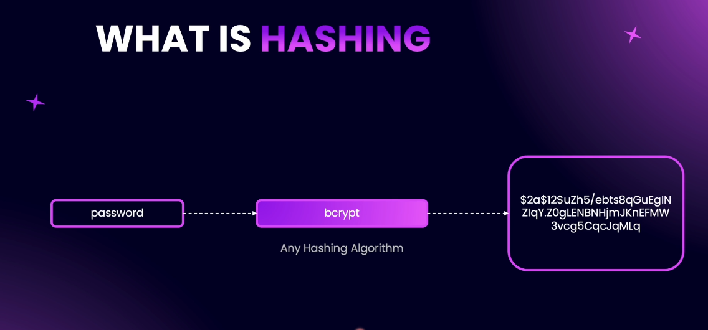
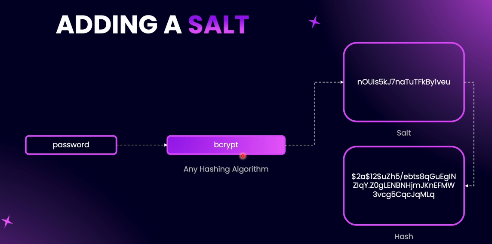
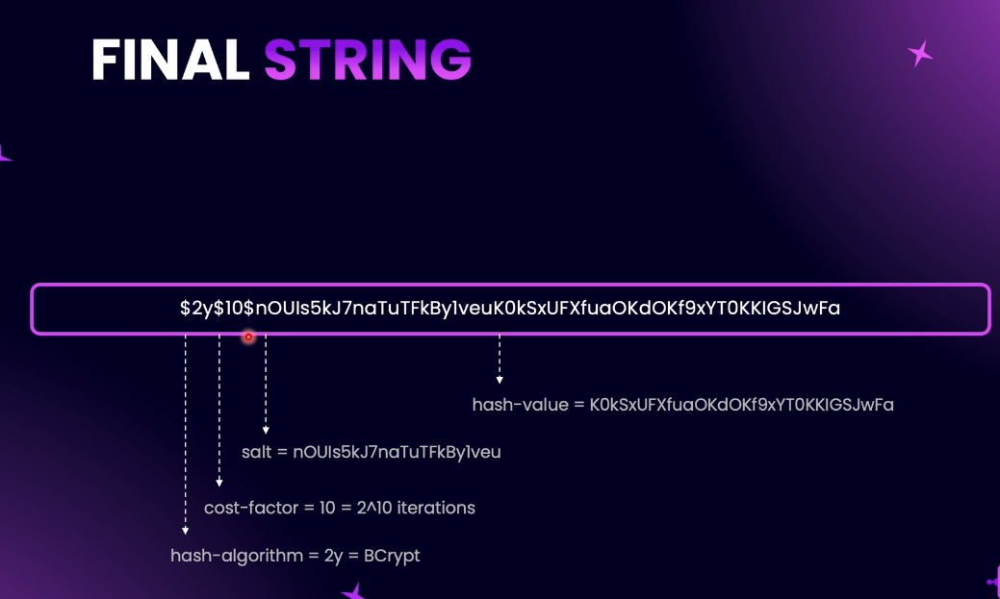

# Step 12 - User Authentication

## Introduction to Authentication


### Authentication in NestJS – Overview


When building a **NestJS** application, there are multiple ways to authenticate a user.  
In this course, we will focus on **two specific methods**:

1. **Password-Based Authentication** (covered in this section)  
2. **Third-Party Authentication** (e.g., Google Authentication – covered in another section)


### 1. What is Password-Based Authentication?
In **password-based authentication**, a user provides their **email** and **password** during sign-up.  
When they log in, the system validates these credentials.

The authentication process involves:
- **Sign-Up** → Accept email & password → Securely store it in the database.
- **Login** → Compare provided credentials with stored data → Authenticate if matched.


### 2. Why Not Store Passwords in Plain Text?
**Storing passwords as plain text is dangerous** because:
- Developers with DB access can see all user passwords.
- If a database breach occurs, hackers can access passwords without effort.
- Users often reuse the same password across services → a breach here can compromise their accounts elsewhere.

**Solution:** Always **hash** and **salt** passwords before storing them.


### 3. Hashing and Salting
- **Hashing** → Converts the password into a fixed-length scrambled string (irreversible).
- **Salting** → Adds random data to the password before hashing to prevent common attacks.

✅ Benefit → Even if two users have the same password, their stored hash will be different.


### 4. Authentication Flow with JWT
Once the password is hashed & stored:
1. **User Login:**
   - User provides email & password.
   - The server hashes the entered password and compares it to the stored hash.
2. **If Match → Generate JWT Token:**
   - **JWT** = **JSON Web Token** → a signed token containing user identity information.
   - Sent back to the user upon successful authentication.


### 5. Using JWT for Subsequent Requests
- For endpoints requiring authentication, the client sends the **JWT** in the request header.
- The server verifies:
  - The JWT signature is valid.
  - The token has not been tampered with.
  - The token has not expired.
- If valid → request is authorized.


### 6. Key Components in This Section
In this section of the course, we will cover:
- **Hashing & Salting Passwords**
- **Storing Secure Passwords in the Database**
- **Comparing Hashed Passwords During Login**
- **Issuing JWT Tokens**
- **Verifying JWTs for Protected Endpoints**
- **Authorizing Requests Based on JWT**

#### Summary Flow Diagram
```
Sign-Up:
   User → Email + Password → Hash + Salt → Store in DB

Login:
   User → Email + Password → Hash + Compare with DB → If Match → Issue JWT

Subsequent Requests:
   Client → Sends JWT → Server Verifies Signature → Authorize or Reject
```

By the end of this section, you will be able to implement **secure, password-based authentication** in your **NestJS** applications.


---

## Hashing and Salting Passwords: Why and How?



### Why Not Store Passwords Directly?
Storing passwords as plain text in a database is extremely risky. If someone gains access to the database (through hacking or internal misuse), they can see all user passwords. Since many people reuse passwords across sites, this can lead to widespread security breaches.

### What is Hashing?
Hashing is a process that transforms any input (like a password) into a fixed-size string of characters, which appears random. This is done using mathematical functions called hash functions. Key points:
- Hashing is one-way: you cannot reverse a hash to get the original password.
- The same input always produces the same hash (with the same algorithm and parameters).
- Hashes are always the same length, regardless of input size.

### How Does Hashing Help?
When a user creates a password, you hash it and store only the hash in the database. When they log in, you hash the password they enter and compare it to the stored hash. If they match, the password is correct. This way, the actual password is never stored or revealed.

### What is Salting?
A salt is a random string added to the password before hashing. This makes each hash unique, even if two users have the same password. Salting prevents attacks like "rainbow table" attacks, where hackers use precomputed tables to reverse hashes.



### How Does Bcrypt Work?
Bcrypt is a popular hashing algorithm for passwords. It:
- Adds a salt automatically.
- Allows you to set a "cost factor" (number of hashing rounds), making it slower and harder to crack.
- Stores the salt, cost, and hash together in one string.



### Why is This Secure?
- Even if someone gets the database, they only see hashes, not passwords.
- Salting ensures that identical passwords have different hashes.
- Bcrypt’s cost factor makes brute-force attacks much harder.

### Summary
- Never store plain text passwords.
- Always hash passwords, and use a salt.
- Use a strong algorithm like bcrypt, which handles salting and hashing securely.
- When verifying a password, hash the input and compare to the stored hash.

---
## Create Hashing Providers

### Why Use Providers for Hashing?


We start by creating an **abstract class** called `HashingProvider`. This class defines the contract for any hashing provider we want to use. It contains two abstract methods:

- `hashPassword(data: string | Buffer): Promise<string>`  
  Hashes the provided password and returns the hashed string.

- `comparePassword(data: string | Buffer, encrypted: string): Promise<boolean>`  
  Compares a plain password with a hashed password and returns `true` if they match.

By using an abstract class, we ensure that any concrete implementation (like bcrypt) must provide these methods.

#### Bcrypt Provider

Next, we create a **BcryptProvider** class that implements the `HashingProvider` abstract class. This class provides the actual logic for hashing and comparing passwords using the bcrypt algorithm.

- The `hashPassword` method uses bcrypt to hash the password.
- The `comparePassword` method uses bcrypt to compare a plain password with a hashed password.

This setup allows us to inject the `HashingProvider` wherever we need password hashing in our application. If we ever want to switch to a different algorithm (like Argon2), we just create a new provider that implements the same abstract class.

**Summary:**
- Create an abstract `HashingProvider` with `hashPassword` and `comparePassword` methods.
- Implement these methods in a concrete `BcryptProvider`.
- Use dependency injection to use the provider throughout the app.

This approach keeps our authentication logic clean, testable, and easy to update in the future.

[code commit](https://github.com/NadirBakhsh/nestjs-resources-code/commit/b891ea81e1beb865cd9a5d68f5451e22d24acbc3)

---
## Implementing Hashing Provider

To implement the hashing provider using bcrypt, follow these steps:

### 1. Install the Bcrypt Package

First, install the bcrypt package in your project.  
It's recommended to use version `5.1.1` for compatibility:

```bash
npm install bcrypt@5.1.1
```

### 2. Import Bcrypt in Your Provider

In your `BcryptProvider` class, import bcrypt like this:

```typescript
import * as bcrypt from 'bcrypt';
```

### 3. Implement the `hashPassword` Method

- Mark the method as `async`.
- Generate a salt using `bcrypt.genSalt()`.
- Hash the password using `bcrypt.hash(data, salt)`.
- Return the hashed password.

Example:

```typescript
public async hashPassword(data: string | Buffer): Promise<string> {
  const salt = await bcrypt.genSalt();
  return bcrypt.hash(data, salt);
}
```

### 4. Implement the `comparePassword` Method

- Use `bcrypt.compare(data, encrypted)` to compare the plain password with the hashed password.
- Return the result (a boolean).

Example:

```typescript
public async comparePassword(data: string | Buffer, encrypted: string): Promise<boolean> {
  return bcrypt.compare(data, encrypted);
}
```

### Why Use Bcrypt?

- Bcrypt automatically handles salt generation and storage.
- It provides simple methods for hashing and comparing passwords.
- You don't need to manage salts or store them separately—bcrypt includes the salt in the hash string.

This makes password management secure and straightforward in your NestJS application.

[github code commit][](https://github.com/NadirBakhsh/nestjs-resources-code/commit/57ac9a496c49a65fbb4b4f22b54f502b3cac0c62)

---
## User Signup
---
## User SignIn Controller
---
## Completing the SignIn Method
---
## Custom Response Code
---
## Understanding JWTs
---
## Adding JWT Configuration
---
## Generating JWT
---
## JWT Token Signatures
---