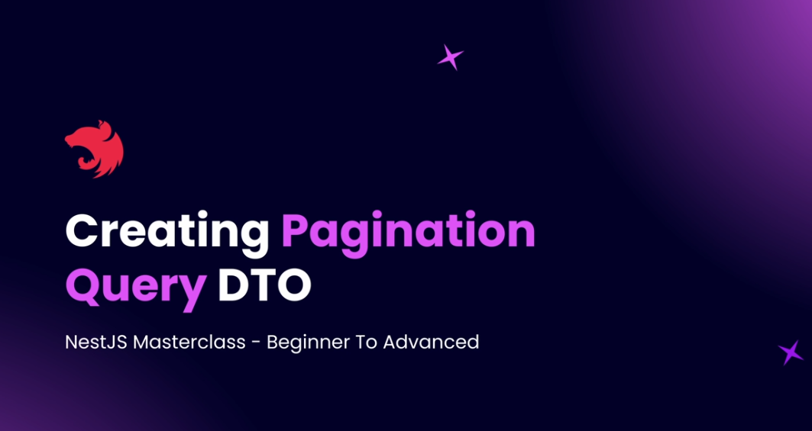

# Step 11 - Pagination

### Introduction to Pagination


Pagination is a crucial feature for optimizing database queries and enhancing user experience in web applications. Instead of fetching all records, pagination allows us to retrieve a subset of data, reducing load on the database and improving response times. This feature is commonly seen in blogs and online platforms where content is split across multiple pages with navigation buttons.


To implement pagination, we use query parameters like `limit` and `page`. The `limit` specifies how many items to display per page, while `page` indicates the current page number. For example, requesting 10 items on page 1 sets `limit=10` and `page=1`. This approach fetches only the necessary data from the database, making the process efficient and user-friendly.

Our pagination system will be generic, applicable to any data entity such as posts or users. The response will include a `data` property containing the current page's items. Additionally, a `meta` property provides pagination details like items per page, total items, current page, and total pages. This metadata helps users understand their position within the dataset.

Furthermore, the response will include `links` for navigation, such as links to the first, last, next, and previous pages. These links facilitate easy navigation for users and integration for front-end developers.


In summary, pagination enhances performance and usability by limiting data retrieval and providing structured navigation. Our implementation in NestJS will be versatile, supporting various entities and offering comprehensive pagination information in the response.

---

### Creating Pagination Query DTO



#### 1. Goal
- Create a **reusable pagination DTO** that works across multiple API endpoints, not just for a single entity.
- Allow combining pagination with **other query parameters** for specific endpoints.
- Use **NestJS’s `IntersectionType`** to merge multiple DTOs.
- Use **implicit type conversion** so query params like `limit` and `page` (string in URL) automatically become numbers.

---

#### 2. Why This is Needed
In real projects:
- Many endpoints need pagination (`limit`, `page`).
- Each endpoint may have **its own unique query params** (e.g., `startDate`, `endDate` for posts).
- We don’t want to duplicate pagination logic in each DTO.
- Solution: Keep pagination DTO in a `common` module and combine it when needed.

---

#### 3. Steps

##### Step 1 – Create `common/pagination/dtos/pagination-query.dto.ts`
```ts
// src/common/pagination/dtos/pagination-query.dto.ts
import { IsOptional, IsPositive, Max } from 'class-validator';
import { ApiPropertyOptional } from '@nestjs/swagger';

export class PaginationQueryDto {
  @ApiPropertyOptional({ description: 'Number of results per page', example: 10 })
  @IsOptional()
  @IsPositive()
  @Max(500) // limit maximum results to avoid heavy DB queries
  limit?: number = 10; // default value

  @ApiPropertyOptional({ description: 'Current page number', example: 1 })
  @IsOptional()
  @IsPositive()
  page?: number = 1; // default value
}
```

---

##### Step 2 – Enable Implicit Type Conversion in `main.ts`
```ts
// src/main.ts
import { ValidationPipe } from '@nestjs/common';
import { NestFactory } from '@nestjs/core';
import { AppModule } from './app.module';

async function bootstrap() {
  const app = await NestFactory.create(AppModule);

  app.useGlobalPipes(
    new ValidationPipe({
      transform: true, // enable auto transformation
      transformOptions: { enableImplicitConversion: true }, // convert string to number/date automatically
    }),
  );

  await app.listen(3000);
}
bootstrap();
```

✅ Now `limit=10` in query string will be converted from `"10"` (string) → `10` (number) automatically.

---

##### Step 3 – Create an Endpoint-Specific DTO
Example for **Posts** endpoint with extra filters (`startDate`, `endDate`):

```ts
// src/posts/dtos/get-posts.dto.ts
import { IsOptional, IsDateString } from 'class-validator';
import { ApiPropertyOptional, IntersectionType } from '@nestjs/swagger';
import { PaginationQueryDto } from 'src/common/pagination/dtos/pagination-query.dto';

class GetPostsBaseDto {
  @ApiPropertyOptional({ description: 'Filter from start date', example: '2025-01-01' })
  @IsOptional()
  @IsDateString()
  startDate?: Date;

  @ApiPropertyOptional({ description: 'Filter to end date', example: '2025-01-31' })
  @IsOptional()
  @IsDateString()
  endDate?: Date;
}

// Combine both DTOs
export class GetPostsDto extends IntersectionType(
  GetPostsBaseDto,
  PaginationQueryDto,
) {}
```

---

##### Step 4 – Use in Controller
```ts
// src/posts/posts.controller.ts
import { Controller, Get, Query } from '@nestjs/common';
import { GetPostsDto } from './dtos/get-posts.dto';

@Controller('posts')
export class PostsController {
  @Get()
  findAll(@Query() query: GetPostsDto) {
    console.log(query);
    // Example: GET /posts?limit=5&page=2&startDate=2025-01-01&endDate=2025-01-31
    // Output:
    // { limit: 5, page: 2, startDate: '2025-01-01', endDate: '2025-01-31' }
    return `Returning ${query.limit} results from page ${query.page}`;
  }
}
```

---

#### 5. Key Points
- **Pagination DTO is reusable** for all entities.
- Placed inside `src/common/` to make it **entity-agnostic**.
- **`IntersectionType`** merges multiple DTOs (from `@nestjs/swagger` for docs).
- **Implicit Conversion** avoids using `@Type(() => Number)` everywhere.
- Default values (`limit = 10`, `page = 1`) ensure **sensible fallbacks**.
- You can add **`Max`** limit to prevent performance issues.

---

#### 6. Example Request
```
GET /posts?limit=5&page=2&startDate=2025-01-01&endDate=2025-01-31
```
Response log in controller:
```json
{
  "limit": 5,
  "page": 2,
  "startDate": "2025-01-01",
  "endDate": "2025-01-31"
}
```

[Github code commit](https://github.com/NadirBakhsh/nestjs-resources-code/commit/51ae478ad75bef053d968320220721b6629ae73d)

---


- Adding Pagination to Query
- Pagination Module and Interface
- Using `paginateQuery`
- Building Response Object
- Complete Paginated Response