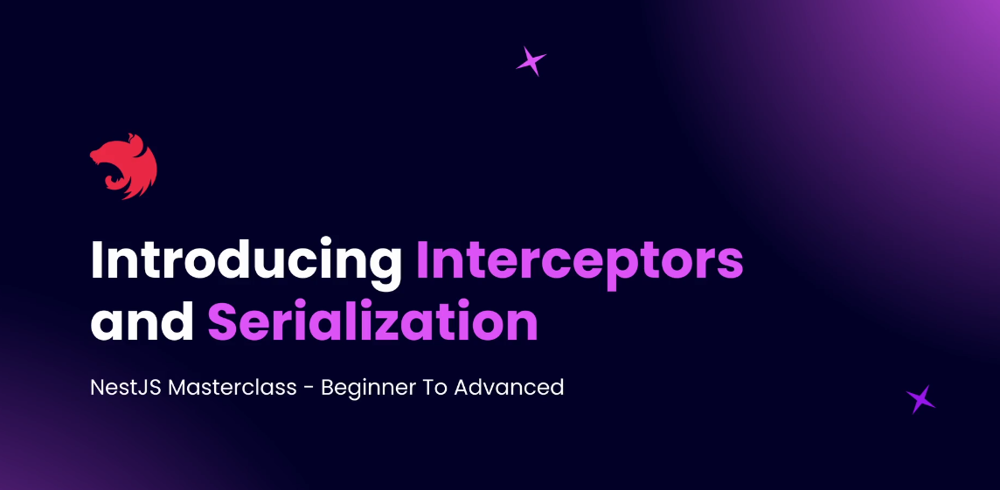

# Step 16 - Serialization and Interceptors

## Introducing Interceptors and Serialization

**Explanation:**
Interceptors in NestJS are executed twice in the request-response lifecycle: once before the controller method runs, and once after the controller returns a response. This unique placement allows interceptors 

to:
- Transform or filter outgoing responses (e.g., remove sensitive fields like passwords or Google IDs)
- Bind extra logic before/after method execution
- Alter exceptions returned by controllers
- Wrap responses in a data property or add metadata like API version

Interceptors help you apply consistent logic across your app without modifying every controller. In this section, you'll create interceptors to filter sensitive properties and globally wrap responses.

## Serializing User Entity

**Explanation:**
Serialization in NestJS allows you to control which properties are included in API responses. By using the built-in `ClassSerializerInterceptor` and the `@Exclude` decorator in your entity (e.g., User), you can easily hide sensitive fields like `password` and `googleId` from outgoing responses. Apply the interceptor to a controller method or class, and mark properties to exclude in your entity. This approach keeps your API responses secure and clean without manual filtering in every controller method.

[Code Example](https://github.com/NadirBakhsh/nestjs-resources-code/commit/07789d7adf6b6732b2622600c424ff275552692d)

- Global Data Interceptor
- Adding API Version