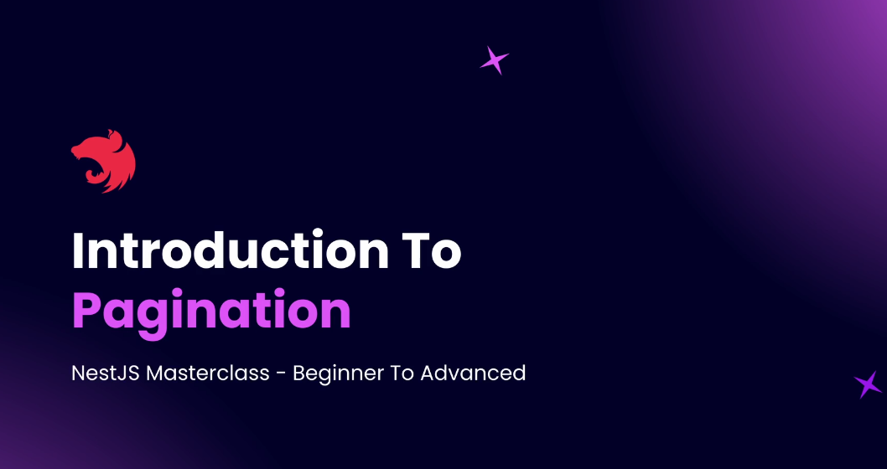
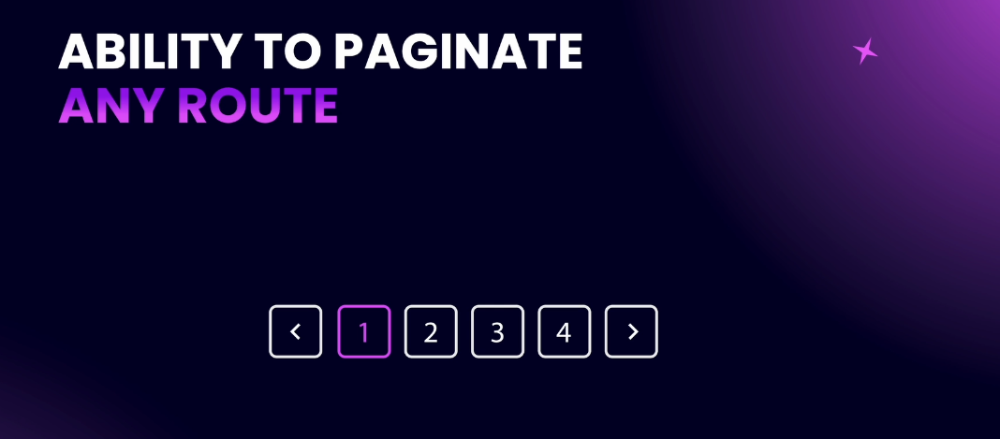
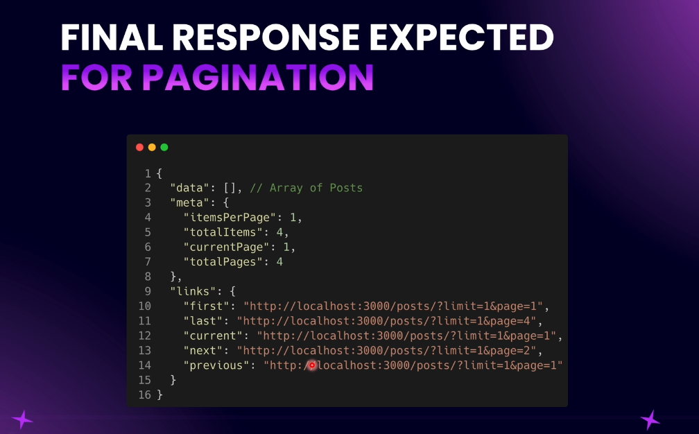

# Step 11 - Pagination

### Introduction to Pagination

Pagination is a crucial feature for optimizing database queries and enhancing user experience in web applications. Instead of fetching all records, pagination allows us to retrieve a subset of data, reducing load on the database and improving response times. This feature is commonly seen in blogs and online platforms where content is split across multiple pages with navigation buttons.

To implement pagination, we use query parameters like `limit` and `page`. The `limit` specifies how many items to display per page, while `page` indicates the current page number. For example, requesting 10 items on page 1 sets `limit=10` and `page=1`. This approach fetches only the necessary data from the database, making the process efficient and user-friendly.

Our pagination system will be generic, applicable to any data entity such as posts or users. The response will include a `data` property containing the current page's items. Additionally, a `meta` property provides pagination details like items per page, total items, current page, and total pages. This metadata helps users understand their position within the dataset.

Furthermore, the response will include `links` for navigation, such as links to the first, last, next, and previous pages. These links facilitate easy navigation for users and integration for front-end developers.

In summary, pagination enhances performance and usability by limiting data retrieval and providing structured navigation. Our implementation in NestJS will be versatile, supporting various entities and offering comprehensive pagination information in the response.

---

- Creating Pagination Query DTO
- Adding Pagination to Query
- Pagination Module and Interface
- Using `paginateQuery`
- Building Response Object
- Complete Paginated Response