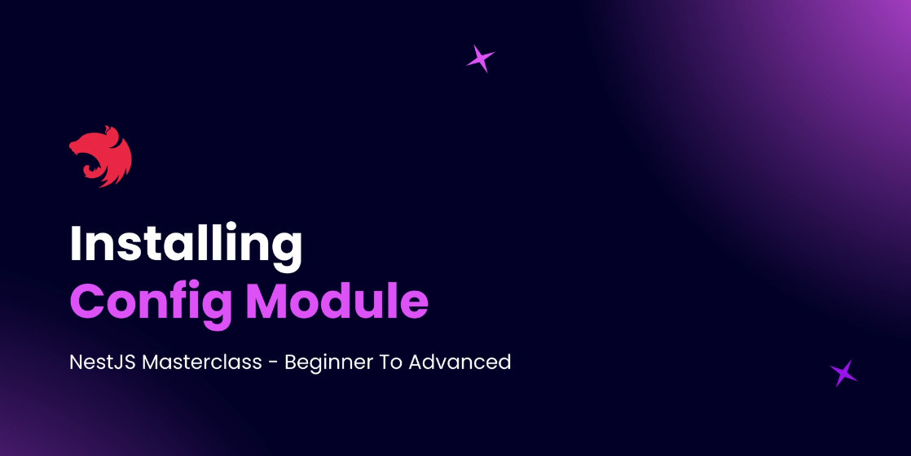
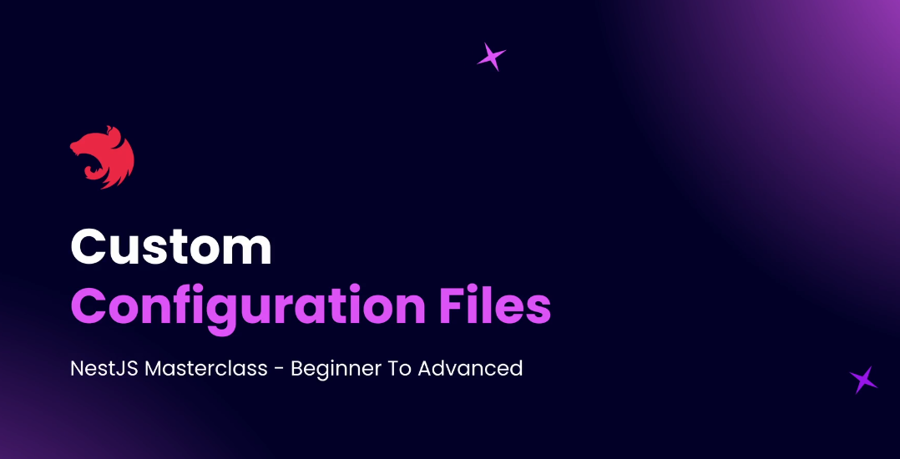

# Step 08 - Environments in NestJS

### Introduction to Environments

#### 🚀 How NestJS Handles This

**NestJS already uses the dotenv package behind the scenes, but also provides:**
- A more powerful and structured way to handle configuration
- A built-in @nestjs/config ConfigModule for environment management

#### 💡 Why Use Different Environments?
Different environments serve different purposes:

1. Development
- Used during coding
- Uses a development DB
- Often enables automatic syncing of DB schema with entities


2. Staging
- Simulates production
- May use separate DB
- Useful for testing features before going live

3. Testing
- Uses a test DB
- Tables and data are frequently created and destroyed
- Isolated from development to prevent data loss

4. Production
- Uses live DB
- ❌ Auto-sync is turned off (for safety)
- Migrations are run manually to ensure stability

#### 🔧 The NestJS ConfigModule
- Load .env files
- Manage environment-based variables
- Provide strong typing support for environment variables
- Make configurations available via Dependency Injection

---


### Installing Config Module

In this guide, we will configure the @nestjs/config module to manage environment variables in a secure and scalable way.



#### Why Use @nestjs/config?
- Keeps sensitive data (e.g., database URLs, API keys) outside your source code
- Enables environment-specific configurations (e.g., dev, test, prod)
- Simplifies accessing .env variables throughout your app

#### 📦 Installation
```
npm i @nestjs/config
```
#### 🛠 Setup in AppModule

```ts
// src/app.module.ts
import { Module } from '@nestjs/common';
import { ConfigModule } from '@nestjs/config';

@Module({
  imports: [
    ConfigModule.forRoot({
      isGlobal: true, // Makes config available in all modules
    }),
    // other modules...
  ],
})
export class AppModule {}
```

#### 📁 Create .env File
Create a .env file at your project root:

```bash
# .env
S3_BUCKET=my-s3-bucket
DB_HOST=localhost
DB_PORT=5432
```

#### 📌 Summary
- Install @nestjs/config@3.2.2
- Set up .env file in root
- Use ConfigModule.forRoot({ isGlobal: true })
- Access vars via ConfigService.get()


[Source Code example](https://github.com/NadirBakhsh/nestjs-resources-code/commit/4c5203024f96d29c5f52771cbdfbce362da91034)

---


### Using Config Service

The `ConfigService` in NestJS allows you to access environment variables and configuration settings throughout your application. By using the `ConfigService`, you can ensure that your application is configurable and environment-specific settings can be easily managed. Here's how you can use it in your NestJS application:

1. **Inject ConfigService:**

   To use the `ConfigService`, you need to inject it into your service or controller. This can be done using NestJS's dependency injection.

   ```ts
   import { Injectable } from '@nestjs/common';
   import { ConfigService } from '@nestjs/config';

   @Injectable()
   export class AppService {
     constructor(private configService: ConfigService) {}

     getDatabaseHost(): string {
       return this.configService.get<string>('DB_HOST');
     }
   }
   ```

2. **Access Environment Variables:**

   You can easily access environment variables using the `get` method provided by the `ConfigService`. The `get` method takes the name of the environment variable as a parameter and returns its value.

   ```ts
   const dbHost = this.configService.get<string>('DB_HOST');
   const dbPort = this.configService.get<number>('DB_PORT');
   ```

3. **Provide Default Values:**

   You can also provide default values in case the environment variable is not set. This is helpful in ensuring that your application runs smoothly even if some configuration is missing.

   ```ts
   const dbPort = this.configService.get<number>('DB_PORT', 5432);
   ```

4. **Type Safety:**

   The `ConfigService` provides strong typing support for environment variables, which helps in avoiding runtime errors and makes your code more predictable.

By utilizing the `ConfigService`, your application becomes more flexible and easier to maintain, as configuration settings are centralized and separated from the codebase.

[Source Code example](https://github.com/NadirBakhsh/nestjs-resources-code/commit/dd86502e088d83df1dbd30b0802806a2210f4370)

---


### Confirming `NODE_ENV` While Testing

To handle different environment configurations in a NestJS application, you can use multiple `.env` files for different environments like development, testing, and production. Jest automatically sets the `NODE_ENV` environment variable to `test` during testing. Here’s how to configure your project to support this setup:

1. **Create Environment Files:**
   - Create separate `.env` files for each environment, e.g., `.env.development`, `.env.test`, etc.
   - Ensure that your environment-specific variables are defined in each file.

2. **Configure Jest:**
   - Modify the `jest-e2e.json` file to update the `rootDir` to point to the root of your application directory.
   - Add `modulePaths` to ensure Jest looks for modules in the correct directory.
   ```json
   {
     "rootDir": "../",
     "modulePaths": ["<rootDir>"]
   }
   ```

3. **Update `package.json`:**
   - In the Jest configuration inside `package.json`, set the `rootDir` to the application root and add `modulePaths`.
   ```json
   {
     "jest": {
       "rootDir": ".",
       "modulePaths": ["<rootDir>"]
     }
   }
   ```

4. **Modify Test File:**
   - In your `app.e2e-spec.ts` file, access the `NODE_ENV` using `process.env.NODE_ENV` and log it to verify its value.
   ```ts
   console.log(process.env.NODE_ENV);
   ```

5. **Run End-to-End Tests:**
   - Use the script in `package.json` to run your end-to-end tests:
   ```bash
   npm run test:e2e

[Source Code example](https://github.com/NadirBakhsh/nestjs-resources-code/commit/19c71c113951bd554615858a5b11917e0e1f5d45)

---


### Conditionally Loading Environments


### Conditionally Loading Environments

To conditionally load different environment variables based on different environments you can pass an expression to the `envFilePath` property of the `ConfigModule`.

For example, if you want to load a different environment file depending on the `NODE_ENV` variable, you can do the following:

[Source Code example](https://github.com/NadirBakhsh/nestjs-resources-code/commit/19c71c113951bd554615858a5b11917e0e1f5d45)

---


### Inject Database Details from Environment Variables

To securely manage your database configuration in NestJS, you should load all database connection details from environment variables using the `@nestjs/config` module and `ConfigService`. This approach keeps sensitive information out of your source code and allows for easy environment-specific configuration.

#### 1. Define Database Variables in `.env` Files

Create the following variables in your environment file (e.g., `.env.development`):

```
DATABASE_PORT=5432
DATABASE_USER=postgres
DATABASE_PASSWORD=password
DATABASE_HOST=localhost
DATABASE_NAME=NestJSBlog
```

> **Tip:** If your password contains special characters (like `#`), wrap it in double quotes.

#### 2. Use ConfigService in TypeORM Configuration

Instead of hardcoding values or using `process.env` directly, inject `ConfigService` into your TypeORM configuration factory. This ensures all values are loaded from the environment and are type-safe.

```typescript
// src/app.module.ts
import { Module } from '@nestjs/common';
import { ConfigModule, ConfigService } from '@nestjs/config';
import { TypeOrmModule } from '@nestjs/typeorm';

@Module({
  imports: [
    ConfigModule.forRoot({ isGlobal: true }),
    TypeOrmModule.forRootAsync({
      imports: [ConfigModule],
      inject: [ConfigService],
      useFactory: (configService: ConfigService) => ({
        type: 'postgres',
        port: +configService.get<string>('DATABASE_PORT'),
        username: configService.get<string>('DATABASE_USER'),
        password: configService.get<string>('DATABASE_PASSWORD'),
        host: configService.get<string>('DATABASE_HOST'),
        database: configService.get<string>('DATABASE_NAME'),
        // ...other TypeORM options
      }),
    }),
    // ...other modules
  ],
})
export class AppModule {}
```

- The `+` before `configService.get<string>('DATABASE_PORT')` ensures the port is converted to a number.

#### 3. Why Use ConfigService?

- **Centralized configuration:** All environment variables are managed in one place.
- **Type safety:** Avoids runtime errors due to missing or mis-typed variables.
- **Environment flexibility:** Easily switch between development, test, and production settings.

#### 4. When to Use `process.env` Directly

- Only use `process.env` directly inside configuration files or when setting up the `ConfigModule` itself.
- For all other usages throughout your application, prefer `ConfigService`.

[Source Code example](https://github.com/NadirBakhsh/nestjs-resources-code/commit/1db6c99b132961e67107532883c3f54f29fcb749)

---

### Custom Configuration Files



---

## Custom Configuration Files in NestJS

Custom configuration files in NestJS provide an additional abstraction layer over environment variables. Instead of accessing environment variables directly throughout your application, you define configuration files (factory functions) that read from `process.env` and return structured configuration objects. This approach allows for:

- Centralized and organized configuration management
- Sensible defaults and type conversions
- Module-specific configuration files for better separation of concerns

### How to Create a Custom Configuration File

1. **Create a Config Directory and File**

   In your `src` directory, create a `config` folder and add a file, e.g., `app.config.ts`:

   ```typescript
   // src/config/app.config.ts
   export default () => ({
     database: {
       host: process.env.DATABASE_HOST || 'localhost',
       port: parseInt(process.env.DATABASE_PORT, 10) || 5432,
       user: process.env.DATABASE_USER,
       password: process.env.DATABASE_PASSWORD,
       name: process.env.DATABASE_NAME,
       synchronize: process.env.DATABASE_SYNC === 'true',
       autoLoadEntities: process.env.DATABASE_AUTOLOAD === 'true',
     },
     environment: process.env.NODE_ENV || 'production',
   });
   ```

   - You can set sensible defaults and perform type conversions (e.g., `parseInt` for port).
   - Use `process.env` directly here, as this file is part of the config module setup.

2. **Add Environment Variables**

   In your `.env.development` (or other env files):

   ```
   DATABASE_PORT=5432
   DATABASE_USER=postgres
   DATABASE_PASSWORD=password
   DATABASE_HOST=localhost
   DATABASE_NAME=NestJSBlog
   DATABASE_SYNC=true
   DATABASE_AUTOLOAD=true
   ```

3. **Load the Config File in AppModule**

   In your `AppModule`, load the config file using the `load` property of `ConfigModule`:

   ```typescript
   import { ConfigModule } from '@nestjs/config';
   import appConfig from './config/app.config';

   @Module({
     imports: [
       ConfigModule.forRoot({
         isGlobal: true,
         load: [appConfig],
       }),
       // ...
     ],
   })
   export class AppModule {}
   ```

4. **Access Config Values via ConfigService**

   When using `ConfigService`, you can now access nested properties from your config file:

   ```typescript
   // Example: Accessing database config in a factory
   useFactory: (configService: ConfigService) => ({
     type: 'postgres',
     port: configService.get<number>('database.port'),
     username: configService.get<string>('database.user'),
     password: configService.get<string>('database.password'),
     host: configService.get<string>('database.host'),
     database: configService.get<string>('database.name'),
     synchronize: configService.get<boolean>('database.synchronize'),
     autoLoadEntities: configService.get<boolean>('database.autoLoadEntities'),
   })
   ```

   - Use dot notation (e.g., `'database.port'`) to access nested config properties.

### Benefits

- **Centralization:** All configuration logic is in one place.
- **Defaults & Type Conversion:** Easily set defaults and convert types as needed.
- **Separation:** You can create module-specific config files for large applications.
- **Safer Production:** Easily control settings like `synchronize` and `autoLoadEntities` per environment.

> **Note:** Only use `process.env` directly inside config files. For the rest of your application, always use `ConfigService`.

[Source Code example  Custom configuration Files](https://github.com/NadirBakhsh/nestjs-resources-code/commit/2e7760ce80dfa32b4cad29344e90ef8cc8a59a8f)


---

### Config Files with Namespaces


With NestJS ConfigModule, you can split your configuration into multiple files and assign each file a **namespace** using the `registerAs` function. This approach helps organize configuration for large applications and keeps related settings together.

### How to Use Namespaces in Config Files

1. **Create Namespaced Config Files**

   - In your `src/config` directory, create files like `database.config.ts` and `app.config.ts`.

   ```typescript
   // src/config/database.config.ts
   import { registerAs } from '@nestjs/config';

   export default registerAs('database', () => ({
     host: process.env.DATABASE_HOST || 'localhost',
     port: parseInt(process.env.DATABASE_PORT, 10) || 5432,
     user: process.env.DATABASE_USER,
     password: process.env.DATABASE_PASSWORD,
     name: process.env.DATABASE_NAME,
     synchronize: process.env.DATABASE_SYNC === 'true',
     autoLoadEntities: process.env.DATABASE_AUTOLOAD === 'true',
   }));
   ```

   ```typescript
   // src/config/app.config.ts
   import { registerAs } from '@nestjs/config';

   export default registerAs('app', () => ({
     environment: process.env.NODE_ENV || 'production',
   }));
   ```

2. **Register Config Files in AppModule**

   - Import both config files and load them in the `ConfigModule`:

   ```typescript
   import { ConfigModule } from '@nestjs/config';
   import appConfig from './config/app.config';
   import databaseConfig from './config/database.config';

   @Module({
     imports: [
       ConfigModule.forRoot({
         isGlobal: true,
         load: [appConfig, databaseConfig],
       }),
       // ...
     ],
   })
   export class AppModule {}
   ```

3. **Access Namespaced Config Values**

   - Use dot notation with the namespace to access config values via `ConfigService`:

   ```typescript
   // Example: Accessing database config
   configService.get<number>('database.port');
   configService.get<string>('database.user');
   configService.get<boolean>('database.synchronize');

   // Accessing app config
   configService.get<string>('app.environment');
   ```

### Benefits

- **Separation of concerns:** Each config file handles a specific part of your application's configuration.
- **Scalability:** Easily add more config files and namespaces as your app grows.
- **Clarity:** Namespaces make it clear where each config value comes from.

> **Tip:** You can create as many global config files as needed, each under its own namespace.

[Source Code example Config Files With Namespaces](https://github.com/NadirBakhsh/nestjs-resources-code/commit/58a0df201a7f9bc48ba04fbb5ad6713347e4c87b)


---

- Module Configuration and Partial Registration
- Validating Environment Variables