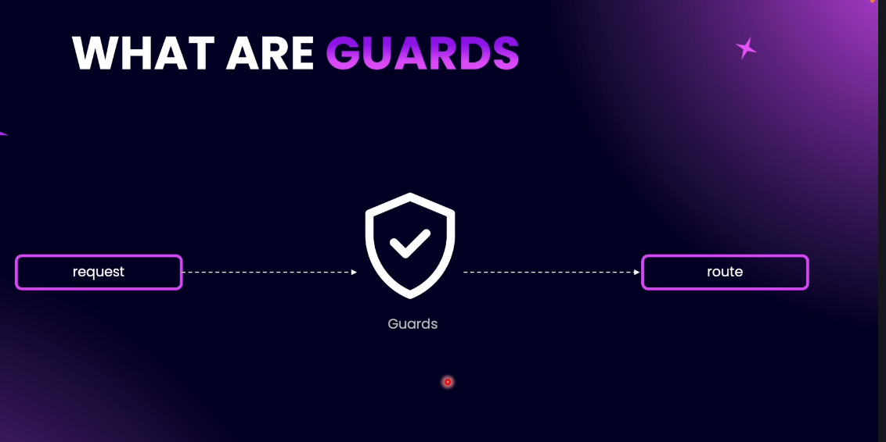
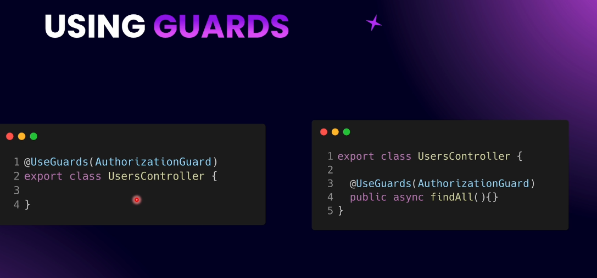
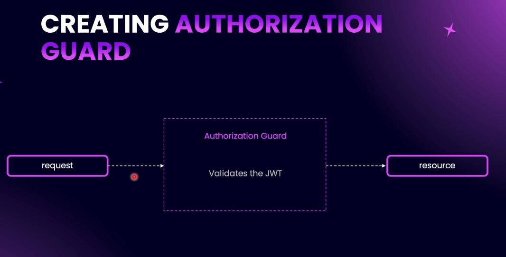
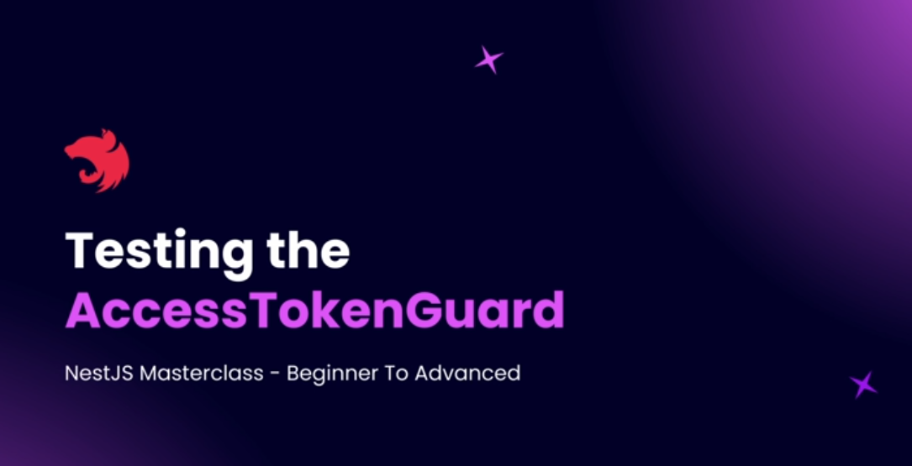

# Step 13 - Guards and Decorators

## Introducing Guards

Guards in NestJS are used to approve or disapprove incoming requests. Their main purpose is to determine whether a request should be processed based on certain conditions, such as the presence and validity of an access token.


**Explanation:**  
A guard acts as a gatekeeper for your routes, controllers, or even the entire application. If a request does not meet the guard's criteria (for example, lacking a valid JWT access token), the guard will deny the request and throw an unauthorized exception.


**Note:**  
- Guards can be applied at the controller class level, method level, or globally.


- Use the `@UseGuards()` decorator to apply guards.


- Guards are commonly used for authentication and authorization, such as validating JWT tokens in 
request headers.

- If the token is missing or invalid, the guard will reject the request.



---

## Creating AccessTokenGuard

**Explanation:**  
The AccessTokenGuard is a special guard in NestJS that checks if a request has a valid access token (usually a JWT) in its headers. Its main job is to extract the token from the request, validate it, and decide if the request should be allowed or denied.

**How it works:**  
1. **Extract the Request:**  
   The guard uses the NestJS `ExecutionContext` to get the incoming HTTP request object.

2. **Get the Token from Headers:**  
   It looks for the `Authorization` header in the request. The header usually looks like:  
   ```
   Authorization: Bearer <token>
   ```
   The guard splits this string and extracts the actual token part.

3. **Validate the Token:**  
   The guard uses the JWT service (from `@nestjs/jwt`) to check if the token is valid. It also uses the JWT configuration to know how to validate the token.

4. **Allow or Deny the Request:**  
   - If the token is valid, the guard returns `true` and the request is processed.
   - If the token is missing or invalid, the guard returns `false` and the request is denied (an unauthorized error is thrown).

**Key Points:**  
- The guard is created using the Nest CLI and placed in the `auth/guards/access-token` directory.
- Dependencies like the JWT service and JWT config are injected into the guard using the constructor.
- The main logic is inside the `canActivate` method, which must return `true` (allow) or `false` (deny).
- Token extraction is done in a private method that safely handles missing headers.

**Summary:**  
The AccessTokenGuard helps protect your routes by making sure only requests with a valid JWT access token can access certain endpoints. This is a common pattern for securing APIs.

[Code example](https://github.com/NadirBakhsh/nestjs-resources-code/commit/0643c0af6c121b7c51439e263db056a437693bb1)

---

## Completing AccessTokenGuard Implementation

**Explanation:**  
To complete the AccessTokenGuard, we need to validate the extracted token and attach the user payload to the request if the token is valid.

**Step-by-step:**
1. **Check for Token:**  
   If the token is missing (`undefined`), immediately throw an `UnauthorizedException`.

2. **Validate the Token:**  
   - Convert the `canActivate` method to `async`.
   - Use a `try...catch` block.
   - In the `try` block, use `await this.jwtService.verifyAsync(token, this.jwtConfig)` to verify the token.
   - If valid, the payload is returned.

3. **Attach Payload to Request:**  
   - Add the payload to the request object using a constant key (e.g., `REQUEST_USER_KEY`).
   - This allows controllers to access the authenticated user's info from the request.

4. **Handle Invalid Token:**  
   - If verification fails, throw an `UnauthorizedException` in the `catch` block.

5. **Return True:**  
   - If all checks pass, return `true` to allow the request.

**Key Points:**  
- Use a constant for the request user key (e.g., `REQUEST_USER_KEY`) instead of a hardcoded string.
- The payload typically contains user info like `sub` (user ID) and `email`.
- If the token is invalid or missing, the guard throws an unauthorized error.

**Summary:**  
The completed AccessTokenGuard checks for a token, validates it, attaches the user payload to the request, and ensures only authenticated requests are processed.

[Code example](https://github.com/NadirBakhsh/nestjs-resources-code/commit/6e7f722a2c7d1184b3798317be64a186bd72f5a2)

---

## Testing the AccessTokenGuard



**Explanation:**  
To test the AccessTokenGuard, you need to apply it to a route and try accessing that route with and without a valid JWT access token.

**How to Test:**
1. **Import JWT Config in Target Module:**  
   If your JWT config is not global, make sure to import the JWT config and JWT module into any module where you want to use the guard (e.g., UsersModule).

2. **Apply the Guard:**  
   Use the `@UseGuards(AccessTokenGuard)` decorator on a controller method (e.g., `createMany` in UsersController).  
   ```typescript
   @UseGuards(AccessTokenGuard)
   @Post('create-many')
   createMany(@Body() dto: CreateManyDto) {
     // ...controller logic...
   }
   ```

3. **Test Without Token:**  
   - Send a request to the guarded endpoint without an Authorization header.
   - You should receive a 401 Unauthorized error.

4. **Test With Token:**  
   - First, sign in to get a valid access token from your auth endpoint.
   - Add the token to the Authorization header as `Bearer <token>`.
   - Send the request again. If the token is valid, the request should go through (you may get a different error, e.g., duplicate user, but not unauthorized).

5. **Check the Payload:**  
   - The guard logs the payload to the terminal, showing user info like user ID and email.
   - You can verify this info in your database.

**Key Points:**  
- You can apply the guard to a single route, an entire controller, or globally.
- If applied to a controller, all endpoints in that controller require authentication.
- The guard blocks unauthorized requests before they reach your controller logic.

**Summary:**  
Testing the AccessTokenGuard ensures that only authenticated users can access protected endpoints. You can verify its behavior by sending requests with and without valid tokens and observing the responses and logs.

[Code example](https://github.com/NadirBakhsh/nestjs-resources-code/commit/bbceb97258cc09ecf9926acd9c103e0de1793b92)

---

## Applying AccessTokenGuard Globally
---

## Practice: Validations for JWT Environment Variables
---

## Solution: Validations for JWT Environment Variables
---

## What are Decorators?
---

## Our First Decorator
---

## Authentication Guard Strategy
---

## Create AuthenticationGuard
---

## AuthenticationGuard Implementation
---

## Understanding User Payload
---

## Create Active User Decorator
---

## Practice: Refactor `createPostDto`
---

## Solution: Refactor `createPostDto`