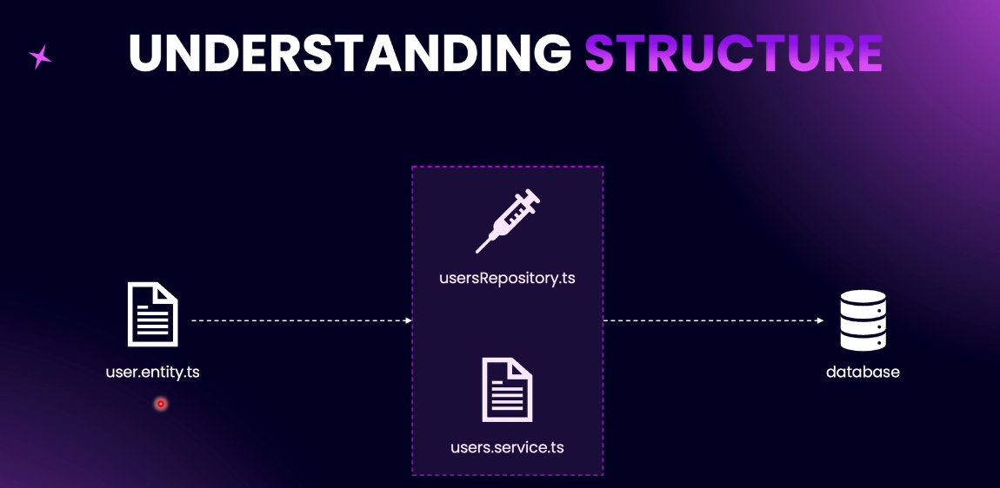

# Step 06 - Working with SQL Databases

## 1. Working with Databases in NestJS


A basic architectural pattern where data is processed without being persisted to any storage system.


### Architecture Flow

- Request: A client sends a request to the system.

- UsersController: Acts as the entry point to handle the request and route it appropriately.

- UsersService: Processes the business logic but does not persist any data.

- Response: A response is sent back to the client based on the in-memory processing.


### Architecture Flow

🔸 No Data Persistence

- Request → UsersController → UsersService (in-memory) → UsersController → Response

- No interaction with any storage or database.

🔸 With Data Persistence

- Request → UsersController → UsersService → Database

- Service reads/writes data to a persistent database, then sends it back via controller.

ORM Integration Flow: Service → ORM Layer → Database


ORM (Object Relational Mapping) - a design layer that bridges the object-oriented application code with relational databases.

🔸 ORM (Object Relational Mapping)

- UsersService → ORM Layer → Database
- ORM handles object-to-table mapping, abstracts SQL queries, and provides CRUD operations through object-oriented code.

### Use Cases

- Rapid application development
- Clean abstraction of database logic
- Seamless integration with object-oriented languages

### Supported ORM in NestJS

NestJS supports integration with multiple Object-Relational Mapping (ORM) tools to facilitate database interaction in a structured and scalable way. Currently supported ORMs:


- **TypeORM**: A powerful and flexible ORM for SQL-based databases such as PostgreSQL, MySQL, SQLite, etc. TypeORM is deeply integrated with NestJS and follows the Data Mapper pattern with support for advanced features like migrations, relations, and query builders.
  🔗 [TypeORM Documentation](https://typeorm.io/)

- **Mongoose**: A popular ODM (Object Data Modeling) library for MongoDB, offering a straightforward schema-based solution to model application data.

🔗 [Mongoose Documentation](https://mongoosejs.com/)

### Commonly Used Databases in NestJS

NestJS offers flexible database integration using ORMs like TypeORM and Mongoose, enabling support for a wide variety of databases.


✅ Popular Supported Databases:

- MySQL / MariaDB – Widely used relational database for web applications.
- PostgreSQL – Advanced relational DB with powerful features and ACID compliance.
- SQLite – Lightweight, file-based database, ideal for small projects or local development.
- Microsoft SQL Server – Enterprise-grade RDBMS used in corporate applications.
- MongoDB – Leading NoSQL document database, great with Mongoose ODM.
- Oracle – Enterprise-level relational DB for complex systems.

---

- What is an ORM?

# Overview: Understanding ORM & TypeORM in SaaS Applications

## 🔍 What is an ORM?

ORM (Object-Relational Mapping) acts as an abstraction layer between your application and the database, allowing developers to interact with databases using programming language constructs rather than SQL.


### 1. **Abstraction Layer**

- ORM provides methods to perform DB operations (e.g., `.create()`, `.find()`), eliminating the need to manually write SQL queries.

### 2. **TypeORM in Action**

- We use **TypeORM** in a SaaS application.
- Enables writing queries and managing DB schema using **TypeScript**.

### 3. **Simplified Data Access**

- Traditional SQL: `SELECT * FROM users WHERE id = 132;`
- TypeORM: `userRepository.findOne({ where: { id: 132 } })`

### 4. **Complex Queries Simplified**

- TypeORM allows writing advanced conditions in TypeScript, not SQL.
- Example: Filtering users with rating > 4, last active in 7 days, amount spent > 1200 — all handled via object-based query.

### 5. **Relationships & Decorators**

- Define relationships (e.g., OneToOne, ManyToOne) via decorators in TypeScript.
- Example:
  ```ts
  @OneToOne(() => Profile)
  profile: Profile;
  ```

### 6. **Schema Management in Code**

- Table structure, indexes, and constraints are defined in code.
- No separate SQL schema files required.
- Example:
  ```ts
  @Index(['firstName', 'lastName'])
  ```

### 7. **Migrations and Syncing**

- ORM syncs your application model to the database schema automatically.
- Ensures consistency between app code and DB structure.

### 8. **Database Portability**

- Easily switch between DBs (MySQL, PostgreSQL, SQL Server).
- Abstracted layer simplifies migration to other DB systems.

### 9. **Fallback to Raw SQL**

- For performance-critical or complex queries, raw SQL can still be executed.

## ✅ Advantages

- No SQL knowledge required.
- Improved developer productivity.
- Code-first schema definition.
- Easy DB migrations.
- Seamless DB switching.

## ⚠️ Disadvantages

- Less control over low-level query optimization.
- Performance issues on complex queries.
- Debugging ORM-generated SQL can be tricky.

---

### Installing PostgreSQL Locally


1. **Download** the installation package from the official website: https://www.postgresql.org/download/
2. **Install** PostgreSQL on your local machine, following the instructions for your operating system.
3. **Create a new user account** for PostgreSQL, e.g., `postgres` with password `secret`.
4. **Create a new database** for your NestJS application, e.g., `myapp` owned by the `postgres` user.

### Adding `psql` to PATH
- **Add `psql` to PATH on Windows and macOS**:
  - Windows: Update the `PATH` environment variable to include the PostgreSQL bin directory, e.g., `C:\Program Files\PostgreSQL\13\bin`.
  - macOS (using Homebrew): Run `brew link --overwrite postgresql` and then `echo 'export PATH="/usr/local/opt/postgresql/bin:$PATH"' >> ~/.bashrc` (or `~/.zshrc` for zsh users). Restart your terminal for the changes to take effect.

## Connecting NestJS to PostgreSQL  & Using Async Configuration

### Database Integration - PostgreSQL + TypeORM

This project uses PostgreSQL as the database engine, integrated with [TypeORM](https://typeorm.io/) via NestJS `@nestjs/typeorm` package.

### 🧩 Required Dependencies

Installed via `package.json`:
- `@nestjs/typeorm`
- `typeorm`
- `pg`

### ⚙ Configuration in `app.module.ts`

code example [github](https://github.com/NadirBakhsh/nestjs-resources-code/commit/d43a089b7c088797aa84b384ba22bd4ee503b0c9)

```ts
TypeOrmModule.forRootAsync({
  useFactory: () => ({
    type: 'postgres',
    host: 'localhost',
    port: 5432,
    username: 'postgres',
    password: 'pg123',
    database: 'nestjs-blog',
    entities: [],
    synchronize: true, // ⚠ Not recommended for production
  }),
}),
```


---

### Theoretical Understanding of the Repository Pattern




#### 🔍 What is Repository Pattern?
A design pattern to abstract database operations and interact with entities via repositories instead of direct queries.

#### 🏗 Key Concepts:
- **Entity:** Represents a database table (e.g., `User` entity ↔ `users` table).
- **Repository:** A TypeORM-provided abstraction to perform DB operations like `find`, `save`, `update`, `delete`.
- **Service:** Business logic layer where repository is injected to perform database interactions.

#### ⚙ Structure:
1. **User Entity (`user.entity.ts`)**
   - Defines columns using decorators like `@PrimaryGeneratedColumn`, `@Column`.
2. **User Repository**
   - Automatically managed by TypeORM.
   - Injected using `@InjectRepository(User)` in the service constructor.
3. **User Service (`user.service.ts`)**
   - Uses injected repository to interact with the database (`this.userRepository.find()` etc).

#### ✅ Example:
```ts
@Injectable()
export class UserService {
  constructor(
    @InjectRepository(User)
    private readonly userRepository: Repository<User>,
  ) {}

  async getAllUsers(): Promise<User[]> {
    return this.userRepository.find();
  }
}
```

#### 📌 Summary:
- Define entity ➝ Inject repository ➝ Use in service.
- TypeORM handles repository creation internally.
- Clean, maintainable, and scalable architecture.

---

### Creating Our First Entity - `user.entity`

# 📦 User Entity - TypeORM + NestJS

This document explains how to create a `User` entity using **TypeORM** in a **NestJS** application, mapping the entity structure to a database table and synchronizing it with a DTO for user creation.

---

## 📚 What is an Entity?
An **Entity** in TypeORM represents a database table. It is defined as a **TypeScript class** with decorators to describe:
- Table name
- Column definitions
- Column types and properties

---

## 🔨 Setup: Create `user.entity.ts`

**File Location:**
```
src/users/user.entity.ts
```

**File Naming Convention:**
- Singular form: `user.entity.ts`
- Unlike plural naming for controllers/modules (e.g., `users.controller.ts`, `users.module.ts`)

### 🧱 Step-by-Step Construction:

#### 1. Define the Class
```ts
export class User {}
```

#### 2. Use the `@Entity()` Decorator
```ts
import { Entity } from 'typeorm';

@Entity()
export class User {}
```

#### 3. Add Properties from DTO
Map your entity properties based on `CreateUserDto`:
- `firstName`
- `lastName`
- `email`
- `password`

```ts
import { Column, Entity, PrimaryGeneratedColumn } from 'typeorm';

@Entity()
export class User {
  @PrimaryGeneratedColumn()
  id: number;

  @Column()
  firstName: string;

  @Column()
  lastName: string;

  @Column()
  email: string;

  @Column()
  password: string;
}
```

#### 4. Add to `AppModule`
Tell TypeORM that this entity exists:
```ts
TypeOrmModule.forRoot({
  type: 'mysql',
  host: 'localhost',
  port: 3306,
  username: 'root',
  password: 'password',
  database: 'your_database',
  entities: [User], // Add this line
  synchronize: true,
})
```

> ✅ Don't forget to import the `User` entity manually if auto-import doesn't work.

---

## 🔁 Recap
| Property     | Type   | Decorator                | Description                           |
|--------------|--------|--------------------------|---------------------------------------|
| `id`         | number | `@PrimaryGeneratedColumn()` | Auto-increment primary key            |
| `firstName`  | string | `@Column()`              | User's first name                     |
| `lastName`   | string | `@Column()`              | User's last name                      |
| `email`      | string | `@Column()`              | User's email address                  |
| `password`   | string | `@Column()`              | Encrypted password (hash it later)    |

---

## ✅ Best Practices
- Match DTO and Entity fields to avoid mismatches.
- Always register entities in TypeORM config.
- Keep your naming conventions consistent.

---

## 📈 Next Steps
In the next phase:
- Add column options (length, nullable, unique)
- Create the **UserRepository**
- Insert users into the DB

---

## 📂 File Structure Preview
```
src/
├── users/
│   ├── user.entity.ts
│   ├── users.module.ts
│   ├── users.controller.ts
│   └── users.service.ts
├── app.module.ts
```

- GitHub: [Code example](https://github.com/NadirBakhsh/nestjs-resources-code/commit/96a2af8ef346ca84a4aedad1ced0fed84a5c3b75)

---

- Expanding Entity Definition
- Creating First Repository
- Practice: Creating Post Entity
- Solution: Creating Post Entity
