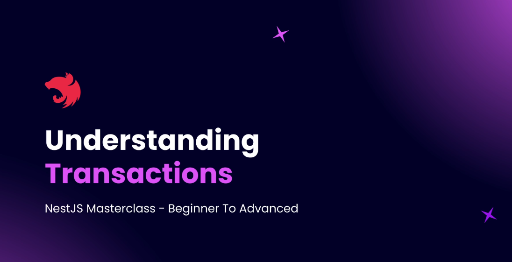
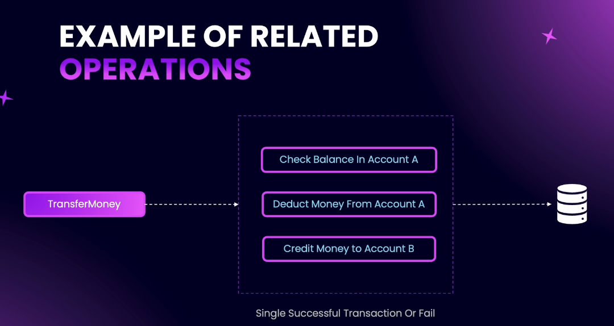
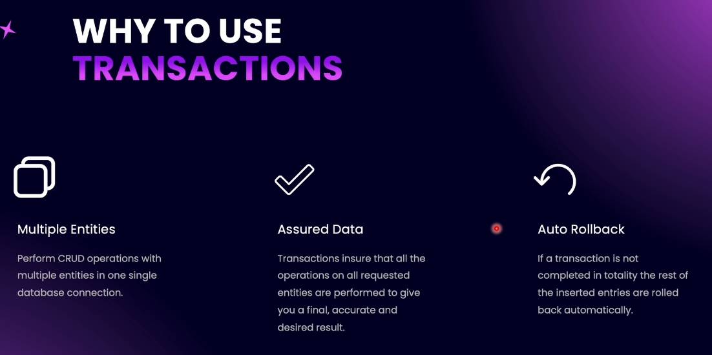
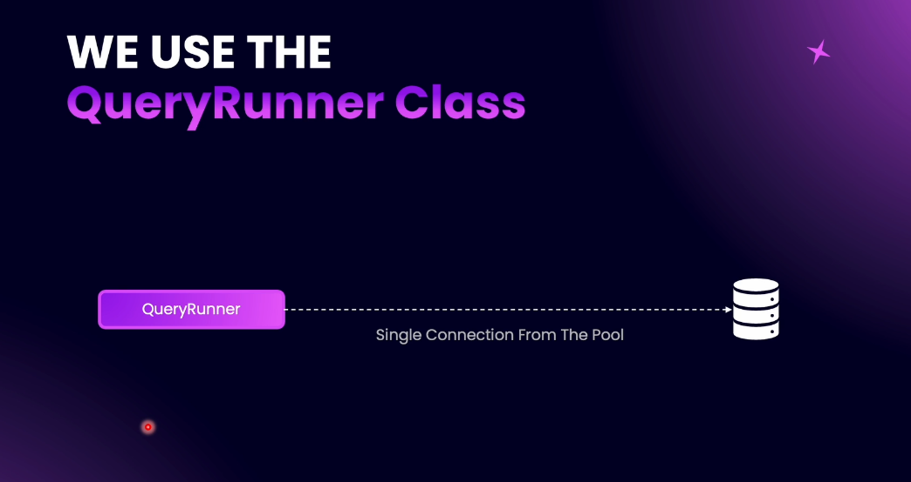
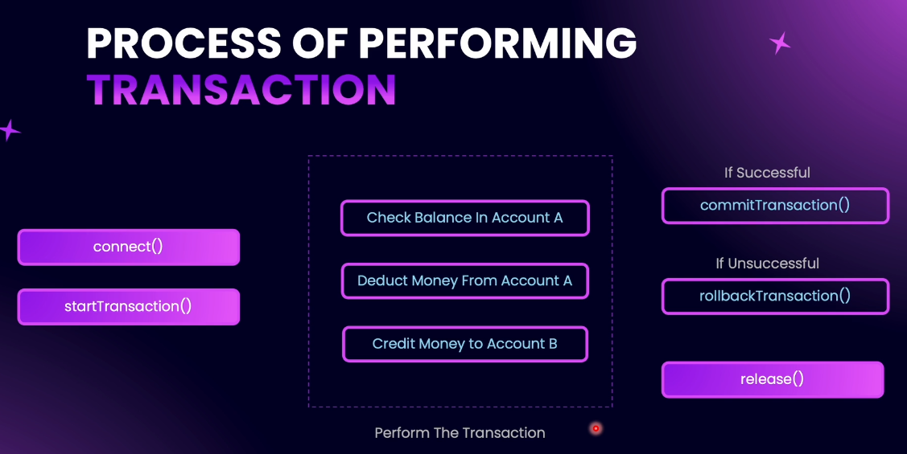

# Step 10 - Transactions Using TypeORM

### Understanding Transactions





1. **What is a Transaction?**

- A transaction is a complete set of CRUD operations on a database that are interrelated.
- If any operation within a transaction fails, the entire transaction is rolled back to prevent data inconsistency.

2. Why Use Transactions?



- Ensures data integrity: All operations succeed or none do.
- Prevents partial updates that could lead to data discrepancies.
- Provides rollback capability if any step fails. 

3. Example Scenario: Money Transfer
- Steps: Check balance → Deduct from sender → Credit receiver.
- If any step fails, all changes are reverted.

4. Application Example
- Creating multiple users in one request.
- If creating any user fails, all previously created users in that transaction are rolled back.

5. Advantages of Transactions
- Data assurance: Only successful if all operations succeed.
- Automatic rollback on failure.
- Useful for multiple, interrelated CRUD operations across one or more entities.

6. TypeORM Support
- TypeORM provides tools (like QueryRunner) to manage transactions in your NestJS application.

Summary:
Use transactions when you need to perform multiple related database operations that must all succeed together. Transactions help maintain data integrity and consistency by ensuring that either all operations are applied or none are.

---

### TypeORM QueryRunner

**QueryRunner** is a TypeORM class that allows you to manage a single database connection for advanced operations like transactions. Instead of using the default connection pool, QueryRunner gives you one dedicated connection for the entire transaction, ensuring all related operations are executed together.



#### How to Use QueryRunner for Transactions



1. **Create a QueryRunner instance:**  
   Use `dataSource.createQueryRunner()` to get a new QueryRunner.

2. **Connect to the database:**  
   Call `queryRunner.connect()`.

3. **Start the transaction:**  
   Use `queryRunner.startTransaction()`.

4. **Perform your CRUD operations:**  
   Use `queryRunner.manager` to run your queries.

5. **Commit or rollback:**  
   - If all operations succeed, call `queryRunner.commitTransaction()`.
   - If any operation fails, call `queryRunner.rollbackTransaction()`.

6. **Release the connection:**  
   Always call `queryRunner.release()` in a `finally` block to free the connection.

#### Example

```typescript
const queryRunner = dataSource.createQueryRunner();

await queryRunner.connect();
await queryRunner.startTransaction();

try {
  // Perform related DB operations
  await queryRunner.manager.save(...);
  await queryRunner.manager.update(...);
  await queryRunner.manager.delete(...);

  await queryRunner.commitTransaction(); // Success!
} catch (err) {
  await queryRunner.rollbackTransaction(); // Undo all changes
} finally {
  await queryRunner.release(); // Always release connection
}
```

**Summary:**  
Use QueryRunner when you need full control over transactions in TypeORM. It ensures all your related operations either succeed together or fail together, maintaining

---

### Creating First Transaction

When you need to create multiple users in a single API call, you should use a transaction to ensure that either all users are created or none are, maintaining data integrity. Here’s how you can implement this in your NestJS service using TypeORM’s QueryRunner:

#### Step-by-Step: Creating Many Users in a Transaction

1. **Inject DataSource**  
   Inject the `DataSource` from TypeORM into your service’s constructor:
   ```typescript
   constructor(
     // ...other injections...
     @Inject(DataSource) private readonly dataSource: DataSource,
   ) {}
   ```

2. **Define the Method**  
   Create a new async method, e.g., `createMany`, which takes an array of `CreateUserDto`:
   ```typescript
   async createMany(createUsersDto: CreateUserDto[]): Promise<User[]> {
     // implementation...
   }
   ```

3. **Create QueryRunner Instance**  
   ```typescript
   const queryRunner = this.dataSource.createQueryRunner();
   await queryRunner.connect();
   await queryRunner.startTransaction();
   ```

4. **Try-Catch-Finally Structure**  
   Use `try/catch/finally` to handle commit, rollback, and release:
   ```typescript
   try {
     // 5. Loop through DTOs and create users
     const newUsers: User[] = [];
     for (const userDto of createUsersDto) {
       const user = queryRunner.manager.create(User, userDto);
       const savedUser = await queryRunner.manager.save(user);
       newUsers.push(savedUser);
     }
     await queryRunner.commitTransaction();
     return newUsers;
   } catch (err) {
     await queryRunner.rollbackTransaction();
     throw err;
   } finally {
     await queryRunner.release();
   }
   ```

6. **Summary**  
   - All user creations are part of a single transaction.
   - If any creation fails, all changes are rolled back.
   - The connection is always released.

#### Example Code

```typescript
async createMany(createUsersDto: CreateUserDto[]): Promise<User[]> {
  const queryRunner = this.dataSource.createQueryRunner();
  await queryRunner.connect();
  await queryRunner.startTransaction();
  try {
    const newUsers: User[] = [];
    for (const userDto of createUsersDto) {
      const user = queryRunner.manager.create(User, userDto);
      const savedUser = await queryRunner.manager.save(user);
      newUsers.push(savedUser);
    }
    await queryRunner.commitTransaction();
    return newUsers;
  } catch (err) {
    await queryRunner.rollbackTransaction();
    throw err;
  } finally {
    await queryRunner.release();
  }
}
```

**Note:**  
- This approach ensures that either all users are created or none are, preventing partial updates.
- For proper validation of each user DTO in the array, consider using a custom array DTO with class-validator decorators.

[ GitHub code Commit](https://github.com/NadirBakhsh/nestjs-resources-code/commit/1a54d8d453dd35b36af6f88e9bb2f459d423f113)

---

### Why Create Post is Not a Transaction

#### 🧠 When to Use Transactions in CRUD Operations

**Why not use transactions for every DB operation if they're so useful?**

While **transactions** offer **commit and rollback mechanisms**, using them **everywhere** is unnecessary and can introduce **overhead**.

#### ✅ Simple Create Operation (No Transaction Needed)

```ts
const post = await this.postRepository.save({ title, content, author, tags });
```

- Only one write operation.
- Other operations (like fetching users/tags) are **read-only**.
- If saving the post fails, it fails entirely — no partial failure possible.
- ✅ Exception handling is enough here.
- ❌ No need for a transaction.

#### ⚠️ Bulk or Multi-Entity Insert (Transaction Recommended)

```ts
await dataSource.transaction(async manager => {
  await manager.save(User, user1);
  await manager.save(User, user2);
  // ...
});
```

- Inserting multiple users or modifying multiple entities.
- Potential for **partial success/failure** (e.g., 3 users created, 7 failed).
- Hard to monitor without extra logic.
- ✅ **Use transaction** to ensure all-or-nothing behavior.

---

> 💡 **Use transactions only when needed** — for complex operations involving multiple writes or entities.  
> For simple operations, transactions are overkill.

---


### Creating Multiple Providers

Create a new endpoint in the UserController to handle the creation of many users:

```ts
  @Post('create-many')
public async createManyUsers(@Body() createUsersDto: CreateUsersDto[]): Promise<User[]> {
  return await this.userService.createMany(createUsersDto);
}
```

**Adding a Unique Slug to the Endpoint**
To avoid conflicts with the existing create endpoint, add a unique slug to the new endpoint:

```ts
  @Post('create-many')
public async createManyUsers(@Body() createUsersDto: CreateUsersDto[]): Promise<User[]> {
  return await this.userService.createMany(createUsersDto);
}
```
[GitHub code Commit](https://github.com/NadirBakhsh/nestjs-resources-code/commit/223fd308a8a4c4b53a2b2278a8b5bebcaf1f9808)

---

### Updating the DTO

The createManyUsers method now uses the CreateManyUsersDTO which is validated against the CreateUserDTO for each user in the array. The CreateManyUsersDTO has a users property which is an array of CreateUserDTO. The isNotEmpty, isArray and ValidateNested decorators are used to validate the users property. The type decorator is used to specify the type of each element in the array as CreateUserDTO.

[GitHub code Commit](https://github.com/NadirBakhsh/nestjs-resources-code/commit/63e6e6b0c71602b31f58ca124c74c1ab48389884)

---

### Practice: Handle Exceptions for CreateManyUsers

  /**
   * This method will create many users at once.
   * If any of the users to be created already exist, an exception will be thrown.
   * @param createUsersDto List of users to be created
   * @returns The created users
   * @throws BadRequestException if any of the users to be created already exist
   */
  

### Solution: Handle Exceptions for CreateManyUsers