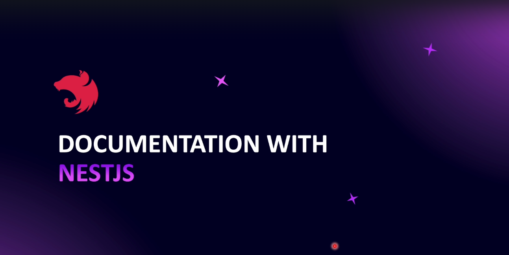
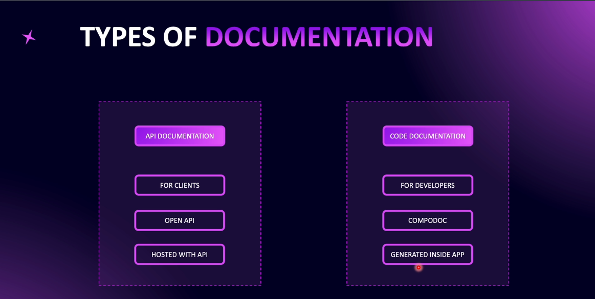
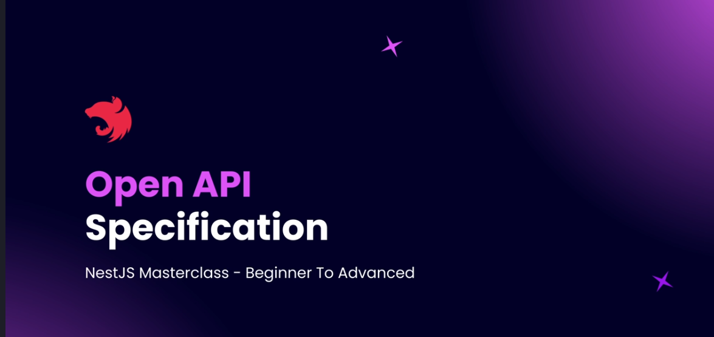

# Step 05 - Documenting Code

## 1. Documentation with NestJS



### Introduction
NestJS provides built-in tools for documenting both code and API endpoints. This documentation helps both developers and clients interact with the system efficiently.

### Types of Documentation
NestJS supports two primary types of documentation:
1. **API Documentation** (for developers and clients)
2. **Code Documentation** (for developers)



### 1. API Documentation with OpenAPI (Swagger)
NestJS leverages **OpenAPI (Swagger)** to document APIs. This allows developers and clients to explore API endpoints, understand request/response structures, and even test APIs interactively.

#### Features:
- Automatically generated documentation based on decorators.
- Hosted at `localhost:3000/api` (by default).
- Documents modules, controllers, routes, query parameters, and request/response bodies.
- Interactive **Try Out** feature to test API requests.

#### Example:
```typescript
import { DocumentBuilder, SwaggerModule } from '@nestjs/swagger';

const config = new DocumentBuilder()
  .setTitle('API Documentation')
  .setDescription('API description')
  .setVersion('1.0')
  .build();
const document = SwaggerModule.createDocument(app, config);
SwaggerModule.setup('api', app, document);
```

### 2. Code Documentation with Compodoc
**Compodoc** generates documentation for the internal structure of a NestJS application, providing an overview of modules, services, controllers, and dependencies.

#### Features:
- Provides a detailed map of modules and their dependencies.
- Displays methods, properties, and class structures.
- Helps track code coverage for documentation completeness.

#### Example Usage:
```bash
npm install -g @compodoc/compodoc
compodoc -p tsconfig.json -s
```

### Key Differences
| Feature           | API Documentation (Swagger) | Code Documentation (Compodoc) |
|------------------|---------------------------|-----------------------------|
| Audience        | Developers & Clients      | Developers Only            |
| Purpose        | Describe API Endpoints    | Describe Internal Code Structure |
| Hosting        | Hosted with API           | Generated locally          |
| Format         | OpenAPI Specification     | HTML-based Documentation   |

### Conclusion
NestJS simplifies both API and code documentation:
- **Swagger** helps document and test APIs interactively.
- **Compodoc** provides an internal view of the codebase for developers.
By leveraging these tools, developers can maintain well-structured, self-explanatory applications.


---
## 2. Open API Specification



### What is OpenAPI Specification?
OpenAPI Specification (OAS) is a standardized format for describing REST APIs. It defines how an API should be documented, ensuring consistency across different platforms and tools.

### What is Swagger?
Swagger UI: A user-friendly interface for exploring and testing APIs.

---
## 3. Enabling Swagger in NestJS

### 1. Install Swagger
Run the following command to install a specific version of `@nestjs/swagger`:
```sh
npm install @nestjs/swagger@<version>
```
### 2. Import Required Modules
Open `main.ts` and import the required modules:
```ts
import { DocumentBuilder, SwaggerModule } from '@nestjs/swagger';
```

### 3. Configure Swagger
#### Create a Swagger config using `DocumentBuilder`:
```ts
const config = new DocumentBuilder()
  .setTitle('API Documentation')
  .setDescription('NestJS Swagger API documentation')
  .setVersion('1.0')
  .build();
  ```

#### Generate a Swagger document using `SwaggerModule.createDocument`:
```ts
const document = SwaggerModule.createDocument(app, config);
```
#### Setup Swagger in the app using `SwaggerModule.setup`:
```ts
SwaggerModule.setup('api', app, document);
```
This will expose the Swagger UI at **`http://localhost:3000/api`**.


### 4. Run the App & Access Swagger
- Start your NestJS app:
  ```sh
  npm run start
  ```
- Open **`http://localhost:3000/api`** in your browser to view the API documentation.


---
## 4. Adding Configuration Methods to Swagger
---
## 5. Documenting GET Users
---
## 6. Practice: POST Endpoint and DTO for Posts Controller
---
## 7. Solution: POST Endpoint and DTO for Posts Controller
---
## 8. Adding Validations to CreatePostDto
---
## 9. Working with Nested DTOs
---
## 10. Testing Validation
---
## 11. Using Swagger for Documenting CreatePostDto
---
## 12. Mapped Types Using Swagger
---
## 13. Getting Started with Compodoc
---
## 14. Compodoc Coverage and JSDocs