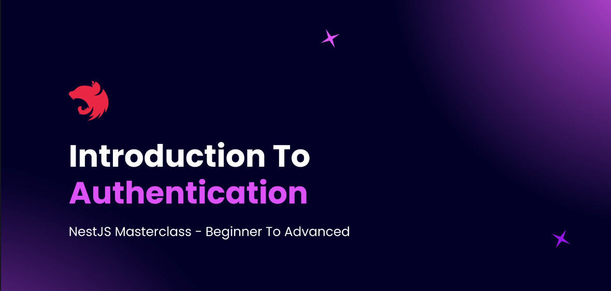
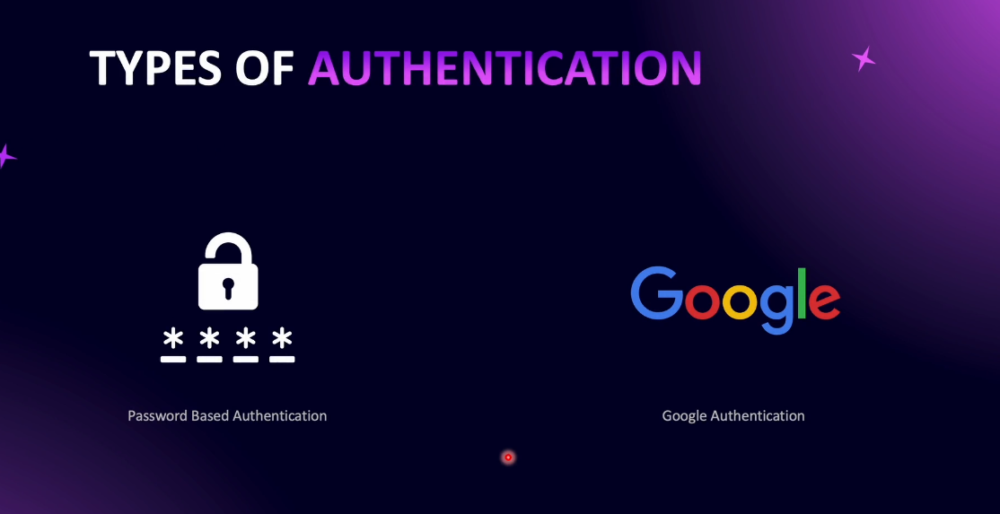
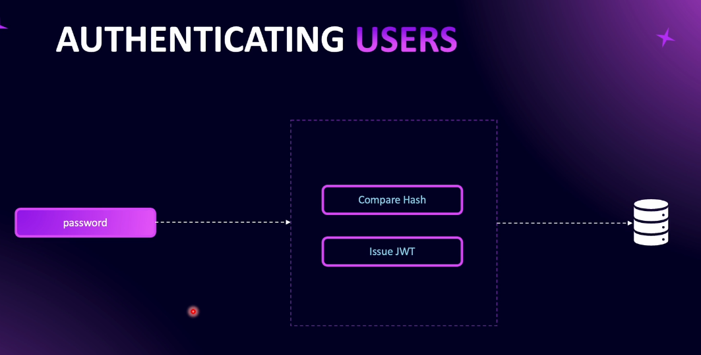
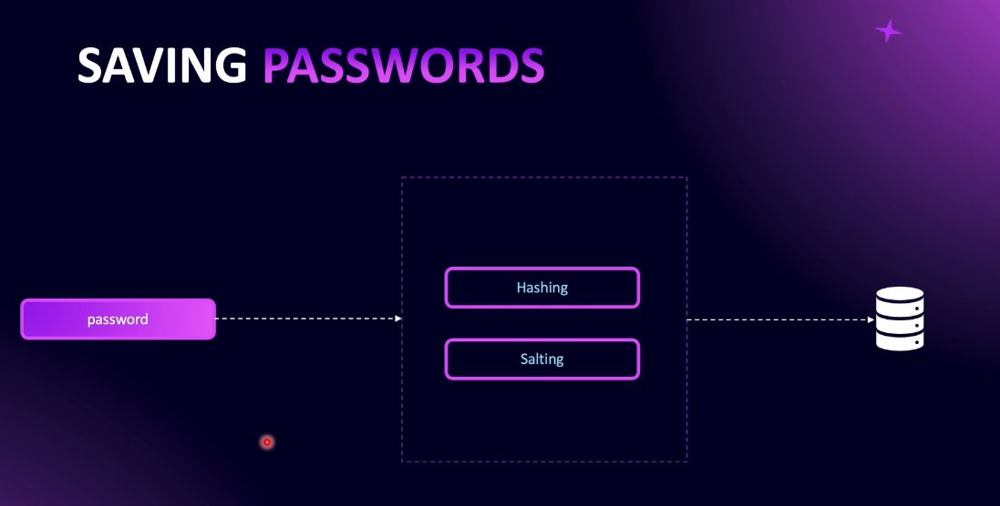

# Step 12 - User Authentication

## Introduction to Authentication



### Authentication in NestJS – Overview




When building a **NestJS** application, there are multiple ways to authenticate a user.  
In this course, we will focus on **two specific methods**:

1. **Password-Based Authentication** (covered in this section)  
2. **Third-Party Authentication** (e.g., Google Authentication – covered in another section)


### 1. What is Password-Based Authentication?
In **password-based authentication**, a user provides their **email** and **password** during sign-up.  
When they log in, the system validates these credentials.

The authentication process involves:
- **Sign-Up** → Accept email & password → Securely store it in the database.
- **Login** → Compare provided credentials with stored data → Authenticate if matched.




### 2. Why Not Store Passwords in Plain Text?
**Storing passwords as plain text is dangerous** because:
- Developers with DB access can see all user passwords.
- If a database breach occurs, hackers can access passwords without effort.
- Users often reuse the same password across services → a breach here can compromise their accounts elsewhere.

**Solution:** Always **hash** and **salt** passwords before storing them.





### 3. Hashing and Salting
- **Hashing** → Converts the password into a fixed-length scrambled string (irreversible).
- **Salting** → Adds random data to the password before hashing to prevent common attacks.

✅ Benefit → Even if two users have the same password, their stored hash will be different.


### 4. Authentication Flow with JWT
Once the password is hashed & stored:
1. **User Login:**
   - User provides email & password.
   - The server hashes the entered password and compares it to the stored hash.
2. **If Match → Generate JWT Token:**
   - **JWT** = **JSON Web Token** → a signed token containing user identity information.
   - Sent back to the user upon successful authentication.


### 5. Using JWT for Subsequent Requests
- For endpoints requiring authentication, the client sends the **JWT** in the request header.
- The server verifies:
  - The JWT signature is valid.
  - The token has not been tampered with.
  - The token has not expired.
- If valid → request is authorized.


### 6. Key Components in This Section
In this section of the course, we will cover:
- **Hashing & Salting Passwords**
- **Storing Secure Passwords in the Database**
- **Comparing Hashed Passwords During Login**
- **Issuing JWT Tokens**
- **Verifying JWTs for Protected Endpoints**
- **Authorizing Requests Based on JWT**

#### Summary Flow Diagram
```
Sign-Up:
   User → Email + Password → Hash + Salt → Store in DB

Login:
   User → Email + Password → Hash + Compare with DB → If Match → Issue JWT

Subsequent Requests:
   Client → Sends JWT → Server Verifies Signature → Authorize or Reject
```

By the end of this section, you will be able to implement **secure, password-based authentication** in your **NestJS** applications.


---
## Hashing and Salting Passwords
---
## Create Hashing Providers
---
## Implementing Hashing Provider
---
## User Signup
---
## User SignIn Controller
---
## Completing the SignIn Method
---
## Custom Response Code
---
## Understanding JWTs
---
## Adding JWT Configuration
---
## Generating JWT
---
## JWT Token Signatures
---