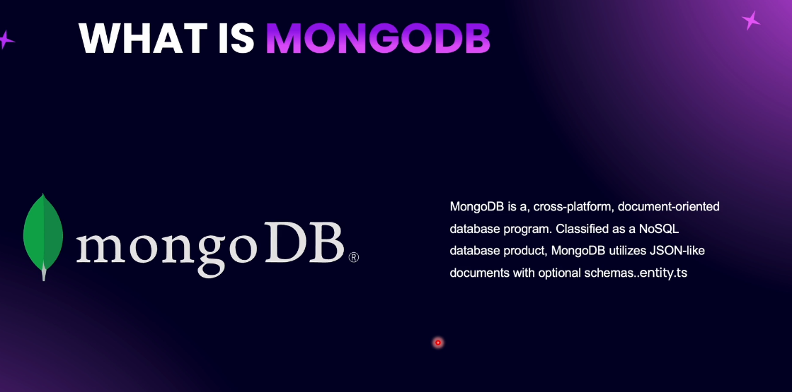
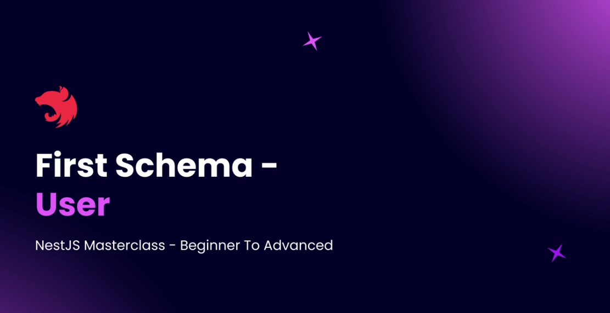
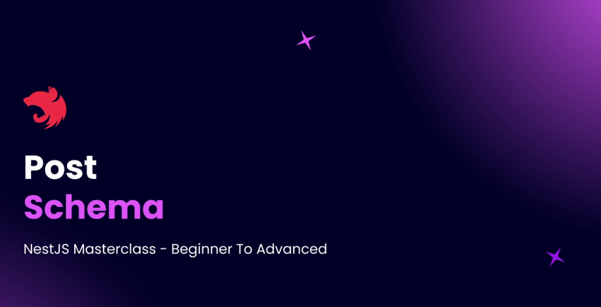
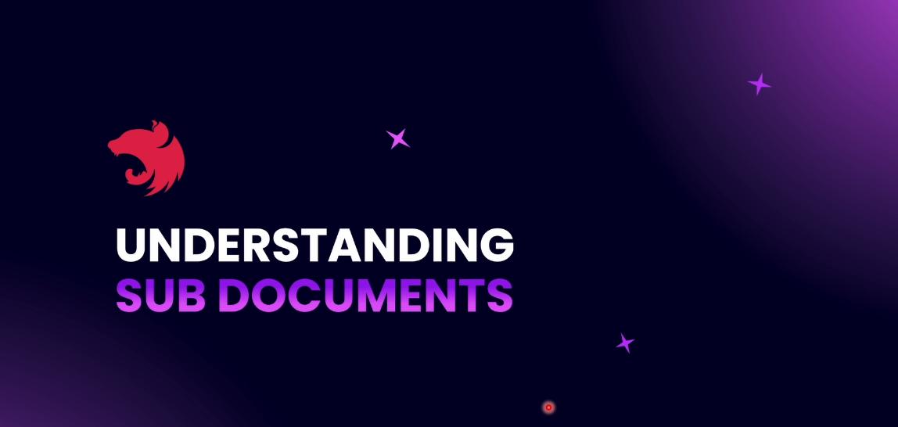
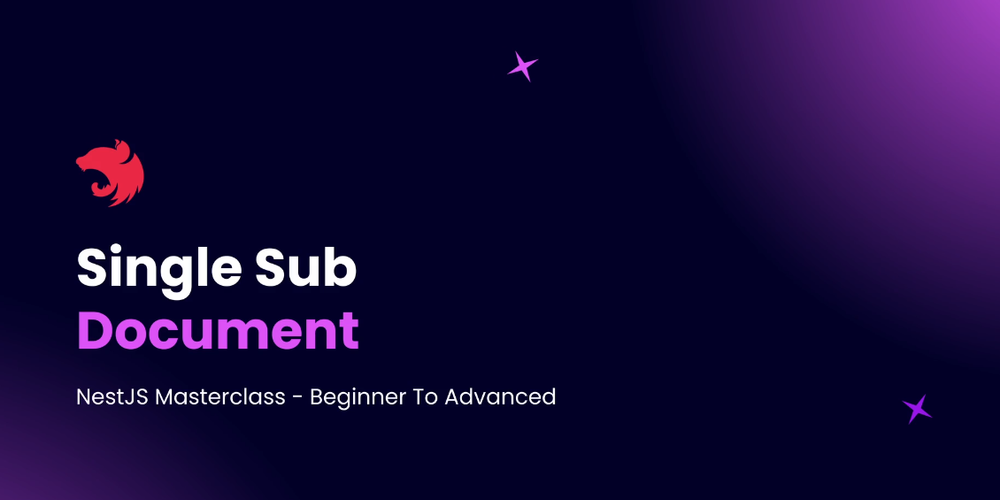
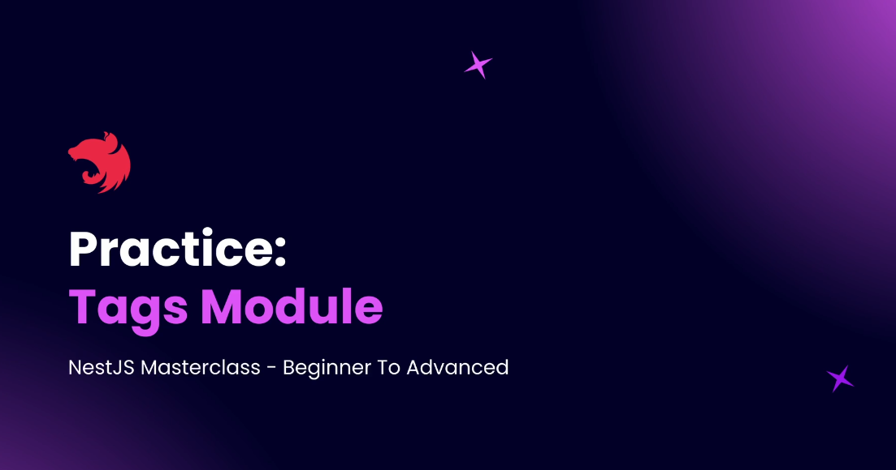
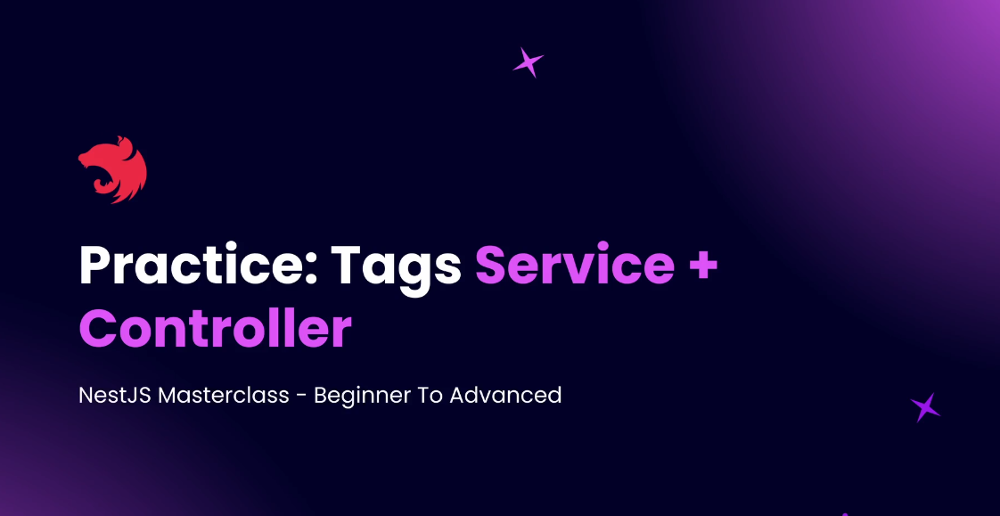
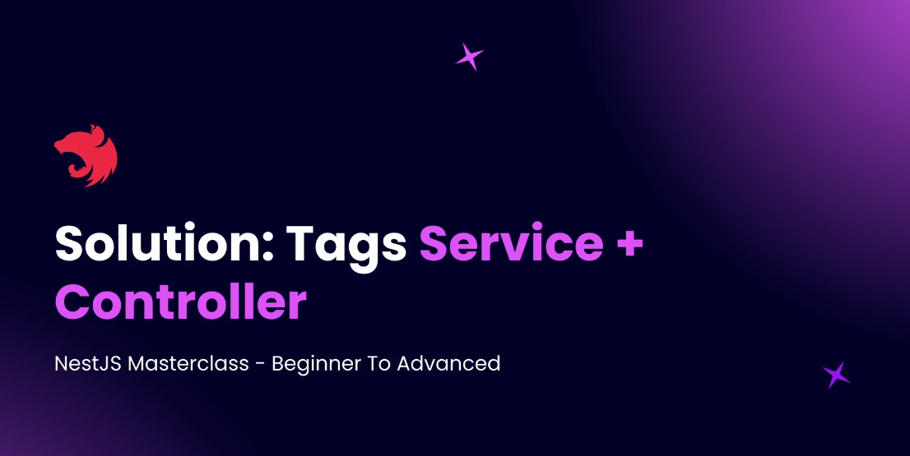

# Step 21 - MongoDB and Mongoose

## Introduction to MongoDB with Mongoose


MongoDB is a NoSQL database that stores data as JSON-like documents, making it ideal for handling unstructured data. In NestJS, Mongoose is used as an abstraction layer to interact with MongoDB, similar to how TypeORM works with SQL databases. Instead of entities, you define schemas to describe the structure of collections. Models are injected into services to perform CRUD operations. This approach allows you to work with MongoDB efficiently within your NestJS applications.





### **SQL vs NoSQL refers to two broad categories of database systems:**

SQL (Structured Query Language) Databases
Type: Relational databases (e.g., MySQL, PostgreSQL, SQL Server)
Data Structure: Tables with rows and columns; each row is a record, each column is a field.
Schema: Fixed and predefined; you must define the structure before inserting data.
Relationships: Supports JOINs to relate data across tables.
Transactions: Strong ACID compliance (Atomicity, Consistency, Isolation, Durability).
Use Case: Ideal for structured data and complex queries (e.g., banking, inventory).
NoSQL (Not Only SQL) Databases
Type: Non-relational databases (e.g., MongoDB, Cassandra, Redis)
Data Structure: Flexible; can be document-based, key-value, graph, or column-family.
Schema: Dynamic; you can store different structures in the same collection.
Relationships: Limited JOIN support; often handled at the application level.
Transactions: May offer eventual consistency; ACID support varies.
Use Case: Great for unstructured or semi-structured data, scalability, and rapid development (e.g., social media, IoT).


## Creating MongoDB Account

To start working with MongoDB, create a free account at mongodb.com and set up a cloud cluster using the M0 free tier. This approach avoids local installation and provides access to features available only in clusters. After registration, whitelist your IP address for access, create a database user, and copy your connection string. You can use MongoDB Compass (GUI tool) to connect and browse your cluster, similar to how PgAdmin works for PostgreSQL. Create your database and collections (e.g., users) in Compass for development.

## MongoDB Configuration


### Setting Up MongoDB with NestJS

To integrate MongoDB with your NestJS application, you need to install the required dependencies and configure the connection. This section assumes you already have a MongoDB Atlas account and cluster set up.

### Required Dependencies

Install two essential packages:

```bash
npm install @nestjs/mongoose@10.0.6 mongoose@8.4.4
```

- **@nestjs/mongoose**: Official NestJS adapter for Mongoose
- **mongoose**: MongoDB object modeling library for Node.js

### Application Configuration

In your `app.module.ts`, import and configure the MongooseModule:

```typescript
import { MongooseModule } from '@nestjs/mongoose';

@Module({
  imports: [
    MongooseModule.forRoot('your-mongodb-connection-string', {
      dbName: 'nestjs-blog'
    }),
    // ... other modules
  ],
})
export class AppModule {}
```

### Configuration Options

**Connection String**: Use the connection string from MongoDB Atlas dashboard
**Database Name**: Specify `dbName` to target a specific database instead of the default 'test' database
**Async Configuration**: For production, use `forRootAsync()` with ConfigService for environment variables

### Key Points

- The connection string connects to your MongoDB cluster
- `dbName` parameter ensures collections are created in the specified database
- Without `dbName`, MongoDB creates a default 'test' database
- Use MongoDB Compass to verify your database connection and view collections
- The configuration is similar to TypeORM but simpler with fewer required parameters


## First Schema - User



### Creating Your First Schema

A schema in Mongoose is equivalent to an entity in TypeORM - it defines the structure of your MongoDB collection. Let's create a User schema to understand the process.

### Schema File Structure

Create `user.schema.ts` in your users module:

```typescript
import { Prop, Schema, SchemaFactory } from '@nestjs/mongoose';
import { Document } from 'mongoose';

@Schema()
export class User extends Document {
  @Prop({ type: String, required: true })
  firstName: string;

  @Prop({ type: String, required: false })
  lastName?: string;

  @Prop({ type: String, required: true })
  email: string;

  @Prop({ type: String, required: true })
  password: string;
}

export const UserSchema = SchemaFactory.createForClass(User);
```

### Key Components Explained

**@Schema() Decorator**: Marks the class as a Mongoose schema
**Document Extension**: All schemas must extend Mongoose's Document class
**@Prop() Decorator**: Defines schema properties with constraints (similar to @Column in TypeORM)
**SchemaFactory**: Creates the actual schema object needed for module registration

### Schema Property Configuration

The `@Prop()` decorator accepts various options:
- **type**: Defines the data type (String, Number, Date, Array, etc.)
- **required**: Makes the field mandatory
- **unique**: Ensures field uniqueness
- **default**: Sets default values

### Module Registration

Register the schema in your module's imports:

```typescript
import { MongooseModule } from '@nestjs/mongoose';
import { User, UserSchema } from './user.schema';

@Module({
  imports: [
    MongooseModule.forFeature([
      { name: User.name, schema: UserSchema }
    ])
  ],
})
export class UsersModule {}
```

### Important Notes

- **Collection Naming**: MongoDB automatically pluralizes schema names (User → users collection)
- **Automatic Creation**: Collections are created automatically when the schema is registered
- **Schema Export**: Always export both the class and the schema constant
- **Boilerplate Pattern**: The SchemaFactory.createForClass() pattern is required for every schema

### Verification

Use MongoDB Compass to verify that your users collection has been created successfully in your database.

## Post Schema



### Creating a More Complex Schema

The Post schema demonstrates advanced Mongoose features including enums, optional properties, and different data types. This provides a comprehensive example of schema creation.

### Post Schema Structure

Create `post.schema.ts` in your posts module:

```typescript
import { Prop, Schema, SchemaFactory } from '@nestjs/mongoose';
import { Document } from 'mongoose';
import { PostType } from '../enums/post-type.enum';
import { PostStatus } from '../enums/post-status.enum';

@Schema()
export class Post extends Document {
  @Prop({ type: String, required: true })
  title: string;

  @Prop({ 
    type: String, 
    required: true, 
    enum: PostType, 
    default: PostType.POST 
  })
  postType: PostType;

  @Prop({ type: String, required: true })
  slug: string;

  @Prop({ 
    type: String, 
    required: true, 
    enum: PostStatus, 
    default: PostStatus.DRAFT 
  })
  status: PostStatus;

  @Prop({ type: String, required: false })
  content?: string;

  @Prop({ type: String, required: false })
  featuredImageUrl?: string;

  @Prop({ type: Date, required: false })
  publishedOn?: Date;
}

export const PostSchema = SchemaFactory.createForClass(Post);
```

### Advanced Schema Features

**Enum Properties**: Use `enum` option to restrict values to predefined constants
**Default Values**: Set `default` to provide fallback values when properties are not specified
**Optional Properties**: Mark with `required: false` and TypeScript optional operator `?`
**Date Types**: Use `Date` type for timestamp fields
**Mixed Types**: Support for various data types (String, Number, Date, Boolean, Array, etc.)

### Key Differences from TypeORM

**No ID Property**: MongoDB automatically creates `_id` field - don't define it manually
**Automatic Pluralization**: Post schema creates "posts" collection
**Enum Handling**: Enums are stored as strings with validation constraints
**Type Flexibility**: More flexible typing system compared to SQL databases

### Module Registration

Register the Post schema in your posts module:

```typescript
import { MongooseModule } from '@nestjs/mongoose';
import { Post, PostSchema } from './post.schema';

@Module({
  imports: [
    MongooseModule.forFeature([
      { name: Post.name, schema: PostSchema }
    ])
  ],
})
export class PostsModule {}
```

### Schema Property Options

Common `@Prop()` decorator options:
- **type**: Data type (String, Number, Date, Boolean, Array, etc.)
- **required**: Field validation (true/false)
- **enum**: Restricts values to enum constants
- **default**: Default value when not provided
- **unique**: Ensures field uniqueness across collection
- **index**: Creates database index for faster queries

### Verification

Check MongoDB Compass to confirm your posts collection has been created automatically when the schema is registered.

## Create Using Model

This section explains how to inject a Mongoose model into a NestJS service and use it to create documents.

### Overview
- When a schema is registered with MongooseModule.forFeature(...) in a module, you can inject the corresponding model into providers (services/controllers) using @InjectModel.
- Models are analogous to repositories in TypeORM. Use `new this.userModel(dto)` then `.save()` to persist documents.

### UsersService — inject model and add createUser
Example service constructor + create method:

```typescript
// Example: users.service.ts
import { Injectable } from '@nestjs/common';
import { InjectModel } from '@nestjs/mongoose';
import { Model } from 'mongoose';
import { User } from './user.schema';
import { CreateUserDto } from './dto/create-user.dto';

@Injectable()
export class UsersService {
  constructor(
    @InjectModel(User.name) private readonly userModel: Model<User>,
  ) {}

  // Create a new user and save to MongoDB
  async createUser(dto: CreateUserDto): Promise<User> {
    const newUser = new this.userModel(dto); // instantiate model
    return await newUser.save(); // persist to DB (async)
  }
}
```

Notes:
- Use `@InjectModel(User.name)` (pass the schema class name) and `Model<User>` from mongoose.
- Unlike TypeORM repository.create/save, for Mongoose you `new` the model instance and call `.save()` on it.
- Wrap operations in try/catch in real code to handle DB errors gracefully.

### UsersController — call the service
Update controller create endpoint to call service:

```typescript
// Example: users.controller.ts
import { Body, Controller, Post } from '@nestjs/common';
import { CreateUserDto } from './dto/create-user.dto';
import { UsersService } from './users.service';

@Controller('users')
export class UsersController {
  constructor(private readonly usersService: UsersService) {}

  @Post()
  async createUser(@Body() dto: CreateUserDto) {
    return this.usersService.createUser(dto);
  }
}
```

### Module registration (reminder)
Ensure your UsersModule registers the schema:

```typescript
// Example snippet in users.module.ts
import { MongooseModule } from '@nestjs/mongoose';
import { User, UserSchema } from './user.schema';

@Module({
  imports: [
    MongooseModule.forFeature([{ name: User.name, schema: UserSchema }]),
    // ...other imports
  ],
  providers: [UsersService],
  controllers: [UsersController],
})
export class UsersModule {}
```

### Helpful notes
- MongoDB adds _id automatically; do not define it in schema manually.
- Mongoose documents include `__v` (versionKey). To hide it in responses:
  - Option A: set schema option `UserSchema.set('toJSON', { versionKey: false })` or `schema.set('versionKey', false)`.

## Mongoose Sub Documents




### What are Subdocuments?
Subdocuments let you express relationships inside MongoDB documents. You can either:
- Reference other documents by storing their ObjectId (normalized, like SQL foreign keys), or
- Embed documents directly (denormalized, nested objects/arrays).

Both patterns are supported and have trade-offs — choose based on access patterns and data reuse.

### Single subdocument (reference)
Store a single related document as an ObjectId reference (one-to-one / many-to-one).

Example (Post -> author reference):

```typescript
import { Prop, Schema, SchemaFactory } from '@nestjs/mongoose';
import { Document, Types } from 'mongoose';

@Schema()
export class Post extends Document {
  @Prop({ type: String, required: true })
  title: string;

  @Prop({ type: Types.ObjectId, ref: 'User', required: true })
  author: Types.ObjectId;
}

export const PostSchema = SchemaFactory.createForClass(Post);
```

Query with populate:

```ts
this.postModel.find().populate('author').exec();
```

### Array of subdocuments (references)
Store many related documents as an array of ObjectIds (one-to-many):

```ts
@Prop({ type: [{ type: Types.ObjectId, ref: 'Tag' }], default: [] })
tags: Types.ObjectId[];
```

Populate tags similarly: .populate('tags')

### Embedded subdocuments (denormalized)
Embed the whole object (useful when data is small and not reused elsewhere):

```ts
// TagSchema example (embedded)
@Schema()
export class Tag {
  @Prop({ type: String, required: true })
  name: string;
}
export const TagSchema = SchemaFactory.createForClass(Tag);

@Schema()
export class Post extends Document {
  // ...
  @Prop({ type: [TagSchema], default: [] })
  tags: Tag[];
}
```

Embedded docs are fetched with the parent — no populate needed.

### When to reference vs embed
- Use references when:
  - The related data is reused across many documents (authors, global tags).
  - You need to update the related data independently.
- Use embedded documents when:
  - The related data is small and tightly coupled to the parent.
  - You prefer fewer queries and denormalized reads.

### Practical notes / best practices
- Use populate to resolve ObjectId references at query time.
- Be aware of the 16MB document size limit when embedding large arrays.
- Index referenced fields if you query by them often.
- Consider partial population or projection to limit returned data.
- Wrap DB operations in try/catch and validate DTOs before saving.

### Quick verification
- Create a post via API, then refresh MongoDB Compass:
  - If you used references, Compass will show ObjectId(s) in the post document.
  - Use populate in your queries to fetch full related documents.


## Single Sub Document


A single subdocument is a reference to one related document (stored as an ObjectId). Common pattern: Post has one author (User). Below are minimal examples to implement this.

Post schema (add author reference):

```typescript
// example: post.schema.ts
import { Prop, Schema, SchemaFactory } from '@nestjs/mongoose';
import mongoose, { Document, Types } from 'mongoose';
import { User } from '../users/user.schema'; // adjust import path

@Schema()
export class Post extends Document {
  // ...existing props...

  @Prop({ type: mongoose.Schema.Types.ObjectId, ref: User.name, required: true })
  author: Types.ObjectId;
}

export const PostSchema = SchemaFactory.createForClass(Post);
```

CreatePost DTO (add author field as string):

```typescript
// example: create-post.dto.ts
import { ApiProperty } from '@nestjs/swagger';
import { IsString, IsNotEmpty, IsOptional } from 'class-validator';

export class CreatePostDto {
  // ...existing props...

  @ApiProperty({ description: 'Author id (ObjectId as string)' })
  @IsString()
  @IsNotEmpty()
  author: string;
}
```

PostsService — inject model and create post:

```typescript
// example: posts.service.ts
import { Injectable } from '@nestjs/common';
import { InjectModel } from '@nestjs/mongoose';
import { Model } from 'mongoose';
import { Post } from './post.schema';
import { CreatePostDto } from './dto/create-post.dto';

@Injectable()
export class PostsService {
  constructor(
    @InjectModel(Post.name) private readonly postModel: Model<Post>,
  ) {}

  async createPost(dto: CreatePostDto): Promise<Post> {
    const newPost = new this.postModel(dto);
    return await newPost.save();
  }
}
```

PostsController — forward DTO to service:

```typescript
// example: posts.controller.ts
import { Body, Controller, Post } from '@nestjs/common';
import { CreatePostDto } from './dto/create-post.dto';
import { PostsService } from './posts.service';

@Controller('posts')
export class PostsController {
  constructor(private readonly postsService: PostsService) {}

  @Post()
  async createPost(@Body() dto: CreatePostDto) {
    return this.postsService.createPost(dto);
  }
}
```

Testing and verification
- Use MongoDB Compass to copy a user's _id and include it in the create-post request body as the author string.
- After creating a post, Compass will show author as an ObjectId in the post document.
- To fetch full author details in queries, use populate: this.postModel.find().populate('author').exec().
- Consider DTO validation and try/catch for production; consider setting schema toJSON options to hide __v if needed.

## Practice: Tags Module


Goal: implement a Tags feature and use it as an array of subdocument references on Post.

Steps
1. Create a TagsModule with TagsController, TagsService.
2. Add CreateTagDto (name, slug) and Tag schema (name, slug).
3. Register the Tag schema with MongooseModule.forFeature(...) in TagsModule.
4. Add `tags` to Post schema as an array of ObjectId references to Tag.
5. Update CreatePostDto to accept `tags?: string[]`.
6. Implement POST /tags and GET /tags; create posts with tag IDs in the request body.
7. Verify in MongoDB Compass and use `.populate('tags')` when needed.

Minimal example snippets (copy into your project files)

- Tag schema (src/tags/tag.schema.ts)
```typescript
// filepath: e:\Nadir Projects\nestjs-learn-zero-to-hero\src\tags/tag.schema.ts
import { Prop, Schema, SchemaFactory } from '@nestjs/mongoose';
import { Document } from 'mongoose';

@Schema()
export class Tag extends Document {
  @Prop({ type: String, required: true })
  name: string;

  @Prop({ type: String, required: true })
  slug: string;
}

export const TagSchema = SchemaFactory.createForClass(Tag);
```

- CreateTagDto (src/tags/dto/create-tag.dto.ts)
```typescript
// filepath: e:\Nadir Projects\nestjs-learn-zero-to-hero\src/tags/dto/create-tag.dto.ts
import { IsString, IsNotEmpty } from 'class-validator';

export class CreateTagDto {
  @IsString() @IsNotEmpty()
  name: string;

  @IsString() @IsNotEmpty()
  slug: string;
}
```

- Post schema: add tags field (snippet for post.schema.ts)
```typescript
// filepath: e:\Nadir Projects\nestjs-learn-zero-to-hero\src/posts/post.schema.ts
// ...existing code...
import { Types } from 'mongoose';
import { Tag } from '../tags/tag.schema';

@Schema()
export class Post extends Document {
  // ...existing props...

  @Prop({ type: [{ type: Types.ObjectId, ref: Tag.name }], default: [] })
  tags: Types.ObjectId[];
}
export const PostSchema = SchemaFactory.createForClass(Post);
```

- CreatePostDto: accept tags (snippet)
```typescript
// filepath: e:\Nadir Projects\nestjs-learn-zero-to-hero\src/posts/dto/create-post.dto.ts
// ...existing code...
import { IsOptional, IsArray, IsString } from 'class-validator';

export class CreatePostDto {
  // ...existing props...

  @IsOptional()
  @IsArray()
  @IsString({ each: true })
  tags?: string[]; // array of Tag _id strings
}
```

Verification & tips
- Create tags first (POST /tags), copy their _id values.
- Send POST /posts with tags: ["<tagId1>", "<tagId2>"].
- In queries, use `.populate('tags')` to return full tag documents.
- Consider validating tag IDs with IsMongoId and adding unique index on slug if needed.

## Solution: Tags Module

This section shows the exact steps and minimal code to implement the Tags feature (module, controller, service, DTO, schema) and register the Tag schema with Mongoose.

Steps (CLI)
1. Generate module, controller, service:
   - npx nest g module tags --no-spec
   - npx nest g controller tags --no-spec
   - npx nest g service tags --no-spec

Files to add/modify (minimal examples)

- create-tag DTO
```typescript
// e:\Nadir Projects\nestjs-learn-zero-to-hero\src\tags\dto\create-tag.dto.ts
export class CreateTagDto {
  name: string;
  slug: string;
}
```

- tag schema
```typescript
// e:\Nadir Projects\nestjs-learn-zero-to-hero\src\tags\tag.schema.ts
import { Prop, Schema, SchemaFactory } from '@nestjs/mongoose';
import { Document } from 'mongoose';

@Schema()
export class Tag extends Document {
  @Prop({ type: String, required: true })
  name: string;

  @Prop({ type: String, required: true })
  slug: string;
}

export const TagSchema = SchemaFactory.createForClass(Tag);
```

- register schema in TagsModule
```typescript
// e:\Nadir Projects\nestjs-learn-zero-to-hero\src\tags\tags.module.ts
import { Module } from '@nestjs/common';
import { MongooseModule } from '@nestjs/mongoose';
import { Tag, TagSchema } from './tag.schema';
import { TagsService } from './tags.service';
import { TagsController } from './tags.controller';

@Module({
  imports: [MongooseModule.forFeature([{ name: Tag.name, schema: TagSchema }])],
  providers: [TagsService],
  controllers: [TagsController],
  exports: [TagsService],
})
export class TagsModule {}
```

- TagsService (create & list)
```typescript
// e:\Nadir Projects\nestjs-learn-zero-to-hero\src\tags\tags.service.ts
import { Injectable } from '@nestjs/common';
import { InjectModel } from '@nestjs/mongoose';
import { Model } from 'mongoose';
import { Tag } from './tag.schema';
import { CreateTagDto } from './dto/create-tag.dto';

@Injectable()
export class TagsService {
  constructor(@InjectModel(Tag.name) private readonly tagModel: Model<Tag>) {}

  async create(dto: CreateTagDto): Promise<Tag> {
    const tag = new this.tagModel(dto);
    return tag.save();
  }

  async findAll(): Promise<Tag[]> {
    return this.tagModel.find().exec();
  }
}
```

- TagsController (POST /tags, GET /tags)
```typescript
// e:\Nadir Projects\nestjs-learn-zero-to-hero\src\tags\tags.controller.ts
import { Body, Controller, Get, Post } from '@nestjs/common';
import { CreateTagDto } from './dto/create-tag.dto';
import { TagsService } from './tags.service';

@Controller('tags')
export class TagsController {
  constructor(private readonly tagsService: TagsService) {}

  @Post()
  create(@Body() dto: CreateTagDto) {
    return this.tagsService.create(dto);
  }

  @Get()
  findAll() {
    return this.tagsService.findAll();
  }
}
```

Using tags with Post (quick notes)
- Add tags field to Post schema as array of ObjectId refs:
  @Prop({ type: [{ type: mongoose.Schema.Types.ObjectId, ref: Tag.name }], default: [] }) tags: Types.ObjectId[];
- Update CreatePostDto to accept tags?: string[].
- When creating a post include tag _id strings; call .populate('tags') when you need full tag documents.

Verification
- Create tags via POST /tags, copy tag _id(s).
- Create post using those tag ids.
- Inspect collections in MongoDB Compass; posts will show tag ObjectId array and populate returns full tag objects.

## Practice: Tags Service + Controller


Goal
- Create a create tag method in TagsService, expose it via TagsController, and test with HTTP requests to create TypeScript and JavaScript tags.

Steps
1. TagsService: add create(dto) that instantiates and saves a new tag.
2. TagsController: add POST /tags endpoint calling the service.
3. HTTP: add a .http file in tags module to send two POST requests for TypeScript and JavaScript.

Hints
- Ensure Tag schema is registered with MongooseModule.forFeature in TagsModule.
- Use DTO CreateTagDto with name and slug.
- Add basic try/catch and validation in real projects.

Minimal snippets (for reference)
```typescript
// filepath: e:\Nadir Projects\nestjs-learn-zero-to-hero\src\tags\tags.service.ts
// ...existing code...
@Injectable()
export class TagsService {
  // ...existing code...
  constructor(@InjectModel(Tag.name) private readonly tagModel: Model<Tag>) {}
  // ...existing code...
  async create(dto: CreateTagDto) {
    const tag = new this.tagModel(dto);
    return await tag.save();
  }
  // ...existing code...
}
```

```typescript
// filepath: e:\Nadir Projects\nestjs-learn-zero-to-hero\src\tags\tags.controller.ts
// ...existing code...
@Controller('tags')
export class TagsController {
  // ...existing code...
  @Post()
  create(@Body() dto: CreateTagDto) {
    return this.tagsService.create(dto);
  }
  // ...existing code...
}
```

HTTP requests (use an HTTP client)
```http
# filepath: e:\Nadir Projects\nestjs-learn-zero-to-hero\src\tags\http\create-tags.http
### Create TypeScript tag
POST http://localhost:3000/tags
Content-Type: application/json

{
  "name": "TypeScript",
  "slug": "typescript"
}

### Create JavaScript tag
POST http://localhost:3000/tags
Content-Type: application/json

{
  "name": "JavaScript",
  "slug": "javascript"
}
```

Verify
- After sending requests, check MongoDB Compass for the tags collection and confirm two documents exist.

## Solution: Tags Service + Controller



## Array of Sub Documents


Use an array of ObjectId references to relate many documents (Post -> many Tags).

Post schema (add tags as references):
```typescript
// filepath: e:\Nadir Projects\nestjs-learn-zero-to-hero\src\posts\post.schema.ts
// ...existing code...
import { Types } from 'mongoose';
import { Tag } from '../tags/tag.schema';

@Schema()
export class Post extends Document {
  // ...existing props...

  @Prop({ type: [{ type: Types.ObjectId, ref: Tag.name }], default: [] })
  tags: Types.ObjectId[];
}

export const PostSchema = SchemaFactory.createForClass(Post);
```

CreatePostDto (accept tag ids):
```typescript
// filepath: e:\Nadir Projects\nestjs-learn-zero-to-hero\src\posts\dto\create-post.dto.ts
// ...existing code...
import { IsOptional, IsArray, IsMongoId } from 'class-validator';

export class CreatePostDto {
  // ...existing props...

  @IsOptional()
  @IsArray()
  @IsMongoId({ each: true })
  tags?: string[];
}
```

Example request body (create a post with tags):
```http
# filepath: e:\Nadir Projects\nestjs-learn-zero-to-hero\src\posts\http\create-post-with-tags.http
POST http://localhost:3000/posts
Content-Type: application/json

{
  "title": "My first post with tags",
  "postType": "POST",
  "slug": "my-first-post-with-tags",
  "status": "DRAFT",
  "author": "<authorObjectId>",
  "tags": ["<tagObjectId1>", "<tagObjectId2>"]
}
```

Notes
- Create tags first via POST /tags, then use their _id values in the post request.
- Keep tags optional so posts can be created without tags and updated later.

## Querying Sub Documents


Populate references to fetch related documents in a single query.

Populate author and tags:
```typescript
// filepath: e:\Nadir Projects\nestjs-learn-zero-to-hero\src\posts\posts.service.ts
// ...existing code...
async findAll() {
  return this.postModel
    .find()
    .populate('author')       // full User doc
    .populate('tags')         // full Tag docs
    .exec();
}
// ...existing code...
```

Select only required fields (projection) and use lean for performance:
```typescript
// filepath: e:\Nadir Projects\nestjs-learn-zero-to-hero\src\posts\posts.service.ts
// ...existing code...
async findSummaries() {
  return this.postModel
    .find({}, { title: 1, slug: 1, status: 1 }) // include fields
    .populate({ path: 'author', select: 'firstName lastName email' })
    .lean() // return plain objects (faster, no Mongoose doc methods)
    .exec();
}
// ...existing code...
```

Filter and paginate:
```typescript
// filepath: e:\Nadir Projects\nestjs-learn-zero-to-hero\src\posts\posts.service.ts
// ...existing code...
async findByStatus(status: string, page = 1, limit = 10) {
  const skip = (page - 1) * limit;
  return this.postModel
    .find({ status })
    .populate('author')
    .populate('tags')
    .skip(skip)
    .limit(limit)
    .exec();
}
// ...existing code...
```

Best practices
- Index frequently queried fields (e.g., slug, status) and referenced fields when needed.
- Use projection (select) to limit payload from populate.
- Prefer lean() for read-only lists to reduce overhead.
- Avoid over-populating deep graphs; populate only what is required.

- Array of Sub Documents
- Querying Sub Documents