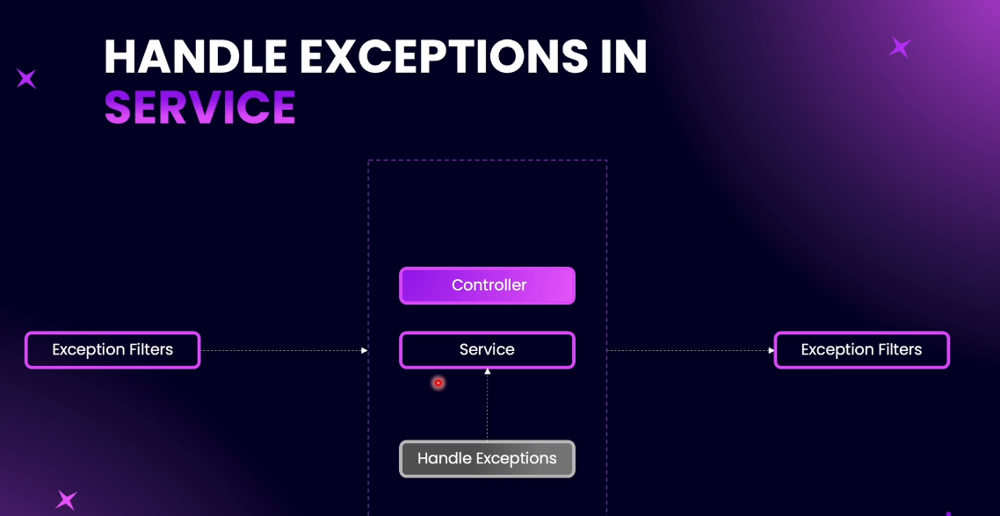

# Step 09 - Exception Handling

### Introduction to Exception Handling


In NestJS, exception handling is a crucial part of the request and response lifecycle. NestJS provides a boundary to handle exceptions across different components such as guards, interceptors, pipes, controllers, and services. By default, exceptions are caught and translated into an HTTP response with a 500 Internal Server Error status. However, to provide meaningful error messages for easier debugging and better client communication, we should handle exceptions more elegantly.

NestJS offers several built-in HTTP exception classes, such as `BadRequestException`, `UnauthorizedException`, `NotFoundException`, among others. These can be used in our service files, where the business logic resides, to manage exceptions effectively. Controllers will primarily handle routing, while services will ensure exceptions are appropriately handled using these pre-built classes.

For more information on built-in exception filters, refer to the NestJS documentation. As we proceed through this course, we will explore using these exception classes and implementing custom exception handling strategies within our service files.


### Built-in HTTP Exceptions

The NestJS documentation provides a comprehensive guide to [built-in HTTP exceptions](https://docs.nestjs.com/exception-filters#built-in-http-exceptions).  This page is a great resource to bookmark and refer back to when you need to handle exceptions in your application.  It lists all the pre-built HTTP exceptions and how to use them.


### Identifying Points of Failure


When adding exception handling to your NestJS application, it's important to identify areas in your code that are prone to errors or "corner cases." Here are common scenarios where you should consider handling exceptions:


- **Database Operations:**  
  Any time you interact with the database (querying, inserting, updating, deleting), errors can occur due to connection issues, invalid data, or constraint violations.

- **Model Constraints:**  
  If your entity has constraints like `unique` fields (e.g., unique email for users), attempting to insert duplicate values will cause database errors. Always check for uniqueness and handle exceptions accordingly.

- **External API Calls:**  
  When your service interacts with external APIs (e.g., fetching user profiles from Google), network failures or invalid responses can occur. Exception handling ensures your app responds gracefully.

- **Middleware and Other Providers:**  
  Exception handling is not limited to services. You should also handle exceptions in middleware, guards, interceptors, and any custom providers.

**Summary:**  
Whenever your code interacts with external systems, enforces constraints, or performs operations that can fail, add exception handling using NestJS's built-in HTTP exceptions or custom strategies. This improves reliability and provides meaningful error messages to clients and developers.

---

### Exception Handling Model Constraints

NestJS provides built-in exception classes (like BadRequestException, RequestTimeoutException, etc.) which ensure consistent, structured, and predictable error handling across your application.

**Scenario Overview**

When handling model constraints (such as unique fields) in your service logic, you should:

- **Check for Existing Records:**  
  Before creating a new user, check if a user with the same email already exists.

- **Use Try-Catch for Database Operations:**  
  Wrap database queries in a try-catch block to handle connection errors or query failures.

- **Throw Specific Exceptions:**  
  - If the database connection fails, throw a `RequestTimeoutException` with a helpful message and description.
  - If a duplicate record is detected (e.g., email already exists), throw a `BadRequestException` with a clear error message.

- **Consistent API Responses:**  
  Using NestJS's built-in exceptions automatically sets the correct HTTP status code and error structure, making your API responses predictable and easy to debug.

**Example:**
```typescript
try {
  // Query for existing user
  const existingUser = await this.userRepository.findOne({ where: { email } });
  if (existingUser) {
    throw new BadRequestException('User already exists. Please check your email.');
  }
  // ...create user logic...
} catch (error) {
  throw new RequestTimeoutException('Unable to process your request at the moment.', {
    description: 'Error connecting to the database',
  });
}
```

**Benefits:**
- Prevents 500 errors for known issues (like duplicates)
- Provides meaningful error messages to clients
- Handles both model constraint violations and database connectivity issues

[code example](https://github.com/NadirBakhsh/nestjs-resources-code/commit/998a5d223f75370e0b1c32908c055eea0df3a829)

---

### Create User Exception Handling

[code example](https://github.com/NadirBakhsh/nestjs-resources-code/commit/f206c8c633431945a230ad2dce8e1c9dc57f40a0)

---

### Throw a Custom Exception

[code example](https://github.com/NadirBakhsh/nestjs-resources-code/commit/c96cdef05bb4414a16567ced23ef157de70809f2)

### Practice: Exception Handling Post Update

- Task: Handle Exception in Post Update

### Solution: Exception Handling Post Update
[code example Exception Handling Post](https://github.com/NadirBakhsh/nestjs-resources-code/commit/c3008132f943501201810e7b103b4d0b80792d82)