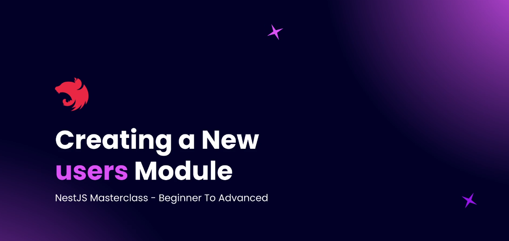
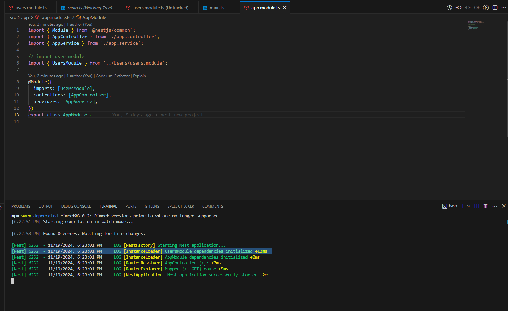

# Step 02 - Understanding Modules

## 1. What are Modules?
<p>
This section outlines the fundamental concepts of using modules in NestJS, focusing on organizing and structuring applications efficiently.
</p>

#### 1. Modules as Packages of Functionality


- In NestJS, **modules** are **_containers for specific functionalities_** within the application.
- When a new functionality is introduced, it should be encapsulated within a dedicated module.
- For instance, in a blog application, a **"Users"** module might handle everything related to user functionality, from routes to data handling.

#### 2. Primary File Structure in a Module

- Each module includes a **_primary file_** which typically follows the naming pattern **_moduleName.module.ts_** (e.g., **_users.module.ts_** for a Users module).
- This primary file acts as the **entry point** for the module, coordinating other essential files within the module.

#### 3. Controller Files

- **Controllers** are essential components in a module and are generally named **_moduleName.controller.ts_** (e.g., **_users.controller.ts_**).
- They manage routing and handle incoming HTTP requests, delegating them to relevant services within the module.
- For example, requests associated with user actions, such as registration or login, would be routed through the **_users.controller.ts_** file.

#### 4. Service Files

- Modules often include **service files** (e.g., **_users.service.ts_**) that house the **business logic** for the module.
- Services provide reusable functions, allowing the controller to execute necessary operations.
- The **_users.service.ts_** file, for instance, might contain methods for user authentication, retrieving user profiles, and other user-related actions.

#### 5. Entity and Test Files

- **Entity files** (e.g., **_users.entity.ts_**) represent database models and are typically found in modules that interact with a database.
- Modules may also contain **spec files** (e.g., **_users.controller.spec.ts_**) for testing the controller and verifying routes and responses.

#### 6. Default App Module

- A default **AppModule** (**_app.module.ts_**) is created with each NestJS installation, serving as the **core module** of the application, linking to other modules.
- The **_main.ts_** file acts as the starting point of a NestJS application. When the application is launched, **_main.ts_** references the **AppModule**, which then connects to all other declared modules.


### Structure of a Basic Module in NestJS

A typical module in NestJS includes the following files:
- **Primary Module File** (e.g., **_users.module.ts_**): Entry point of the module.
- **Controller** (e.g., **_users.controller.ts_**): Manages routes and HTTP requests.
- **Service** (e.g., **_users.service.ts_**): Contains business logic.
- **Entity** (e.g., **_users.entity.ts_**): Represents database models.
- **Spec File** (e.g., **_users.controller.spec.ts_**): For testing the controller.


### Reflection

The modular approach in NestJS promotes a clean structure, making it easier to develop and manage applications by grouping related files into dedicated modules. This structure improves readability and enhances reusability, as each module operates independently while integrating smoothly with others.

---

## 2. How NestJS Bootstraps (main.ts)

In a NestJS application, main.ts is the entry point. The bootstrap function is responsible for setting up the application. By using NestFactory.create(AppModule), it initializes the application with AppModule as the base, ensuring that all routes, dependencies, and configurations are correctly loaded.

```typescript

import { NestFactory } from '@nestjs/core';
import { AppModule } from './app.module';

async function bootstrap() {
  const app = await NestFactory.create(AppModule);
  await app.listen(3000);
}

bootstrap();

```

### Setting the Port with app.listen()

The app.listen() method launches the server and listens on the specified port. By default, this guide uses port 3000, but it can be easily changed to another port, such as 3300.

```typescript
await app.listen(3300);

```

After updating and saving this line, restart the server to apply the new port configuration. Your application will then be accessible at http://localhost:3300.

### Debugging with the app Object

For deeper insights into the application’s structure and configuration, log the app object to the console. This reveals the various components of your NestJS app, aiding in debugging and customization.

```typescript
console.log(app);

```

### Summary

1. NestFactory initializes the application.
2. AppModule organizes the main structure of the application.
3. app.listen(port) starts the server on the specified port.

With these configurations in main.ts, your NestJS application is ready for further development, customization, and expansion!

---

## 3. Understanding the App Module


### 1. Structure of the `src` Directory
The `src` folder typically includes key files like `app.module.ts`, which serves as the root module for the entire application. This file is responsible for importing and organizing other modules, controllers, and services.


### 2. Main.ts - Application Entry Point
The `main.ts` file uses the `bootstrap()` function to initialize and load the application’s main module, `app.module.ts`. This makes it the central point where the application starts running.

### 3. App Module Naming Convention
The `app.module.ts` file contains the word "module" by convention, making it easy for developers to recognize it as a module file. However, it’s not mandatory to name it this way. What makes a file a module is the use of the `@Module()` decorator within it, as shown in the example code below:

```typescript
import { Module } from '@nestjs/common';
import { AppController } from './app.controller';
import { AppService } from './app.service';

@Module({
  imports: [],
  controllers: [AppController],
  providers: [AppService],
})
export class AppModule {}
```


### 4. Importing New Modules
- As you add new modules to your NestJS application, they should be added to the imports array in app.module.ts. This makes them accessible within the application's module tree, centralizing the application configuration.


### 5. Organizing Files within `src`
- In the src folder, files like controllers and services can be stored directly or organized into separate directories. If you decide to reorganize them into folders, ensure that the import paths in main.ts and other files are updated to prevent errors

### 6. Naming Conventions for Controllers and Services
- The filenames for controllers and services don’t need to explicitly contain the words "controller" or "service." Their functionality is determined by the use of @Controller() and @Injectable() decorators rather than by the filename.

### Additional Resources
For further exploration, refer to the NestJS [Resource Repository](https://github.com/NadirBakhsh/nestjs-resources-code/commit/eff8d909fd64d22be4758a28c8adfcefb98e4b08), where you can review sample code and learn best practices for NestJS development.

---

## 4. Creating a New Users Module



1. Start by creating a new folder inside the `src` directory named `users`.
2. Inside the `users` folder, create a new file named `users.module.ts`. This file will serve as the main module file for the `Users` module.

Here is the initial code for `users.module.ts`:

```users.module.ts

export class UsersModule{}

```

This code simply initializes a class named UsersModule. However, to make it behave like a NestJS module, we need to import and use the @Module decorator from @nestjs/common.

### Step 2: Adding the @Module Decorator

Modify the users.module.ts file as follows:

```users.module.ts

import { Module } from '@nestjs/common';

@Module({})
export class UsersModule {}

```

The @Module decorator allows us to define a NestJS module. It accepts an object as an argument, where we can specify the following properties:

- imports: Modules that this module depends on.
- controllers: Controllers associated with this module.
- providers: Services/providers used by this module.

At this stage, we have created a basic UsersModule.


### Step 3: Adding the UsersModule to AppModule

To make the UsersModule available across the application, we need to import and register it in the app.module.ts file.

- Open the app.module.ts file.
- Import the UsersModule.
- Add it to the imports array of the @Module decorator.

```app.module.ts

import { Module } from '@nestjs/common';
import { AppController } from './app.controller';
import { AppService } from './app.service';

// Import the UsersModule
import { UsersModule } from './users/users.module';

@Module({
  imports: [UsersModule], // Add the UsersModule here
  controllers: [AppController],
  providers: [AppService],
})
export class AppModule {}

```

### Step 4: Verifying the UsersModule

To ensure the `UsersModule` is correctly initialized and working, you can check the terminal logs. If your application is running in development mode, you should see a log message indicating that the `UsersModule` has been `initialized` as part of the application’s dependencies.

```bash
[Nest] 12345   - UsersModule dependencies initialized
```



## Summary

This guide explains how to create a `UsersModule` in a NestJS application, integrate it into the `AppModule`, and verify its functionality. Follow these steps:

1. **Create Module**: Add a `users` folder in the `src` directory and create a `users.module.ts` file.
2. **Initialize Module**: Use the `@Module` decorator from `@nestjs/common` to define the `UsersModule`.
3. **Register Module**: Import the `UsersModule` into the `app.module.ts` and include it in the `imports` array.
4. **Verify Module**: Check the terminal logs to ensure the `UsersModule` is initialized correctly.

## Source Code

View the full source code [Resource Code Repository](https://github.com/NadirBakhsh/nestjs-resources-code/commit/206e9331aac14d950634b671c042a3a0ee726498)


## 3. Creating a New Users Module Using Nest CLI - Part 2
In this guide, we'll focus on creating a UsersModule using the Nest CLI, streamlining our workflow by replacing manual processes with CLI-generated code. Let's break it down step-by-step.

### Removing the Manually Created Module
Before proceeding, ensure that any manually created UserModule and its corresponding imports in `app.module.ts` are removed. This will help avoid conflicts when using the Nest CLI to generate the module.

### What is Nest CLI?
If you’re new or need a quick recap, Nest CLI is a command-line interface provided by NestJS that allows developers to:

- Automate repetitive tasks like creating files, boilerplate code, or scaffolding modules, services, controllers, etc.
- Save time by running predefined commands to generate consistent and correctly structured code.
- Customize project generation behavior for specific needs.

With Nest CLI, you can avoid manual creation and configuration of files, making your development faster and more efficient.

### Generating a Module with the CLI

To generate a UsersModule, follow these steps:

Step 1: Preview the Output with --dry-run
Run the following command in your terminal:

```bash
nest g module users --dry-run
```
Explanation:
- The nest g module users command tells Nest CLI to generate a module named users.
- The --dry-run flag ensures that the CLI doesn’t create files immediately. Instead, it outputs the files and code it 

would generate, letting you preview the changes without committing them.
This is a safe way to ensure that the command does what you expect before making any actual changes.

Step 2: Create the Module Without --dry-run
Once you're satisfied with the preview, run the command without the --dry-run flag:

```bash
nest g module users
```

- This creates a users directory inside the src folder and generates the users.module.ts file.

### Handling File Locations
If you’ve previously moved files like app.module.ts into a custom directory (e.g., app), you might encounter issues because Nest CLI defaults to the src directory for imports and updates.

To ensure everything works seamlessly:

1. Move Back to src Directory:

- Ensure that all default NestJS files like app.module.ts are in the src root directory.
- The CLI relies on this structure for automatic updates during module creation.

2. Customize Nest CLI Behavior (Optional):

- If you want Nest CLI to recognize a custom directory (e.g., app), modify the nest-cli.json file.
- Update the sourceRoot property to point to your custom directory

With this configuration, CLI commands will generate and update files in the app directory instead of src.

### Visual Overview
Below is an example of the CLI output when generating a UsersModule:


### Summary
Using the Nest CLI simplifies module creation and project management. Here's a quick recap:

1. Remove manual files: Clean up any previously created modules and imports.
2. Preview with --dry-run: Test the CLI command before applying changes.
3. Generate modules: Run the command without --dry-run to create files.
4. Handle custom directories:
- Ensure files are in src by default, or
- Modify nest-cli.json to match your directory structure.
With these steps, you’ll efficiently create and manage modules in your NestJS project.

### Source Code

View the full source code [Resource Code Repository](https://github.com/NadirBakhsh/nestjs-resources-code/commit/16bb8436c839b278fb6bd66cb8eecdda0c9d60cf)

---

- What is a REST API
- Setting Up Postman and httpYac
- Creating Controllers
- Working With Routing Decorators
- Params, Query, and Body
- Additional Request Components
- Providers in NestJS
