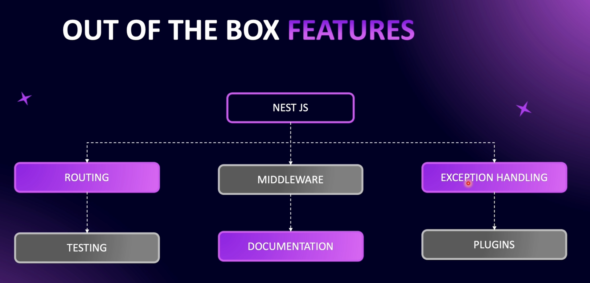
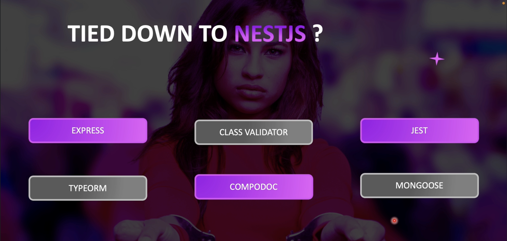

# Step 01 - Introduction to NestJS

1. What is NestJS? 
   Nest is a framework. for building efficient, scalable, Node.js server-side applications with
   fully supports TypeScript. Under the hood Express (the default) and nodejs is used and optionally
   can be configured to use Fastify as well! his gives developers the freedom to use the myriad of third-party modules which are available for the underlying platform.

2. Why we are not going to use Node.js and Express directly?  
   We're not using Node.js or Express directly because with the introduction of Nest.js,
   there's now a standardized structure and pattern for writing code. Many developers and companies have their own unique ways of working and writing code,
   which can make it difficult for teammates to understand. Nest.js, with its modular and organized approach,
   makes it easier to maintain scalability and maintainability in the codebase.

3. NestJS Features
   

- **_Routing:_** NestJS provides a powerful routing mechanism out of the box, allowing developers to define paths and controllers to handle HTTP requests. This feature is essential for structuring APIs and web applications.

- **_Testing:_** NestJS has built-in support for testing, enabling developers to write unit tests and end-to-end tests for their applications. This includes easy integration with testing libraries like Jest, helping ensure the quality and reliability of the application.

- **_Middleware:_** Middleware functions in NestJS are used to process requests before they reach the route handler. Middleware can be used for tasks such as logging, authentication, and validation. NestJS provides a robust way to manage middleware, making it flexible for handling cross-cutting concerns.

- **_Documentation:_** NestJS supports the generation of API documentation, especially with tools like Swagger. This feature allows developers to create interactive API documentation, making it easier for others to understand and interact with the API endpoints.

- **_Exception Handling:_** NestJS includes built-in exception handling, allowing developers to manage errors gracefully. By default, it provides a consistent error response format and options to customize error handling logic, making it easier to handle various types of errors in the application.

- **_Plugins:_** NestJS supports various plugins to extend its functionality. These plugins can provide additional features or integrate with other tools, frameworks, or libraries, allowing developers to customize the framework to meet specific requirements.

4. Tied down to the Standard?

   

- Here’s an explanation of each item shown in the diagram:

- **_Express:_** is a minimal and flexible Node.js web application framework that provides a robust set of features for web and mobile applications. NestJS is built on top of Express by default, though it can be switched to use Fastify as well if needed. This shows that while NestJS is a powerful framework, developers can opt to use plain Express if they need a more lightweight setup and this company standard to use express.

 

- **_Class Validator:_** This is a library used with NestJS for validating objects based on decorators, often used with data transfer objects (DTOs) to ensure incoming data meets certain criteria. It integrates smoothly with NestJS but is also usable outside of it for validation purposes.
   

- **_Jest:_** Jest is a testing framework maintained by Facebook, widely used for unit testing in JavaScript projects. NestJS integrates with Jest for testing out of the box, making it a popular choice for writing tests in NestJS applications. However, developers can choose to use Jest without NestJS as well.
   

- **_TypeORM:_** TypeORM is an ORM (Object Relational Mapper) that works well with TypeScript and is a popular choice for database management in NestJS. However, it’s not exclusive to NestJS and can be used in any TypeScript project that requires database operations.
   

- **_Compodoc:_** Compodoc is a documentation tool tailored for Angular and NestJS projects, helping developers generate detailed documentation. While it’s optimized for NestJS, it can also be used for generating documentation in other JavaScript/TypeScript projects.
   

- **_Mongoose:_** Mongoose is a MongoDB object modeling tool designed to work in an asynchronous environment. NestJS provides support for Mongoose as an option for developers who prefer using MongoDB, but it can be used independently of NestJS in any Node.js application.

- Setting Up The Development Environment
- Installing NestJS CLI
- Creating Our First NestJS Application
- Boilerplate Code in NestJS
- Best Learning Path For The Course
