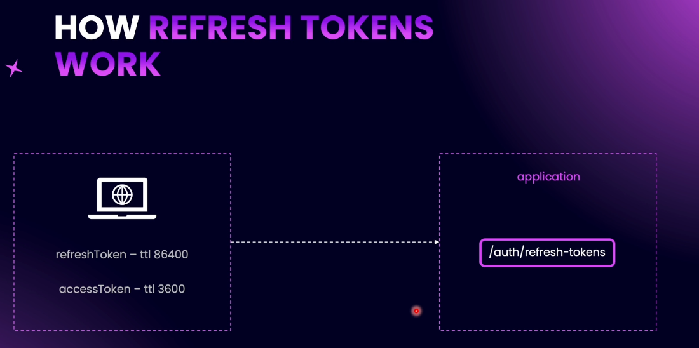

# Step 14 - Refresh Tokens

## Introduction to Refresh Tokens


**Explanation:**  
Access tokens are short-lived tokens used to authenticate users. Because they expire quickly (e.g., after 1 hour), they help keep your application secure by limiting the time an attacker can use a stolen token.

**Refresh tokens** are longer-lived tokens (e.g., 1 day) that allow users to get new access tokens without logging in again. When an access token expires, the frontend uses the refresh token to request a new access token from the backend.

- **Access tokens**: Used for authentication, short lifespan, more sensitive payload.
- **Refresh tokens**: Used only to get new access tokens, longer lifespan, minimal payload (usually just user ID).



**How it works:**
1. When a user signs in, both an access token and a refresh token are returned.
2. The frontend stores both tokens (in local storage or cookies).
3. When the access token expires, the frontend sends the refresh token to the backend to get a new access token.
4. This process repeats until the refresh token expires, at which point the user must log in again.

**Benefits:**  
- Improved security: Short-lived access tokens reduce risk if stolen.
- Better user experience: Users stay logged in without frequent re-authentication.

---

## Refresh Token Configuration

**Steps:**
1. **Add Environment Variable:**  
   - In your `.env` or environment file, add:
     ```
     JWT_REFRESH_TOKEN_TTL=86400
     ```
     (Represents 24 hours in seconds.)

2. **Add Validation:**  
   - In `src/config/environment.validation.ts`, add validation for `JWT_REFRESH_TOKEN_TTL` (e.g., required, number).

3. **Update JWT Config:**  
   - In `src/auth/config/jwt.config.ts`, add a property for `refreshTokenTtl`:
     ```typescript
     refreshTokenTtl: parseInt(process.env.JWT_REFRESH_TOKEN_TTL ?? '86400', 10),
     ```

4. **Create DTO for Refresh Token:**  
   - In `src/auth/dto/refresh-token.dto.ts`, create:
     ```typescript
     export class RefreshTokenDto {
       @IsNotEmpty()
       @IsString()
       refreshToken: string;
     }
     ```
   - This DTO will be used to receive the refresh token from the client when requesting new tokens.

[code example](https://github.com/NadirBakhsh/nestjs-resources-code/commit/6eff3ffee9799e37a6efaf799a9e59f445ee39f8)

---

## Generate Tokens Provider


**Explanation:**  
To avoid duplicating token generation logic, create a dedicated provider (e.g., `GenerateTokensProvider`) in the `auth/providers` directory. This provider encapsulates the logic for signing both access and refresh tokens.

**Steps:**
1. **Inject Dependencies:**  
   - Inject `JwtService` and JWT config into the provider's constructor.

2. **Create a Generic Method:**  
   - Add a public async method (e.g., `signToken<T>`) that accepts:
     - `userId: number`
     - `expiresIn: number`
     - `payload?: T` (optional, for extra data like email)
   - Use the method to sign a JWT with the given payload and expiration.

3. **Usage:**  
   - Use this provider to generate both access and refresh tokens, passing the appropriate payload and TTL.

**Benefits:**  
- Centralizes token generation logic.
- Supports flexible payloads for different token types.
- Reduces code duplication across your authentication flow.

[code example](https://github.com/NadirBakhsh/nestjs-resources-code/commit/a683061c96119a0addf5522cb1d9852c455e9b2c)

---

## Generate Tokens Method


**Explanation:**  
Add a `generateTokens` method to your tokens provider to generate both access and refresh tokens together.

**Steps:**
1. **Method Signature:**  
   - The method receives a `UserEntity` as a parameter.

2. **Generate Access Token:**  
   - Use the `signToken` method, passing user ID, access token TTL, and a payload containing the user's email.

3. **Generate Refresh Token:**  
   - Use the `signToken` method, passing user ID and refresh token TTL (no extra payload).

4. **Promise.all:**  
   - Use `Promise.all` to run both token generations in parallel and await their results.

5. **Return Tokens:**  
   - Return an object containing both the access token and refresh token.

**Benefits:**  
- Centralizes token generation logic.
- Ensures both tokens are created and returned together.
- Handles different payloads for access and refresh tokens.

[code example](https://github.com/NadirBakhsh/nestjs-resources-code/commit/cc12cf700e4da6b252904476f01c3a741facfae7)

---

## Generate Refresh Token on SignIn

**Explanation:**  
Update your sign-in provider to use the new `GenerateTokensProvider` for generating both access and refresh tokens when a user signs in.

**Steps:**
1. **Inject Provider:**  
   - Inject `GenerateTokensProvider` into the sign-in provider's constructor.

2. **Generate Tokens:**  
   - Replace the old access token generation logic with:
     ```typescript
     return await this.generateTokensProvider.generateTokens(user);
     ```
   - Pass the authenticated user entity to the method.

3. **Cleanup:**  
   - Remove unused dependencies (`JwtService`, JWT config) from the constructor.

**Result:**  
When a user signs in, both an access token and a refresh token are returned in the response.

[code example](https://github.com/NadirBakhsh/nestjs-resources-code/commit/da13298a6c3bd4990fc4b59fd547eb834a13ddbe)

---

## Generate Access Token Using Refresh Token

**Explanation:**  
Create a new provider called `RefreshTokensProvider` with a method `refreshTokens` that takes a `RefreshTokenDto` as input. This method:

1. **Verifies the Refresh Token:**  
   - Uses `JwtService.verifyAsync` with the secret, audience, and issuer from JWT config.
   - Extracts the user ID (`sub`) from the token payload.

2. **Fetches the User:**  
   - Uses `UserService.findOneById` to get the user from the database.

3. **Generates New Tokens:**  
   - Calls `GenerateTokensProvider.generateTokens(user)` to create fresh access and refresh tokens.

4. **Handles Errors:**  
   - Wraps logic in a try-catch block and throws an `UnauthorizedException` if verification or user lookup fails.

**Result:**  
This enables users to obtain new access and refresh tokens by sending a valid refresh token to the backend.

[code example](https://github.com/NadirBakhsh/nestjs-resources-code/commit/5861c88526cfafbd2df1b970d605bfd4da34d900)

---

## Create Refresh Token Endpoint

**Explanation:**  
Add a new endpoint to your `AuthController` called `refresh-tokens`.  
- This endpoint accepts a `RefreshTokenDto` in the request body.
- It calls the `refreshTokens` method in your `AuthService`, which uses the `RefreshTokensProvider` to verify the refresh token and generate new access and refresh tokens.
- The endpoint returns the new tokens to the client.

**Steps:**
1. Add a `POST /auth/refresh-tokens` endpoint in `AuthController`.
2. Inject `RefreshTokensProvider` into `AuthService`.
3. Implement the `refreshTokens` method in `AuthService` to delegate to the provider.
4. Test the endpoint by sending a valid refresh token and receiving new tokens in response.

**Result:**  
Clients can now obtain new access and refresh tokens by calling this endpoint with a valid refresh token.

[code example](https://github.com/NadirBakhsh/nestjs-resources-code/commit/9831e23ba2d9375ef8d9c723b4f8aec59031af82)

---
