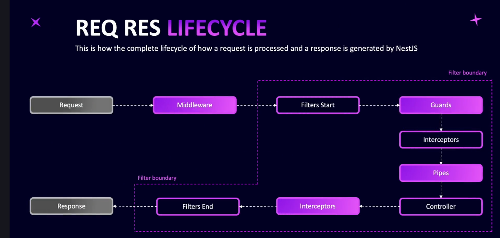

# Step 16 - Serialization and Interceptors

## Introducing Interceptors and Serialization

**Explanation:**
Interceptors in NestJS are executed twice in the request-response lifecycle: once before the controller method runs, and once after the controller returns a response. This unique placement allows interceptors 

to:
- Transform or filter outgoing responses (e.g., remove sensitive fields like passwords or Google IDs)
- Bind extra logic before/after method execution
- Alter exceptions returned by controllers
- Wrap responses in a data property or add metadata like API version

Interceptors help you apply consistent logic across your app without modifying every controller. In this section, you'll create interceptors to filter sensitive properties and globally wrap responses.

## Serializing User Entity

**Explanation:**
Serialization in NestJS allows you to control which properties are included in API responses. By using the built-in `ClassSerializerInterceptor` and the `@Exclude` decorator in your entity (e.g., User), you can easily hide sensitive fields like `password` and `googleId` from outgoing responses. Apply the interceptor to a controller method or class, and mark properties to exclude in your entity. This approach keeps your API responses secure and clean without manual filtering in every controller method.

[Code Example](https://github.com/NadirBakhsh/nestjs-resources-code/commit/07789d7adf6b6732b2622600c424ff275552692d)

## Global Data Interceptor

**Explanation:**
You can create your own custom interceptor in NestJS to transform the shape of API responses globally. By implementing the `intercept` method, you can access the response before it is sent to the client and modify it as needed (e.g., wrap data in a `data` property, add API version info, or filter properties). Applying the interceptor globally ensures consistent response formatting across your application without changing every controller.

[code example](https://github.com/NadirBakhsh/nestjs-resources-code/commit/1f86a5793c8156c91b5e50160a2c11752d0d5950)

## Adding API Version

**Explanation:**
Enhance your global data interceptor to wrap all responses in a `data` property and include the API version. Use the RxJS `map` operator to transform the outgoing response, and inject `ConfigService` to access the API version from your environment variables. Apply this interceptor globally in the app module using the `APP_INTERCEPTOR` provider. This ensures every response is consistently formatted and includes version info, without changing your controller methods.

[code example](https://github.com/NadirBakhsh/nestjs-resources-code/commit/e1205113f32000d3e734da6ed9049289eaf6b49c)